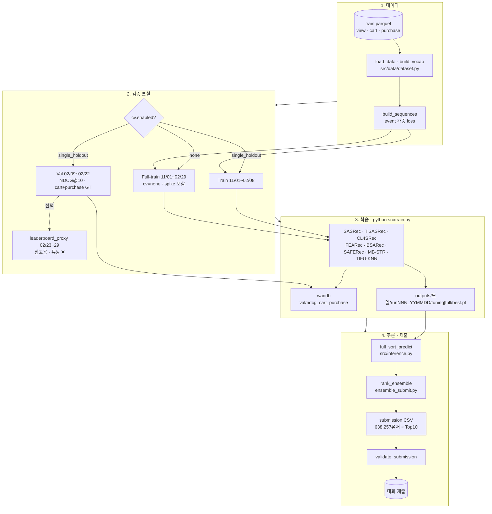

# RecSys 2026 — 이커머스 시퀀스 추천

이커머스 사용자의 **조회·장바구니·구매** 로그를 시간순으로 학습해, 각 사용자에게 **다음에 살 만한 상품 Top-10**을 추천하는 경진대회용 프로젝트입니다.  
평가 지표는 **NDCG@10**이며, **Hydra**로 설정을 관리하고 **Weights & Biases(wandb)** 로 실험을 기록합니다.

상세 설계·EDA·모델 선정 근거는 [`docs/PLAN.md`](docs/PLAN.md)를, **단계별 실행·CLI**는 [`docs/OPERATION.md`](docs/OPERATION.md)를, **튜닝**은 [`docs/TUNING.md`](docs/TUNING.md)를 참고하세요.

---

## 한눈에 보기

| 단계                            | 무엇을 하나                                                             | 비유                         |
| ------------------------------- | ----------------------------------------------------------------------- | ---------------------------- |
| **1. Train / Val**              | 11/1~2/8로 공부, 2/9~22로 모의고사 점수 → **설정(하이퍼파라미터) 선택** | 모의고사로 공부법 정하기     |
| **2. leaderboard_proxy** (선택) | 2/23~29 구간으로 **참고용** 점수 한 번 더                               | 대회와 비슷한 주간 연습 시험 |
| **3. Full-train**               | 11/1~2/29 **전체**로 다시 학습 (`cv=none`)                              | 최종 제출용 실전 복습        |
| **4. Submission**               | 추천 CSV 생성 → 대회 제출                                               | 답안지 제출                  |

- **Val 점수**로만 모델·설정을 고릅니다.
- **leaderboard_proxy**는 리더보드와 **비슷할지 참고**만 하며, 설정 변경에는 쓰지 않습니다.
- **제출 파일**은 Full-train(또는 그에 준하는 전체 기간 학습) 체크포인트로 만듭니다.

---

## 데이터 요약

| 항목      | 값                                                              |
| --------- | --------------------------------------------------------------- |
| 기간      | 2019-11-01 ~ 2020-02-29 (120일)                                 |
| 유저      | 638,257명                                                       |
| 아이템    | 29,502개                                                        |
| 이벤트    | view 99.78% / cart 0.20% / purchase 0.02%                       |
| 학습 파일 | `data/train.parquet` (대회 제공 — 레포에 포함되지 않을 수 있음) |
| 제출 형식 | `data/sample_submission.csv`와 동일한 롱 포맷 (유저당 10행)     |

**핵심 가설**: 구매 예측에서 **장바구니(cart) → 구매(purchase)** 전환이 가장 중요한 신호입니다.

---

## 검증(시간 분할) 설계

```
전체: 2019-11-01 ~ 2020-02-29

Train  : 11/01 ~ 02/08   ← 학습에 사용
Val    : 02/09 ~ 02/22   ← 튜닝 기준 (cart+purchase GT ~1,072명)
─────────────────────────
Full-train (cv=none) : 11/01 ~ 02/29  ← 최종 제출용
leaderboard_proxy    : 02/23 ~ 02/29  ← 참고용 NDCG (튜닝 미반영)
```

설정 파일: [`conf/cv/single_holdout.yaml`](conf/cv/single_holdout.yaml), [`conf/cv/none.yaml`](conf/cv/none.yaml)

---

## 지원 모델

| 모델 | 설명 | 설정 파일 |
|------|------|-----------|
| **SASRec** | Self-Attentive Sequential Recommendation | [`conf/model/sasrec.yaml`](conf/model/sasrec.yaml) |
| **TiSASRec** | 시간 간격 반영 SASRec (CV=4.12 대응) | [`conf/model/tisasrec.yaml`](conf/model/tisasrec.yaml) |
| **CL4SRec** | 대조학습 기반 시퀀스 추천 (희소 대응) | [`conf/model/cl4srec.yaml`](conf/model/cl4srec.yaml) |
| **FEARec** | FFT 주파수 증강 + InfoNCE 대조학습 (SIGIR 2023) | [`conf/model/fearec.yaml`](conf/model/fearec.yaml) |
| **BSARec** | FFT 저역통과 필터 + SA 혼합 (AAAI 2024) | [`conf/model/bsarec.yaml`](conf/model/bsarec.yaml) |
| **SAFERec** | SASRec + view 빈도 임베딩 (롱테일 대응) | [`conf/model/saferec.yaml`](conf/model/saferec.yaml) |
| **MB-STR** | SASRec + view/cart/purchase 행동 타입 임베딩 | [`conf/model/mbstr.yaml`](conf/model/mbstr.yaml) |
| **TIFU-KNN** | 시간 감쇠 그룹 기반 비신경망 스코어 (앙상블 보조) | — (`src/train_tifu.py`) |

구현: [`src/models/`](src/models/)  
초기 베이스라인·RecBole 실험: [`baseline_code/`](baseline_code/)

---

## 전체 파이프라인



| 단계 | CLI 예시 |
|------|----------|
| 튜닝 (Train/Val) | `python src/train.py model=sasrec` |
| Proxy 참고 (학습 직후) | `python src/train.py model=tisasrec cv.run_leaderboard_proxy=true` |
| Proxy만 (ckpt) | `python src/eval_proxy.py model=tisasrec` |
| Full-train | `python src/train.py model=tisasrec cv=none` |
| TIFU-KNN 예측 생성 | `python src/train_tifu.py` |
| 앙상블 가중치 최적화 | `python src/optimize_ensemble.py` |
| 앙상블 제출 | `python src/ensemble_submit.py` |

---

## 디렉터리 구조

```
recsys/
├── README.md                 # 이 문서
├── docs/PLAN.md              # 상세 설계·EDA·체크리스트
├── conf/                     # Hydra 설정
│   ├── config.yaml
│   ├── data/                 # 데이터 경로, spike 처리
│   ├── model/                # 모델별 하이퍼파라미터 (sasrec·tisasrec·cl4srec·fearec·bsarec·saferec·mbstr)
│   ├── cv/                   # Holdout / none
│   ├── train/                # 학습률, 배치, loss 가중치
│   └── ensemble/rank.yaml    # 앙상블 가중치 (8개 모델)
├── src/
│   ├── train.py              # 학습 + Val 평가 (+ proxy 선택)
│   ├── train_tifu.py         # TIFU-KNN 예측 생성 → outputs/tifu_knn/preds.pkl
│   ├── optimize_ensemble.py  # 랜덤 서치로 앙상블 가중치 최적화
│   ├── eval_proxy.py         # ckpt만 로드 → proxy NDCG (재학습 없음)
│   ├── util/
│   │   ├── paths.py          # 체크포인트 run 경로·자동 증가
│   │   └── proxy_eval.py     # leaderboard_proxy 평가
│   ├── submit.py             # 단일 모델 제출 CSV
│   ├── ensemble_submit.py    # 랭크 앙상블 + cart boost → 제출 CSV
│   ├── inference.py          # 추론·제출 검증 (freq/behavior/time 보조 시퀀스 지원)
│   ├── metrics.py            # NDCG@10 + 모델별 보조 피처 evaluate()
│   ├── ensemble.py           # rank_ensemble (RRF)
│   ├── cv/holdout.py         # 시간 분할, GT 생성
│   ├── data/
│   │   ├── dataset.py        # 로더, 시퀀스 빌드
│   │   └── features.py       # time/freq/behavior 보조 시퀀스 빌드
│   └── models/
│       ├── sasrec.py         # SASRec (Pre-LN, causal mask, BPR)
│       ├── tisasrec.py       # TiSASRec (시간 간격 attention)
│       ├── cl4srec.py        # CL4SRec (crop/mask/reorder 대조학습)
│       ├── fearec.py         # FEARec (FFT 주파수 증강 + InfoNCE)
│       ├── bsarec.py         # BSARec (FFT 저역통과 + SA 혼합)
│       ├── saferec.py        # SAFERec (view 빈도 임베딩)
│       ├── mbstr.py          # MB-STR (행동 타입 임베딩)
│       ├── tifu_knn.py       # TIFU-KNN (비신경망, 시간 감쇠 그룹 스코어)
│       └── __init__.py       # build_model() 팩토리
├── data/                     # train.parquet, sample_submission.csv
├── outputs/                  # 체크포인트·제출 CSV (학습 시 생성)
│   └── tifu_knn/preds.pkl    # TIFU-KNN 예측 캐시 (train_tifu.py 실행 후)
├── EDA/                      # 탐색 분석 노트북
├── baseline_code/            # 초기 SASRec·ALS 베이스라인
├── requirements.txt
├── .env.template             # wandb 등 환경 변수 템플릿
└── run_*.sh                  # 배치 학습·앙상블 스크립트 예시
```

---

## 환경 설정

### 1. 의존성 설치

```bash
cd /data/ephemeral/home/recsys
pip install -r requirements.txt
```

- Python 3.10+ 권장
- GPU: **NVIDIA RTX 3090 24GB** 기준으로 배치·AMP(BF16) 설정이 맞춰져 있음

### 2. 환경 변수

```bash
cp .env.template .env
# .env 에 WANDB_API_KEY, WANDB_ENTITY 등 입력
```

wandb를 끄려면: `python src/train.py wandb.enabled=false`

### 3. 학습 데이터 배치

대회에서 받은 `train.parquet`를 `data/`에 둡니다.

```
data/train.parquet
data/sample_submission.csv
```

---

## 실행 방법

> **모든 명령은 프로젝트 루트(`recsys/`)에서 실행**합니다.

### 1단계: Train / Val (설정 튜닝)

```bash
# 딥 모델 — 기본 Holdout CV (batch는 conf/model/*.yaml 기본값)
python src/train.py model=sasrec
python src/train.py model=tisasrec
python src/train.py model=cl4srec
python src/train.py model=fearec
python src/train.py model=bsarec
python src/train.py model=saferec
python src/train.py model=mbstr

# batch 변경 예시 (OOM 시)
python src/train.py model=tisasrec train.train_batch_size=512

# loss 가중치 등 오버라이드 예시
python src/train.py model=sasrec train.loss_weights.cart=30

# leaderboard_proxy 참고 평가 (학습 run 끝에 1회)
python src/train.py model=tisasrec cv.run_leaderboard_proxy=true

# 이미 학습된 체크포인트만 proxy 평가 (최신 run/tuning)
python src/eval_proxy.py model=tisasrec
python src/eval_proxy.py model=tisasrec run_id=run001
```

- Val 기준 지표: `val/ndcg_cart_purchase` (NDCG@10)
- Best 체크포인트: `outputs/<모델>/runNNN_YYMMDD/tuning/best.pt` (튜닝, run 자동 증가) · `.../full/best.pt` (Full-train, 최신 run)
- Hydra 실행 로그: `outputs/YYYY-MM-DD/HH-MM-SS/`

### 2단계: Full-train (최종 제출용)

```bash
python src/train.py model=sasrec   cv=none
python src/train.py model=tisasrec cv=none
python src/train.py model=cl4srec  cv=none
python src/train.py model=fearec   cv=none
python src/train.py model=bsarec   cv=none
python src/train.py model=saferec  cv=none
python src/train.py model=mbstr    cv=none
```

`cv=none`이면 Train/Val 분할 없이 **전 기간(2/29까지, spike 포함)** 으로 학습합니다.

### 3단계: Submission (제출 CSV)

**단일 모델**

```bash
python src/submit.py model=sasrec
# → outputs/submission_sasrec.csv
```

**TIFU-KNN 예측 사전 생성** (선택 — ensemble_submit.py가 직접 실행하지 않는 경우)

```bash
python src/train_tifu.py
# → outputs/tifu_knn/preds.pkl
```

**앙상블 가중치 자동 최적화** (Val 기준 랜덤 서치)

```bash
python src/optimize_ensemble.py
# conf/ensemble/rank.yaml 가중치 자동 업데이트
```

**랭크 앙상블 제출** (최대 8개 모델 + cart boost 후처리)

```bash
python src/ensemble_submit.py
# → outputs/submission_ensemble_<사용된모델>.csv
```

앙상블 가중치: [`conf/ensemble/rank.yaml`](conf/ensemble/rank.yaml)  
각 모델의 `outputs/<모델명>/runNNN_YYMMDD/full/best.pt`가 있어야 합니다.  
`cart_boost: true` (기본)로 carted-but-not-purchased 아이템을 예측 상위로 이동합니다.

### 배치 스크립트 예시

```bash
# TiSASRec + CL4SRec 순차 학습 (Val 모드)
bash run_tisasrec_cl4srec.sh

# 학습 완료 후 앙상블 (PID는 환경에 맞게 수정)
bash run_ensemble_after_train.sh
```

---

## 설정(Hydra) 요약

| 그룹    | 파일                   | 주요 항목                                                 |
| ------- | ---------------------- | --------------------------------------------------------- |
| `data`  | `conf/data/base.yaml`  | `data_dir`, `exclude_spike_purchase`                      |
| `model` | `conf/model/*.yaml`    | `train_batch_size`, `max_seq_len` (기본 50), `hidden_size`, 레이어 수 |
| `cv`    | `conf/cv/*.yaml`       | Holdout 기간, `run_leaderboard_proxy`                     |
| `train` | `conf/train/base.yaml` | `epochs`, `lr`, `loss_weights`, `early_stopping_patience` |
| `wandb` | `conf/config.yaml`     | `project`, `enabled`                                      |

**자주 쓰는 오버라이드**

```bash
python src/train.py model=tisasrec cv=none data=spike_excluded   # spike ablation
python src/train.py model=sasrec cv=none wandb.enabled=false
python src/train.py model=cl4srec train.epochs=20 train.early_stopping_patience=5
```

---

## wandb 지표

| 지표                     | 용도                                               |
| ------------------------ | -------------------------------------------------- |
| `val/ndcg_cart_purchase` | **튜닝 목적** (Val 2/9~22, cart+purchase GT)       |
| `val/ndcg_purchase_only` | 보조 (purchase만, 표본 적음)                       |
| `leaderboard_proxy/ndcg` | 참고 (2/23~29, `cv.run_leaderboard_proxy=true` 시) |
| `train_loss`             | 과적합 모니터링                                    |

---

## 출력물

| 경로                                | 설명                                   |
| ----------------------------------- | -------------------------------------- |
| `outputs/<model>/runNNN_YYMMDD/tuning/best.pt` | Val 튜닝 ckpt (run 자동 증가) |
| `outputs/<model>/runNNN_YYMMDD/full/best.pt`   | Full-train 제출용 ckpt (최신 run) |
| `outputs/tifu_knn/preds.pkl`        | TIFU-KNN 예측 캐시 (`train_tifu.py`)   |
| `outputs/submission_<model>.csv`    | 단일 모델 제출 파일                    |
| `outputs/submission_ensemble_*.csv` | 앙상블 제출 파일 (cart boost 포함)     |
| `outputs/YYYY-MM-DD/HH-MM-SS/.hydra/` | 해당 실행의 전체 설정 스냅샷        |

제출 CSV는 **638,257 유저 × 10행 = 6,382,570행** 롱 포맷이며, `validate_submission`으로 형식을 검증합니다.

---

## 하드웨어·배치 가이드 (RTX 3090 24GB, BF16, max_seq_len=50)

| 모델     | 기본 `train_batch_size` (`conf/model/*.yaml`) | VRAM (대략) |
| -------- | --------------------------------------------- | ----------- |
| SASRec   | 4096                                          | ~6 GB       |
| TiSASRec | 1024                                          | ~9 GB (time_matrix [B,L,L]) |
| CL4SRec  | 2048                                          | ~10 GB (대조 뷰 2개) |
| FEARec   | 2048                                          | ~10 GB (FFT 증강 뷰) |
| BSARec   | 4096                                          | ~6 GB       |
| SAFERec  | 4096                                          | ~6 GB       |
| MB-STR   | 4096                                          | ~6 GB       |
| TIFU-KNN | — (CPU, 비신경망)                             | < 1 GB      |

OOM 시: `train.train_batch_size=` 로 절반씩 낮춰 재실행.

추론 배치(`eval_batch_size`): 32768 (전 유저 full-item scoring)

---

## 관련 문서

- **[`docs/PLAN.md`](docs/PLAN.md)** — EDA, 모델 선정, 앙상블·후처리, 리더보드 체크리스트
- **[`docs/OPERATION.md`](docs/OPERATION.md)** — Phase 0~6-B 운영 가이드 (CLI·체크리스트·Runbook)
- **[`docs/TUNING.md`](docs/TUNING.md)** — 하이퍼파라미터 튜닝 가이드 (우선순위·grid·실험 기록표)
- **[`baseline_code/README.md`](baseline_code/README.md)** — 초기 SASRec·ALS·RecBole 베이스라인
- **[`EDA/eda.ipynb`](EDA/eda.ipynb)** — 탐색 분석

---

## 주의사항

1. **대회 규정**에서 허용하는 외부 데이터·사전학습 여부를 반드시 확인하세요.
2. `.env`에는 API 키가 들어가므로 **Git에 커밋하지 마세요**.
3. Val 구간 데이터로 튜닝한 뒤, 제출은 **Full-train(`cv=none`)** 체크포인트를 사용하는 것이 일반적인 흐름입니다.
4. Feb 27~29 **purchase spike**는 실제 데이터이며, 기본 설정은 **학습에 포함**합니다 (`exclude_spike_purchase: false`).

---

## 라이선스·대회

본 레포는 RecSys 2026 경진대회 실험용입니다. 데이터·규정은 대회 주최 측 안내를 따릅니다.
