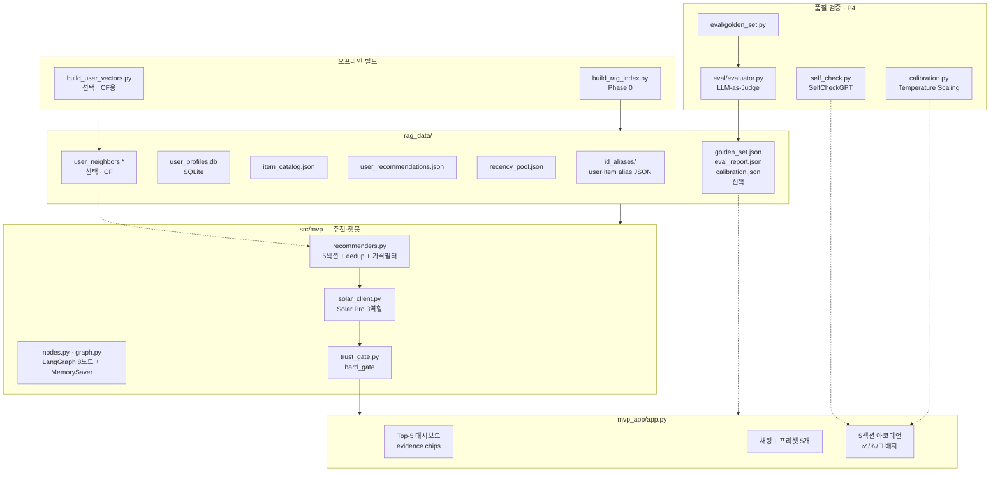
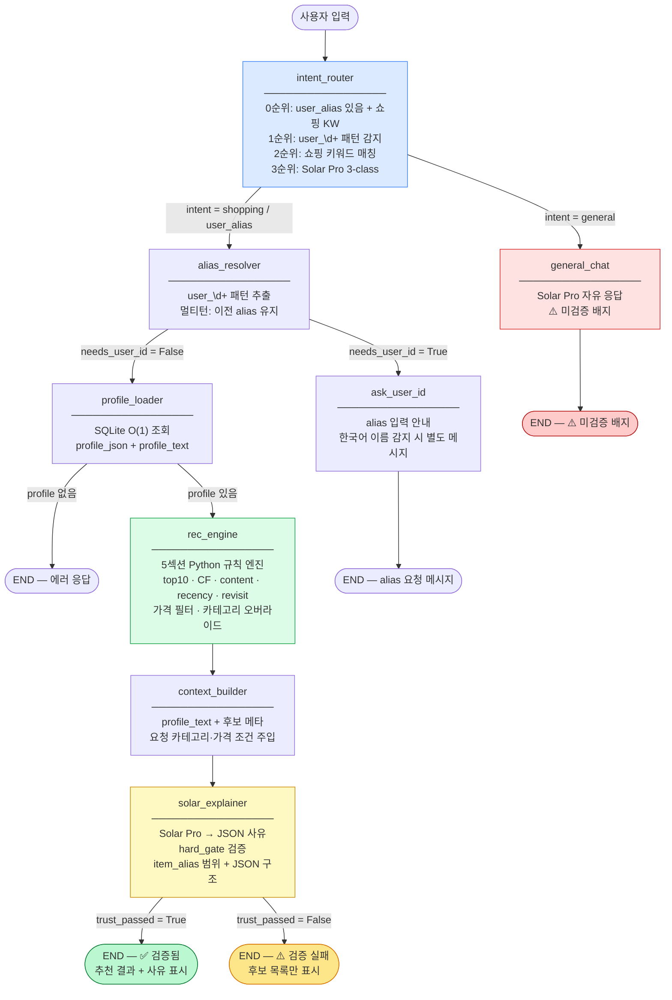

# LLM 커머스 추천 MVP

경진대회에서 만든 **Top-10 추천 모델(submission)** 위에, **Upstage Solar Pro** LLM이 "왜 이 상품인지"를 자연어로 설명해 주는 **데모 서비스**입니다.

> **핵심 원칙**: LLM은 상품을 **고르지 않고**, Python 규칙 엔진이 고른 후보에 **설명만** 붙입니다.

상세 PRD는 [`docs/LLM_Based_RecSys.md`](docs/LLM_Based_RecSys.md)(구현 역추적 PRD — 먼저 읽기)를 참고하세요.

---

## 한눈에 보기

| 구분 | 내용 |
| ---- | ---- |
| **목적** | "이 유저에게 왜 이 상품을 추천하는가?"를 채팅으로 보여 주는 Streamlit 데모 |
| **추천 선정** | submission CSV + 유저 프로필 기반 **5섹션 규칙 엔진** (Python) |
| **설명 생성** | Solar Pro API — 후보 JSON 고정 → 섹션별 사유 JSON 반환 |
| **검증** | `hard_gate`: 후보 범위 밖 item_alias 차단 + JSON 구조 검사 |
| **UI** | 유저 선택 → Top-5 대시보드 + 채팅 + 5섹션 아코디언 |
| **빌드 상태** | DB·FAISS 1,000명 샘플 완료 · 전체 638K 빌드 가능 |

---

## 구현 모듈 관계도



| 레이어 | 파일 | 역할 |
| ------ | ---- | ---- |
| **오프라인 빌드** | `build_rag_index.py` | alias, DB, catalog, recs, recency_pool |
| **CF (선택)** | `build_user_vectors.py` | FAISS `user_neighbors.*` — 👥 섹션 |
| **추천 엔진** | `recommenders.py` | 5섹션 후보 + dedup + 가격 필터 |
| **챗봇 파이프라인** | `nodes.py`, `graph.py` | LangGraph 8노드, MemorySaver 멀티턴 |
| **LLM** | `solar_client.py` | 의도 분류 / 추천 사유 / 일반 대화 |
| **검증** | `trust_gate.py` | hard_gate: item 범위 + JSON 구조 |
| **품질 P4** | `self_check.py`, `calibration.py` | SelfCheckGPT, ECE Temperature Scaling |
| **평가 P4** | `eval/golden_set.py`, `eval/evaluator.py` | Golden Set, LLM-as-Judge |
| **UI** | `mvp_app/app.py` | Streamlit 대시보드·채팅·아코디언 |

---

## 동작 흐름

```
[오프라인, 1회]
  train.parquet + submission CSV
       ↓  build_rag_index.py
  유저·상품 별칭 / 프로필 DB / 카탈로그 / 추천 JSON / recency pool
       ↓  build_user_vectors.py (선택)
  유사 유저 FAISS 인덱스

[Streamlit 실행 중]
  1. 사이드바에서 유저 선택 (예: 김민지 · user_00001)
     → 우측 추천 목록에 Python 엔진 후보 즉시 표시
  2. 채팅: "왜 이걸 추천해?" → 쇼핑 의도 분류
  3. LangGraph: 프로필 조회 → 5섹션 추천 → Solar Pro 사유 생성
  4. hard_gate 통과 → ✅ 배지 + 대시보드·아코디언 갱신
  5. (SelfCheckGPT 토글 시) 🧪 Groundedness 점수 표시
```

**RAG**: `user_alias` → SQLite·JSON 직접 lookup. 벡터 검색 없음. FAISS는 👥 CF 섹션 전용.

---

## 빠른 시작

### 1. 의존성 설치

```bash
pip install -r requirements_mvp.txt
```

### 2. 환경 변수

```bash
cp .env.template .env
```

`.env`에서 **`UPSTAGE_API_KEY`** 를 실제 키로 설정하세요.

주요 선택 변수:

| 변수 | 기본값 | 설명 |
| ---- | ------ | ---- |
| `SOLAR_MODEL` | `solar-pro3` | 사용 모델 |
| `PRICE_SCALE` | `1000` | price_median × 배율 → 원화 표시 |
| `RECENCY_DAYS` | `14` | recency_pool 기준 최근 N일 |
| `REVISIT_EXCLUDE_DAYS` | `14` | revisit에서 최근 구매 제외 기간 |

### 3. RAG 데이터 빌드 (최초 1회)

`data/train.parquet`와 submission CSV가 필요합니다.

```bash
# 빠른 데모 (1,000명 샘플, ~5분)
python src/mvp/build_rag_index.py \
  --submission outputs/submission_reranker_lgbm.csv \
  --skip-faiss --sample 1000

# 전체 638K 빌드 (~55분, FAISS 제외)
python src/mvp/build_rag_index.py \
  --submission outputs/submission_reranker_lgbm.csv \
  --skip-faiss
```

> **현재 빌드 상태**: DB·FAISS 모두 1,000명 샘플 완료 (`user_neighbors.npy` 78 KB)

### 4. (선택) CF 섹션용 FAISS 빌드

```bash
# 👥 "비슷한 분들이 산" 섹션 활성화
python src/mvp/build_user_vectors.py --full
```

3개 파일(`user_neighbors.npy`, `user_neighbors_meta.pkl`, `user_alias_to_row.pkl`)이 모두 있어야 CF 섹션이 표시됩니다.

### 5. 앱 실행

```bash
streamlit run mvp_app/app.py
```

---

## 추천 5섹션

| 섹션 | UI 라벨 | 선정 방식 | 비고 |
| ---- | ------- | --------- | ---- |
| **Top-10** | 📊 모델 추천 Top-5 (대시보드) | submission 순위 그대로 | dedup 기준점 |
| **content** | 🎯 내 취향 | 카테고리(×2가중)·브랜드·가격대 affinity, unseen 필터 | |
| **recency** | 🆕 새로 나온 | recency_pool − seen_items, 4단계 fallback | |
| **revisit** | 🔄 다시 볼 만한 | seen_items revisit score (temporal decay), 최근 구매 제외 | seen < 3이면 숨김 |
| **collaborative** | 👥 비슷한 분들이 산 | FAISS Top-20 이웃의 purchase/cart 점수, unseen 필터 | FAISS 없으면 숨김 |

**Dedup 우선순위 (unseen 풀)**: Top10 > CF > content > recency  
**Revisit은 seen 풀 독립** — dedup 제외

**가격 재질의**: "더 싼 걸로" / "더 고급으로" 요청 시 이전 추천 중앙값 ±20% 필터를 전 섹션에 적용.  
**카테고리 오버라이드**: "신발 추천해줘" 등 카테고리 키워드 감지 시 해당 L2로 content 섹션 오버라이드.

---

## LangGraph 채팅 파이프라인

`src/mvp/graph.py`에서 그래프를 **한 번 컴파일**하고, Streamlit은 `thread_id`(세션 ID)로 멀티턴 대화를 유지합니다.



- **의도 분류 3단계**: alias 패턴 즉시 감지 → 쇼핑 키워드 → Solar Pro fallback (API 비용 절감)
- **멀티턴**: MemorySaver가 thread_id별 상태 누적. user_alias 한 번 입력하면 이후 대화에서 재입력 불필요
- **그래프만 테스트**:
  ```bash
  python src/mvp/graph.py
  ```

---

## ID 별칭 (alias)

LLM·채팅에는 긴 원본 UUID 대신 **짧은 별칭**만 사용합니다.

| 대상 | 형식 | 예시 |
| ---- | ---- | ---- |
| 유저 | `user_00001` + 한국어 가명 (드롭다운 표시 전용) | `user_00001` · 김민지 |
| 상품 | `{L2}[.{L3}].{brand_slug}.{price_bucket}_{seq:04d}` | `shoes.keds.kapika.mid_0001` |

**⚠️ 중요**: Semantic ID는 prompt 간결성이 목적입니다. Solar Pro system prompt에 alias 문자열에서 속성 추론 **금지**가 명시됩니다. 속성은 반드시 카탈로그 JSON 필드로 전달합니다.

---

## P4 품질 검증 (선택)

| 기능 | 설명 | 활성화 방법 |
| ---- | ---- | ----------- |
| **SelfCheckGPT** | Solar Pro 2회 추가 호출 → item Jaccard + reason F1 → groundedness 점수 | 앱 사이드바 토글 |
| **Calibration** | groundedness ↔ LLM Judge 간 ECE 측정 + Temperature Scaling 보정 | `evaluator.py` 실행 후 `calibration.json` 생성 |
| **Golden Set** | 샘플 유저 N명 추천 저장 | `golden_set.py --build --n 20` |
| **LLM-as-Judge** | Solar Pro 채점 (1~5점) + 회귀 테스트 (threshold 3.0) | `evaluator.py` 실행 |

```bash
# P4 평가 실행
python src/mvp/eval/golden_set.py --build --n 20
python src/mvp/eval/evaluator.py \
  --golden rag_data/golden_set.json \
  --self-check
```

결과는 `rag_data/eval_report.json`에 저장되며 앱 사이드바에서 확인할 수 있습니다.

---

## 디렉터리 구조

```
recsys/
├── README_MVP.md              ← 이 문서
├── requirements_mvp.txt       ← MVP 전용 패키지
├── .env.template              ← UPSTAGE_API_KEY 등
│
├── mvp_app/
│   └── app.py                 ← Streamlit UI
│
├── src/mvp/
│   ├── id_alias.py            ← 유저·상품 별칭 생성
│   ├── user_profile.py        ← 프로필 집계 → user_profiles.db
│   ├── build_rag_index.py     ← 오프라인 RAG 인덱스 빌드
│   ├── build_user_vectors.py  ← FAISS 유사 유저 (별도 실행)
│   ├── recommenders.py        ← 5섹션 추천 + dedup + 가격 필터
│   ├── trust_gate.py          ← hard_gate: item 범위 + JSON 구조
│   ├── solar_client.py        ← Solar Pro API (분류/설명/대화)
│   ├── graph_state.py         ← GraphState TypedDict
│   ├── nodes.py               ← LangGraph 노드 8개
│   ├── graph.py               ← StateGraph 조립·전역 컴파일
│   ├── category_ko.py         ← L2/L3 → 한국어 카테고리명
│   ├── self_check.py          ← SelfCheckGPT groundedness (P4)
│   ├── calibration.py         ← Temperature Scaling ECE (P4)
│   └── eval/
│       ├── golden_set.py      ← Golden Set 생성
│       └── evaluator.py       ← LLM-as-Judge + ECE 리포트
│
├── rag_data/                  ← 빌드 산출물 (gitignore, 로컬 생성)
│   ├── id_aliases/
│   │   ├── user_alias.json
│   │   └── item_alias.json
│   ├── user_profiles.db
│   ├── item_catalog.json
│   ├── user_recommendations.json
│   ├── recency_pool.json
│   ├── user_neighbors.npy          ← (선택) CF
│   ├── user_neighbors_meta.pkl     ← (선택) CF
│   ├── user_alias_to_row.pkl       ← (선택) CF
│   ├── golden_set.json             ← (선택) P4 평가
│   ├── eval_report.json            ← (선택) P4 평가 결과
│   └── calibration.json            ← (선택) Temperature Scaling
│
└── docs/
    ├── LLM_Based_RecSys.md         ← 구현 역추적 PRD (주 참고)
    ├── LLM_MVP_UNIFIED_ROADMAP.md  ← 1페이지 통합 로드맵
    ├── LLM_Based_EC_RecSys_MVP.md  ← 구현 상세 (LangGraph, alias, 4종)
    └── LLM_RECSYS_SERVICE_PLAN.md  ← Evidence Pack, trust_gate, UI 기획
```

---

## 구현 완료 현황

| Phase | 내용 | 상태 |
| ----- | ---- | ---- |
| **P0** | alias, SQLite 프로필, catalog, submission join, recency pool | ✅ 완료 |
| **P1** | 5섹션 recommenders (top10·CF·content·recency·revisit), dedup, 가격 필터 | ✅ 완료 |
| **P2** | LangGraph 8노드, Solar JSON prompt, hard_gate, 카테고리 오버라이드 | ✅ 완료 |
| **P3** | Streamlit UI: Top-5 대시보드, 프리셋 5개, 5섹션 accordion, evidence chips | ✅ 완료 |
| **P4** | FAISS CF, SelfCheckGPT, Calibration (Temperature Scaling), Golden Set 평가 | ✅ 완료 |

---

## 미완 / 알려진 제한

| 항목 | 설명 |
| ---- | ---- |
| **Evidence Pack** | `rag_data/evidence_pack.jsonl` 및 38+ 신호 스키마 — 설계 문서에는 있으나 미구현. 현재 chips는 카탈로그·프로필에서 직접 계산 |
| **hard_gate 완전판** | item_alias 범위 + JSON 구조 검사만. Evidence Pack 기반 `evidence_ref` 화이트리스트·bool 모순 검사 미구현 |
| **전체 유저** | DB·FAISS 모두 1,000명 샘플. 전체 638K 빌드 시 FAISS `IndexFlatIP` 기준 수 시간 소요 |
| **실시간 행동** | 2020-02-29 기준 고정 데이터 |
| **브랜드 재질의** | 카테고리("신발") / 가격("더 싸") 오버라이드는 구현됨. "다른 브랜드는?" 등 브랜드 기반 재질의 미구현 |

---

## 데모 시나리오

1. **유저 선택** → 대시보드 Top-5 카드 + evidence chips 확인
2. **프리셋** "왜?" 클릭 → Solar Pro 사유 + ✅ 검증됨 배지 확인
3. **프리셋** "💰 더 싼?" → 가격 필터 적용된 새 추천 확인
4. **직접 입력** "신발 추천해줘" → 카테고리 오버라이드 확인
5. **일반 질문** "안녕" → ⚠️ 미검증 배지 확인
6. (FAISS 빌드 후) **👥 비슷한 분들이 산** 섹션 + `🛒 이웃 구매` 칩 확인
7. (SelfCheckGPT 토글) **🧪 Groundedness** 점수 확인

---

## 문제 해결

| 증상 | 확인 |
| ---- | ---- |
| 앱이 유저 목록을 못 불러옴 | `rag_data/user_profiles.db`, `id_aliases/user_alias.json` 존재 여부 |
| Solar Pro 오류 | `.env`의 `UPSTAGE_API_KEY`, 네트워크 연결 |
| CF 섹션이 안 보임 | `build_user_vectors.py` 실행 후 3개 파일(`user_neighbors.npy`, `user_neighbors_meta.pkl`, `user_alias_to_row.pkl`) 모두 확인 |
| 빌드 실패 | `data/train.parquet`, `--submission` CSV 경로 확인 |
| hard_gate 실패 반복 | Solar Pro 응답 JSON 구조 문제. `SOLAR_MAX_TOKENS_EXPLAIN` 늘리기 |

---

## 관련 문서

| 문서 | 용도 |
| ---- | ---- |
| [`docs/LLM_Based_RecSys.md`](docs/LLM_Based_RecSys.md) | **구현 역추적 PRD** (먼저 읽기) |
| [`docs/LLM_MVP_UNIFIED_ROADMAP.md`](docs/LLM_MVP_UNIFIED_ROADMAP.md) | 착수·일정·통합 방향 (1페이지) |
| [`docs/LLM_Based_EC_RecSys_MVP.md`](docs/LLM_Based_EC_RecSys_MVP.md) | LangGraph, FAISS, 4종 로직, alias 상세 설계 |
| [`docs/LLM_RECSYS_SERVICE_PLAN.md`](docs/LLM_RECSYS_SERVICE_PLAN.md) | Evidence Pack, trust_gate, UI·평가 기획 |
| [`README.md`](README.md) | 경진대회 본편 (학습·submission·NDCG@10) |

---

*최종 수정: 2026-05-30 · 본 MVP는 RecSys 2026 경진대회 submission을 전제로 한 데모이며, 프로덕션 서비스가 아닙니다.*
