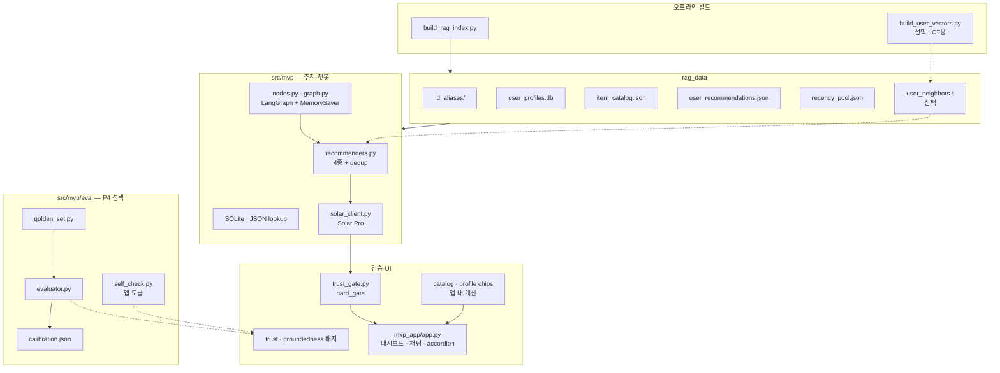

# LLM 커머스 추천 MVP

경진대회에서 만든 **Top-10 추천 모델(submission)** 위에, **Upstage Solar Pro** LLM이 “왜 이 상품인지”를 자연어로 설명해 주는 **데모 서비스**입니다.

> **핵심 원칙**: LLM은 상품을 **고르지 않고**, Python 규칙 엔진이 고른 후보에 **설명만** 붙입니다.

상세 설계는 [`docs/LLM_MVP_UNIFIED_ROADMAP.md`](docs/LLM_MVP_UNIFIED_ROADMAP.md)(1페이지 로드맵), [`docs/LLM_Based_EC_RecSys_MVP.md`](docs/LLM_Based_EC_RecSys_MVP.md)(구현 상세), [`docs/LLM_RECSYS_SERVICE_PLAN.md`](docs/LLM_RECSYS_SERVICE_PLAN.md)(검증·UI)를 참고하세요.

---

## 한눈에 보기

| 구분 | 내용 |
| ---- | ---- |
| **목적** | “이 유저에게 왜 이 상품을 추천하는가?”를 채팅으로 보여 주는 Streamlit 데모 |
| **추천 선정** | submission CSV + 유저 프로필 기반 **4종 규칙 엔진** (Python) |
| **설명 생성** | Solar Pro API — 후보 JSON을 받아 섹션별 사유 JSON 반환 |
| **검증** | `hard_gate`: LLM이 후보 밖 상품을 지어내면 차단 |
| **UI** | 유저 선택 → Top-5 대시보드 + 채팅 + 4섹션 아코디언 |

구현된 모듈 구조는 아래 [구현 모듈 관계도](#구현-모듈-관계도)를 참고하세요.

---

## 구현 모듈 관계도

아래는 **현재 코드·데이터에 실제로 있는 것만** 정리한 구조입니다.  
설계 문서의 Evidence Pack(`evidence_pack.jsonl`) 등 **미구현 항목은 포함하지 않습니다.**



| 레이어 | 구현 파일 | 산출물 / 역할 |
| ------ | --------- | ------------- |
| **오프라인 빌드** | `build_rag_index.py` | alias, DB, catalog, recs, recency_pool |
| **CF (선택)** | `build_user_vectors.py` | `user_neighbors.npy` 등 — collaborative 섹션 |
| **추천·챗봇** | `recommenders.py`, `graph.py`, `nodes.py`, `solar_client.py` | 4종 후보 → LangGraph → Solar Pro 사유 |
| **검증** | `trust_gate.py` | `hard_gate`: 후보 밖 item_alias 차단 |
| **UI** | `mvp_app/app.py` | Top-5, 채팅, 4섹션, chips, ✅/⚠️ 배지 |
| **평가 (P4)** | `eval/golden_set.py`, `eval/evaluator.py`, `self_check.py` | golden set, LLM Judge, groundedness 토글 |

**미구현 (관계도 제외)**: `evidence_pack.jsonl`, Evidence Pack 38+ 신호, `build_rag_index` 내 FAISS 통합.

---

## 동작 흐름 (비개발자용)

```
[오프라인, 1회]
  train.parquet + submission CSV
       ↓
  유저·상품 별칭, 프로필 DB, 카탈로그, 추천 JSON 생성
       ↓
  (선택) 유사 유저 FAISS 인덱스

[실행 중, Streamlit]
  1. 사이드바에서 유저 선택 (예: 김민지 · user_00001)
  2. 채팅: "왜 이걸 추천해?" → 쇼핑 의도로 분류
  3. LangGraph: 프로필 로드 → 4종 추천 → Solar Pro 사유 생성
  4. hard_gate 통과 시 화면에 카드·설명 표시
```

**RAG**는 벡터 검색이 아니라, `user_alias`로 **SQLite·JSON을 lookup**하는 방식입니다. FAISS는 “비슷한 분들이 산” CF 섹션 전용입니다.

---

## 빠른 시작

### 1. 의존성 설치

```bash
pip install -r requirements_mvp.txt
```

학습 파이프라인용 `torch`, `wandb`, `recbole` 등은 **포함되지 않습니다**. MVP만 돌릴 때는 `requirements_mvp.txt`만 설치하면 됩니다.

### 2. 환경 변수

```bash
cp .env.template .env
```

`.env`에서 **`UPSTAGE_API_KEY`** 를 실제 키로 바꿔 주세요. Solar Pro 호출에 필요합니다.

### 3. RAG 데이터 빌드 (최초 1회)

submission CSV와 `data/train.parquet`가 있어야 합니다.

```bash
# 전체 638K 유저 빌드 (~55분)
python src/mvp/build_rag_index.py \
  --submission outputs/submission_reranker_lgbm.csv

# CF "비슷한 분들이 산" 섹션용 FAISS 전체 인덱스 (~3분 + 검색 시간)
.mvp/bin/python src/mvp/build_user_vectors.py --full
```

빠른 데모용 subset(1,000명)만 필요하다면:

```bash
python src/mvp/build_rag_index.py \
  --submission outputs/submission_reranker_lgbm.csv \
  --skip-faiss \
  --sample 1000
```

`rag_data/`는 git에 올리지 않습니다. 로컬에서 위 명령으로 생성하거나, 이미 빌드된 폴더를 두면 됩니다.

> **현재 빌드 상태**: DB 1,000명 샘플 완료 · FAISS 1,000명 완료 (`user_neighbors.npy` 78 KB)

### 4. 앱 실행

터미널에서 직접 실행해 주세요.

```bash
streamlit run mvp_app/app.py
```

브라우저에서 유저를 고르고, 채팅으로 추천 사유를 물어볼 수 있습니다.

---

## 추천 5섹션

| 섹션 | UI 라벨 | 선정 방식 |
| ---- | ------- | --------- |
| **모델 Top-10** | 대시보드 Top-5 카드 | submission 순위 그대로 |
| **내 취향** | 🎯 내 취향 | 프로필(브랜드·카테고리·가격대) × submission, 미구매·미노출 우선 |
| **새로 나온** | 🆕 새로 나온 | 최근 N일 신상 풀 − 이미 본 상품 |
| **다시 볼 만한** | 🔄 다시 볼 만한 | 과거 조회·장바구니 이력 재방문 점수 (이력 3개 미만이면 숨김) |
| **비슷한 분들이 산** | 👥 비슷한 분들이 산 | FAISS 유사 유저의 구매·장바구니 (파일 없으면 섹션 비표시) |

섹션 1~3은 **중복 제거(dedup)** 규칙이 있습니다. submission·CF를 우선하고, content·recency는 겹치지 않게 정리합니다.

**가격 재질의**: "더 싼 걸로" / "더 고급으로" 요청 시 이전 추천 가격 중앙값 기준 ±20% 필터를 전 섹션에 적용합니다. 👥 CF 섹션 chips는 `cf_neighbor_*` 신호(유사 유저·이웃 구매·장바구니)만 표시합니다.

---

## ID 별칭 (alias)

LLM·채팅에는 긴 원본 ID 대신 **짧은 별칭**만 씁니다.

| 대상 | 형식 | 예시 |
| ---- | ---- | ---- |
| 유저 | `user_00001` + 한국어 가명(드롭다운 표시용) | `user_00001` · 김민지 |
| 상품 | `{L2}.{L3}.{brand}.{price_bucket}_{seq}` | Semantic ID (속성은 카탈로그 JSON에서만 조회) |

채팅 프롬프트에는 **`user_00001`만** 넣고, `display_name`은 UI 드롭다운 전용입니다.

---

## 디렉터리 구조

```
recsys/
├── README_MVP.md              ← 이 문서
├── requirements_mvp.txt       ← MVP 전용 패키지
├── .env.template              ← UPSTAGE_API_KEY 등
│
├── mvp_app/
│   └── app.py                 ← Streamlit UI (대시보드 + 채팅)
│
├── src/mvp/
│   ├── id_alias.py            ← 유저·상품 별칭 생성
│   ├── user_profile.py        ← 프로필 집계·profile_text
│   ├── build_rag_index.py     ← 오프라인 RAG 인덱스 빌드
│   ├── build_user_vectors.py  ← FAISS 유사 유저 (별도 실행)
│   ├── recommenders.py        ← 4종 추천 + dedup
│   ├── trust_gate.py          ← hard_gate 검증
│   ├── solar_client.py        ← Solar Pro API
│   ├── graph_state.py         ← LangGraph 상태
│   ├── nodes.py               ← 그래프 노드 (의도·추천·설명)
│   ├── graph.py               ← LangGraph 조립·컴파일
│   ├── self_check.py          ← SelfCheckGPT groundedness (P4)
│   ├── calibration.py         ← 설명 신뢰도 보정 (P4)
│   └── eval/
│       ├── golden_set.py      ← 평가용 골든셋 생성
│       └── evaluator.py       ← LLM-as-Judge + groundedness
│
├── rag_data/                  ← 빌드 산출물 (gitignore, 로컬 생성)
│   ├── id_aliases/
│   ├── user_profiles.db
│   ├── item_catalog.json
│   ├── user_recommendations.json
│   ├── recency_pool.json
│   ├── user_neighbors.npy     ← (선택) CF
│   ├── golden_set.json          ← (선택) P4 평가
│   └── eval_report.json         ← (선택) P4 평가 결과
│
└── docs/
    ├── LLM_MVP_UNIFIED_ROADMAP.md
    ├── LLM_Based_EC_RecSys_MVP.md
    └── LLM_RECSYS_SERVICE_PLAN.md
```

---

## LangGraph 채팅 파이프라인

`src/mvp/graph.py`에서 그래프를 **한 번 컴파일**하고, Streamlit은 `thread_id`(세션 ID)로 멀티턴 대화를 유지합니다.

```
intent_router → (general) → general_chat
              → (shopping) → alias_resolver → profile_loader
                                        → rec_engine (4종 후보)
                                        → context_builder
                                        → solar_explainer
                                        → hard_gate
```

- **general**: 일반 대화 — UI에 **⚠️ 미검증** 배지
- **shopping**: 추천·설명 — `hard_gate` 통과 시 **✅ 검증됨** 배지

그래프만 테스트:

```bash
python src/mvp/graph.py
```

---

## 구현 Phase 요약

| Phase | 내용 | 상태 |
| ----- | ---- | ---- |
| **P0** | alias, SQLite 프로필, catalog, submission join, `build_rag_index` | ✅ |
| **P1** | 4종 recommenders, dedup, trust_gate 골격 | ✅ |
| **P2** | LangGraph 노드, Solar JSON prompt, hard_gate | ✅ |
| **P3** | Streamlit UI, Top-5·채팅·아코디언, evidence chips | ✅ |
| **P4** | FAISS, SelfCheckGPT, calibration, golden set 평가 | ✅ |

### P4 상세 (선택 기능)

| 항목 | 설명 |
| ---- | ---- |
| FAISS | `build_user_vectors.py`로 별도 빌드. `build_rag_index.py`는 `--skip-faiss` 없이 실행해도 FAISS는 아직 통합되지 않음 |
| SelfCheckGPT | 앱 사이드바 토글 — groundedness 점수 표시 |
| Calibration | `rag_data/calibration.json` — temperature 보정 |
| Golden set | `golden_set.py --build` → `evaluator.py` → `eval_report.json` |

평가 예시 (로컬 빌드 기준, `--self-check`):

```bash
python src/mvp/eval/golden_set.py --build --n 20
python src/mvp/eval/evaluator.py \
  --golden rag_data/golden_set.json \
  --self-check
```

---

## MVP 1.0 “완료” 정의

1. 사이드바에서 유저 선택
2. shopping 질문 1회 (예: “왜 이걸 추천해?”)
3. **5섹션**(Top-10 + 4종) 추천과 hard_gate 통과 설명 표시
4. general 질문은 **미검증** 배지로 구분

---

## 아직 미완 / 알려진 제한

| 항목 | 설명 |
| ---- | ---- |
| **Evidence Pack** | `rag_data/evidence_pack.jsonl`·`evidence_pack.py` — 설계 문서에는 있으나 **코드·데이터 미구현**. 현재 chips는 catalog·프로필에서 직접 계산 |
| **hard_gate** | item_alias 범위 검사만. Evidence 키 화이트리스트·bool 모순 검사 미구현 |
| **전체 유저** | 현재 DB·FAISS 모두 1,000명 샘플 기준. 전체 638K 빌드 시 DB ~2.5분 + FAISS `--full` (IndexFlatIP 기준 수 시간 소요, 실용적이지 않음) |

---

## 데모 시나리오 (예시)

1. **유저 선택** → 대시보드 Top-5와 프로필 칩 확인  
2. **프리셋** “왜?” / “살까?” / “더 싼?” / “더 고급?” 클릭 또는 직접 입력  
3. **4섹션 아코디언** 펼쳐 상품별 Solar Pro 사유 확인  
4. **일반 질문** (“안녕”) → 미검증 배지 확인  
5. (FAISS 빌드 후) **👥 비슷한 분들이 산** 섹션 노출 확인  

---

## 관련 문서

| 문서 | 용도 |
| ---- | ---- |
| [`docs/LLM_MVP_UNIFIED_ROADMAP.md`](docs/LLM_MVP_UNIFIED_ROADMAP.md) | 착수·일정·통합 방향 (먼저 읽기) |
| [`docs/LLM_Based_EC_RecSys_MVP.md`](docs/LLM_Based_EC_RecSys_MVP.md) | LangGraph, FAISS, 4종 로직, alias 상세 |
| [`docs/LLM_RECSYS_SERVICE_PLAN.md`](docs/LLM_RECSYS_SERVICE_PLAN.md) | Evidence Pack 스키마, trust_gate, UI·평가 |
| [`README.md`](README.md) | 경진대회 본편 (학습·submission·NDCG@10) |

---

## 문제 해결

| 증상 | 확인 |
| ---- | ---- |
| 앱이 유저 목록을 못 불러옴 | `rag_data/user_profiles.db`, `id_aliases/user_alias.json` 존재 여부 |
| Solar Pro 오류 | `.env`의 `UPSTAGE_API_KEY`, 네트워크 |
| CF 섹션이 안 보임 | `build_user_vectors.py` 실행 후 `user_neighbors.npy` 등 3파일 확인 |
| 빌드 실패 | `data/train.parquet`, `--submission` CSV 경로 |

---

*최종 수정: 2026-05-30 (1,000명 샘플 재빌드) · 본 MVP는 RecSys 2026 경진대회 submission을 전제로 한 데모이며, 프로덕션 서비스가 아닙니다.*
