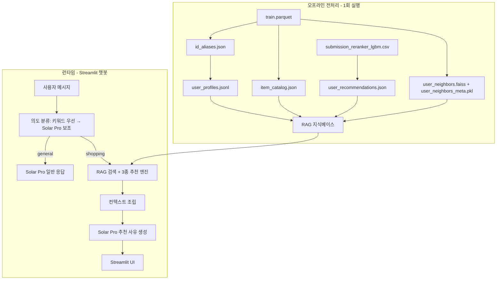
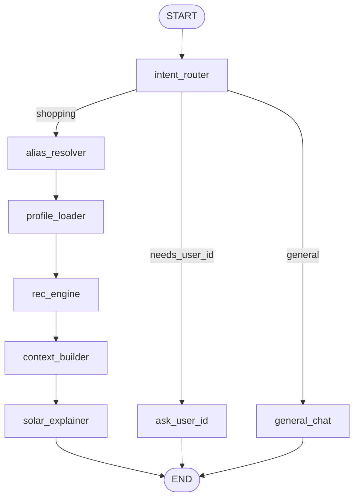

# LLM 기반 이커머스 추천 챗봇 MVP

| 항목 | 내용 |
| ---- | ---- |
| 최종 수정 | 2026-05-27 |
| LLM | Upstage **Solar Pro** API (`solar-pro3`) |
| 파이프라인 | **LangGraph** 상태 그래프 |
| UI | Streamlit |
| 개요 | 경진대회 추천 모델 결과(submission CSV)와 train.parquet를 RAG 지식베이스로 활용해, 채팅 기반 쇼핑 추천 + 자연어 사유 설명 MVP |

상세 모델링·EDA는 [`PLAN.md`](PLAN.md), 운영·CLI는 [`OPERATION.md`](OPERATION.md)를 참고하세요.

---

## 목표

경진대회에서 만든 **추천 모델 결과(submission CSV)** 와 **학습 데이터(train.parquet)** 를 재활용해, 사용자가 채팅으로 대화하면:

1. **일반 대화**와 **쇼핑 추천**을 구분하고
2. 사용자 ID(또는 프로필)를 입력하면 **과거 행동 기반**으로
3. **3가지 추천 유형**(유사 사용자 / 프로필 기반 / 신상품)의 상품과 **Solar Pro가 작성한 추천 사유**를 보여주는 MVP

---

## 전체 아키텍처



---

## 1. 활용할 기존 자산

| 자산 | 경로 | MVP에서의 역할 |
| ---- | ---- | -------------- |
| 행동 로그 | `data/train.parquet` | 유저 프로필, 상품 메타, 유사 사용자 계산 |
| 최종 추천 | `outputs/submission_reranker_lgbm.csv` (또는 ensemble CSV) | **모델이 이미 골라둔 Top-10** → RAG 1순위 근거 |
| 시퀀스 빌드 | `src/data/dataset.py` `build_sequences()` | 최근 본 상품 이력 재사용 |
| 리랭커 피처 | `src/train_reranker_lgbm.py` `build_history_maps()` | cart/purchase/seen 플래그 재사용 |

> **submission을 RAG로 쓰는 의미**: LLM이 "무작위로 상품을 고르는" 것이 아니라, **이미 NDCG@10으로 검증된 추천 결과**를 근거로 설명하게 합니다. train 데이터는 "왜 이 유저에게 맞는지"를 설명하는 **프로필·맥락**을 제공합니다.

---

## 2. ID 별칭 매핑 (사람이 읽기 쉬운 이름)

원본 UUID(`0b517454-e7c3-...`)는 데모·채팅·LLM 응답에 그대로 노출하지 않습니다. **오프라인 1회 생성**하는 양방향 매핑 테이블을 두고, UI·RAG·Solar Pro prompt 전 구간에서 **별칭(alias)만 사용**합니다.

### 저장 위치

```
rag_data/
├── id_aliases/
│   ├── user_alias.json      # user_id ↔ alias ↔ display_name
│   └── item_alias.json      # item_id ↔ alias ↔ category_leaf
```

### A. User ID 매핑

| 필드 | 예시 | 설명 |
| ---- | ---- | ---- |
| `user_id` (원본) | `0b517454-e7c3-...` | train.parquet 키 (내부 lookup용) |
| `user_alias` | `user_00001` | **시퀀셜 번호** (sample_submission 유저 순서 기준) |
| `display_name` | `김민지` | **한국어 가명** (데모 UI dropdown 표시 전용) |

**생성 규칙**

1. `data/sample_submission.csv`의 유저 등장 순서대로 `user_00001` ~ `user_638257` 부여 (재현 가능)
2. 같은 순서에 한국어 가명 638,257개 매핑 (고정 seed로 항상 동일 결과)
3. 채팅/UI에서 표시는 **`김민지 (user_00001)`** 형태
4. **채팅 입력 파싱은 `user_00001` 형태만 허용** → 역매핑으로 원본 `user_id` 조회

> **주의**: `display_name`은 한국어 이름 풀이 한정적이어서 638K 유저에 걸쳐 중복이 대량 발생합니다. "김민지" 입력만으로는 어떤 유저인지 특정할 수 없으므로, `display_name`은 **UI dropdown 표시 전용**으로만 사용하고 채팅 파싱에는 사용하지 않습니다.

```python
# user_alias.json 구조 (1건 예시)
{
  "0b517454-e7c3-44ec-8c39-a68ef9c0ec60": {
    "user_alias": "user_00001",
    "display_name": "김민지"
  }
}
```

### B. Item ID 매핑

| 필드 | 예시 | 설명 |
| ---- | ---- | ---- |
| `item_id` (원본) | `18c11cbb-a18d-...` | train.parquet 키 |
| `item_alias` | `keds_0001` | **최하위 카테고리명 + 시퀀스** |
| `category_leaf` | `keds` | L3 있으면 L3, 없으면 L2 사용 |

**카테고리 최하위 레벨 결정** ([`PLAN.md`](PLAN.md) 계층 구조 기준):

```python
# category_code 예: apparel.shoes.keds → leaf = "keds"
# category_code 예: apparel.tshirt      → leaf = "tshirt" (L3 없음)
parts = category_code.split(".")
category_leaf = parts[-1] if len(parts) >= 2 else "unknown"
```

**시퀀스 번호 부여**

1. `category_leaf`별로 item_id를 **사전순(또는 item_id hash) 정렬**
2. 같은 leaf 내에서 `0001`, `0002`, ... 4자리 zero-pad
3. 결과: `shoes_0001`(L2만 있는 경우), `keds_0042`, `tshirt_0123` 등

```python
# item_alias.json 구조 (1건 예시)
{
  "18c11cbb-a18d-4a9e-bdea-6abd3f7d3c04": {
    "item_alias": "keds_0001",
    "category_leaf": "keds",
    "category_code": "apparel.shoes.keds",
    "brand": "kapika",
    "price_median": 72.05
  }
}
```

### C. 별칭이 적용되는 지점

| 구간 | 적용 방식 |
| ---- | --------- |
| Streamlit 유저 선택 | dropdown: `김민지 (user_00001)` |
| 채팅 입력 파싱 | **`user_00001` 형태만** → 원본 user_id 역변환 |
| RAG chunk / profile_text | UUID 대신 `user_00001`, `keds_0001` 사용 |
| Solar Pro prompt | "추천 상품: keds_0001 (브랜드 kapika, 7만원)" |
| 추천 결과 UI | 상품명 대신 `keds_0001 · respect · 82,000원` 카드 |
| 내부 추천 엔진 | 원본 ID로 lookup, **출력 직전** alias 변환 |

### D. 모듈

```
src/mvp/id_alias.py   # build_user_aliases(), build_item_aliases(), resolve_user(), resolve_item()
```

> **주의**: leaf 카테고리별 item 수가 다르므로 `keds_0001`과 `tshirt_0001`은 **서로 다른 상품**입니다. LLM·사용자 모두 UUID 없이 의미 있는 이름으로 대화할 수 있습니다.

---

## 3. User 프로필 만드는 방법

현재 프로젝트에는 별도 프로필 모듈이 없습니다([`PLAN.md`](PLAN.md)의 `build_user_profiles`는 TIFU-KNN용 설계 초안). MVP에서는 **train.parquet에서 오프라인 집계**로 3층 프로필을 만듭니다.

### A. 구조화 프로필 (SQLite, RAG + 추천 엔진용)

유저 프로필은 **SQLite DB** `rag_data/user_profiles.db`에 저장합니다. `user_alias`를 Primary Key로 인덱싱하여 런타임에 전체 로드 없이 O(1) 디스크 룩업합니다.

```
rag_data/
└── user_profiles.db    # user_alias PK 인덱스, 런타임 필요 행만 SELECT
```

> **JSONL 전체 로드 대신 SQLite를 쓰는 이유**: 638K 유저를 전부 인메모리에 올리면 유저당 평균 1KB 기준으로도 640MB+가 되고, `recent_items` 등 리스트 필드가 커질수록 수 GB까지 증가합니다. Streamlit은 소스 변경 시 프로세스를 재시작하므로 매번 로딩 지연이 발생합니다. SQLite는 Python 내장(`sqlite3`)으로 추가 의존성 없이 인덱스 기반 O(1) 접근이 가능합니다.

**스키마**:

```sql
CREATE TABLE user_profiles (
    user_alias    TEXT PRIMARY KEY,
    user_id       TEXT,
    profile_json  TEXT,   -- JSON 직렬화된 전체 프로필
    profile_text  TEXT    -- Solar Pro 주입용 한국어 텍스트
);
CREATE INDEX idx_user_alias ON user_profiles(user_alias);
```

유저당 아래 통계를 `profile_json`에 저장:

| 필드 | 계산 방법 | 용도 |
| ---- | --------- | ---- |
| `top_categories_l2` | category_code L2 빈도 Top-5 (view/cart/purchase 가중) | 프로필 기반 추천 |
| `top_brands` | brand 빈도 Top-5 | 프로필 기반 추천 |
| `price_range` | 조회/구매 가격 p25~p75 | 가격대 맞춤 설명 |
| `activity_level` | 전체 이벤트 수, 최근 14일 활동 | "활발한 쇼핑러" 등 서술 |
| `recent_items` | 최근 10개 (**item_alias**, category, brand, event_type) | LLM 맥락 |
| `cart_items` | cart 했지만 purchase 안 한 상품 | "장바구니에 담아두신..." |
| `purchased_items` | purchase 이력 | 중복 추천 방지 |

**가중치 예시** (기존 TIFU-KNN·리랭커와 일관):

```python
EVENT_WEIGHT = {"view": 1.0, "cart": 25.0, "purchase": 50.0}
```

**런타임 룩업 패턴** (`profile_loader` 노드):

```python
import sqlite3, json

def profile_loader(state: GraphState) -> GraphState:
    with sqlite3.connect("rag_data/user_profiles.db") as con:
        row = con.execute(
            "SELECT profile_json, profile_text FROM user_profiles WHERE user_alias = ?",
            (state["user_alias"],)
        ).fetchone()
    if row:
        state["profile"] = {**json.loads(row[0]), "profile_text": row[1]}
    return state
```

### B. 자연어 프로필 (LLM용 텍스트)

템플릿 예시 (Solar Pro에 주입):

```
[사용자 프로필 — 김민지 (user_00001)]
- 선호 카테고리: shoes(42%), tshirt(18%), jacket(12%)
- 선호 브랜드: respect, kapika, ...
- 가격대: 5만~12만원
- 최근 관심: 장바구니에 담은 keds_0003, 지난주 jacket_0012 조회 다수
- 활동: 총 23회 조회, 최근 2주 8회 활동
```

### C. 유사도 프로필 (유사 사용자 추천용) — FAISS GPU 배치 계산

638K 유저 전체 user-user 코사인 유사도를 직접 계산하면 float32 기준 약 1.5 TB 행렬로 불가능합니다. **FAISS `IndexFlatIP` + GPU 배치 계산**으로 Top-20 유사 유저를 사전 계산합니다.

**벡터 표현**:
- 각 유저를 **L2 카테고리 17차원 + Top-20 브랜드 one-hot** 벡터로 표현 (L2 정규화 후 내적 = 코사인 유사도)

**FAISS GPU 배치 계산 절차**:

```python
import faiss
import numpy as np

# 1. 유저 벡터 행렬 구성 (638K × D), L2 정규화
vectors = build_user_vectors(train_df)          # shape: (N, D)
faiss.normalize_L2(vectors)

# 2. GPU 인덱스 생성
res   = faiss.StandardGpuResources()
index = faiss.GpuIndexFlatIP(res, vectors.shape[1])
index.add(vectors)

# 3. 배치 검색 (메모리 제어: 1만 유저씩)
BATCH = 10_000
all_neighbors = []
for start in range(0, len(vectors), BATCH):
    D, I = index.search(vectors[start:start+BATCH], k=21)  # k+1 (자기 자신 제외)
    all_neighbors.append(I[:, 1:])   # 자기 자신(rank 0) 제거

# 4. 결과 저장
neighbors = np.vstack(all_neighbors)   # (N, 20)
```

**저장**:

```
rag_data/
├── user_neighbors.npy          # (N, 20) int32 — faiss index 순서 기준 행 번호
└── user_neighbors_meta.pkl     # {faiss_row_idx: user_alias} 역매핑
```

- 유사 유저가 **purchase/cart**한 상품 중, 대상 유저가 본 적 없는 것 추천
- `--sample 1000` 개발 모드에서는 **submission에 포함된 유저만** 샘플링해 인덱스 구성

> **참고**: 기존 TIFU-KNN(`src/models/tifu_knn.py`)은 "자기 히스토리만" 쓰므로, "유사 취향 사용자" 추천은 이 **별도 user-user CF 모듈**이 담당합니다.

---

## 4. RAG 지식베이스 구성

오프라인 스크립트 `src/mvp/build_rag_index.py` (신규)로 아래 4종 인덱스 생성:

### Chunk 유형

| Chunk ID | 내용 | 검색 키 |
| -------- | ---- | ------- |
| `user_profile` | 프로필 JSON + profile_text (**user_alias** 포함) | user_alias |
| `model_recs` | submission Top-10 + **item_alias** + brand/price | user_alias |
| `item_meta` | **item_alias**별 category_leaf, brand, price, 인기도 | item_alias / category |
| `similar_user_evidence` | "유사 유저 user_00142가 keds_0007 구매" 근거 | user_alias |

### 상품 메타데이터 추출

별도 items.csv가 없으므로 train.parquet에서 **item_id별 최신/최빈값** 집계:

```python
# item_id → {category_code, brand, price_median, view_count, last_seen_date}
items = df.groupby("item_id").agg(
    category_code=("category_code", lambda x: x.mode()[0]),
    brand=("brand", lambda x: x.mode()[0]),
    price=("price", "median"),
    ...
)
```

### MVP RAG 검색 방식

638K 유저 규모에서 MVP는 **벡터 DB 없이 직접 lookup**으로 충분:

- `user_alias` → 프로필 + submission + 유사유저 chunk를 **즉시 로드** (내부는 원본 ID, prompt는 alias)
- Solar Pro context window에 **구조화 JSON** (~2K tokens) 주입
- 추후 확장 시: item/category 설명 chunk만 FAISS/Chroma에 임베딩

---

## 5. 3가지 추천 범주 + LLM 사유

각 유형당 **Top-3~5개** 후보를 선정한 뒤, Solar Pro가 **사유만** 자연어로 작성 (상품 선택은 규칙 기반 → hallucination 방지).

### 유형 1: 유사 취향 사용자 기반 (Collaborative)

```
입력: user_neighbors.npy + train purchase/cart 이력
로직:
  1. Top-20 유사 유저 조회 (user_neighbors_meta.pkl로 역변환)
  2. 유사 유저의 purchase > cart > view 순으로 점수 합산
  3. 대상 유저가 seen_before=False 인 상품만
출력 예: "비슷한 취향의 user_00142 등 12명이 구매한 respect 브랜드 keds_0007"
```

### 유형 2: 프로필 기반 (Content-based)

```
입력: user_profile + item_catalog
로직:
  1. top_categories_l2 / top_brands와 매칭되는 상품 필터
  2. submission Top-10 중 해당 카테고리/브랜드 우선
  3. 가격대(price_range) 필터
출력 예: "평소 shoes·respect 선호에 맞는 shoes_0023 (모델 2위 추천)"
```

### 유형 3: 신상품 추천 (Recency)

```
입력: item_catalog.last_seen_date + user_profile
로직:
  1. 데이터 전체 기간 중 상위 14일 내 train에 등장한 item → 신상품 풀 추출
     (고정 데이터이므로 "신상품"은 데이터 기준 최신 상품 — 데모 스크립트에 명시)
  2. [필수] 유저 프로필 top_categories_l2 와 교집합 → 카테고리 필터
  3. [선택] 유저 프로필 top_brands 와 교집합 → 브랜드 필터 (결과 없으면 생략)
  4. submission 순위가 높을수록 가중 정렬
  5. purchased_items 제외 후 Top-3~5 반환
출력 예: "최근 2주 등장한 jacket_0045 (평소 즐겨보시는 jacket 카테고리, 모델 추천 3위)"
```

> **인터섹션 주의**: 신상품 풀이 모든 유저에게 동일하므로, 유저 선호 카테고리 필터를 반드시 적용해야 "모든 유저에게 같은 신상품"이 추천되는 현상을 방지할 수 있습니다. 브랜드 필터 적용 후 결과가 0이면 카테고리 필터만 적용하는 fallback을 구현합니다.

> **데모 안내**: 고정 데이터 기반이므로 "신상품"은 항상 동일한 상품 풀에서 나옵니다. 데모 시나리오 및 README에 "2020-02-29 기준 최신 상품"임을 명시합니다.

### LLM 역할 분리 (중요)

| 단계 | 담당 | 이유 |
| ---- | ---- | ---- |
| 상품 선정 | Python 규칙 엔진 | 존재하지 않는 상품 hallucination 방지 |
| 추천 사유 작성 | Solar Pro | 자연스러운 한국어 설명 |
| 의도 분류 | 키워드 우선 → Solar Pro 보조 | API 비용 절감 |

Solar Pro 호출 시 **후보 상품 JSON을 고정**하고, "아래 상품만 설명하라"는 system prompt 사용.

---

## 6. 챗봇 파이프라인: LangGraph 아키텍처

런타임 챗봇 파이프라인은 **LangGraph 상태 그래프**로 구성합니다. 각 처리 단계를 노드로 분리하고, 조건부 엣지로 intent에 따라 분기합니다.

### 상태 스키마 (GraphState)

```python
from typing import TypedDict, Literal, Optional

class GraphState(TypedDict):
    # 입력
    message:       str                          # 유저 원문 메시지
    # 의도 분류
    intent:        Optional[Literal["shopping", "general"]]
    user_alias:    Optional[str]                # user_00001
    needs_user_id: bool                         # alias 미확인 시 True
    # RAG / 추천
    profile:       Optional[dict]               # user_profiles.db 1행
    candidates:    Optional[dict]               # {유형: [item_alias, ...]}
    context_text:  Optional[str]                # Solar Pro에 주입할 컨텍스트
    # 출력
    response:      Optional[str]                # 최종 응답 텍스트
    # MemorySaver가 thread_id별 상태를 자동 관리하므로 chat_history는 불필요
    # (하위 호환을 위해 필드는 유지, MemorySaver 미사용 시에만 수동 전달)
```

### 그래프 노드 구성



| 노드 | 역할 | Solar Pro 호출 |
| ---- | ---- | -------------- |
| `intent_router` | 키워드 우선 분류 → 미매칭 시 Solar Pro | 조건부 1회 |
| `alias_resolver` | `user_00001` 파싱 → 원본 user_id 역변환 | 없음 |
| `profile_loader` | SQLite O(1) lookup + submission + neighbors | 없음 |
| `rec_engine` | 3종 추천 후보 생성 (규칙 기반) | 없음 |
| `context_builder` | 프로필 + 후보 → prompt 컨텍스트 조립 | 없음 |
| `solar_explainer` | 후보 고정 후 사유 생성 | 1회 |
| `general_chat` | 일반 대화 응답 | 1회 (streaming) |
| `ask_user_id` | alias 입력 요청 메시지 반환 | 없음 |

### 노드 구현 예시

```python
from langgraph.graph import StateGraph, END

def intent_router(state: GraphState) -> GraphState:
    msg = state["message"]
    if any(kw in msg for kw in SHOPPING_KEYWORDS):
        state["intent"] = "shopping"
    else:
        state["intent"] = solar_classify(msg)   # Solar Pro 보조
    return state

def alias_resolver(state: GraphState) -> GraphState:
    msg   = state["message"]
    alias = extract_user_alias(msg)   # r"user_\d+" 패턴 추출

    if alias is None:
        # 한국어 이름 패턴 감지 시 친절한 안내 메시지
        if re.search(r"[가-힣]{2,4}", msg):
            state["response"] = (
                "죄송해요, 이름만으로는 정확한 유저를 특정하기 어렵습니다. "
                "사이드바 드롭다운에서 본인의 ID를 선택하시거나, "
                "'user_00001' 형식으로 입력해 주세요."
            )
        state["needs_user_id"] = True
    else:
        # 숫자만 입력된 경우 (예: "0001번") 전체 alias 요청
        state["user_alias"]    = alias
        state["needs_user_id"] = False
    return state

def rec_engine(state: GraphState) -> GraphState:
    profile = state["profile"]
    state["candidates"] = {
        "collaborative": recommend_cf(profile),
        "content":       recommend_cb(profile),
        "recency":       recommend_recency(profile),
    }
    return state

# 조건부 엣지
def route_after_intent(state: GraphState) -> str:
    if state["intent"] == "general":
        return "general_chat"
    return "alias_resolver"

def route_after_alias(state: GraphState) -> str:
    return "ask_user_id" if state["needs_user_id"] else "profile_loader"

# 그래프 조립
graph = StateGraph(GraphState)
graph.add_node("intent_router",   intent_router)
graph.add_node("alias_resolver",  alias_resolver)
graph.add_node("profile_loader",  profile_loader)
graph.add_node("rec_engine",      rec_engine)
graph.add_node("context_builder", context_builder)
graph.add_node("solar_explainer", solar_explainer)
graph.add_node("general_chat",    general_chat)
graph.add_node("ask_user_id",     ask_user_id)

graph.set_entry_point("intent_router")
graph.add_conditional_edges("intent_router",  route_after_intent)
graph.add_conditional_edges("alias_resolver", route_after_alias)
graph.add_edge("profile_loader",  "rec_engine")
graph.add_edge("rec_engine",      "context_builder")
graph.add_edge("context_builder", "solar_explainer")
graph.add_edge("solar_explainer", END)
graph.add_edge("general_chat",    END)
graph.add_edge("ask_user_id",     END)

from langgraph.checkpoint.memory import MemorySaver

app = graph.compile(checkpointer=MemorySaver())
```

### Streamlit 연동 (MemorySaver + thread_id)

```python
# mvp_app/app.py
import uuid

# 세션당 고유 thread_id 생성 (Streamlit 세션 시작 시 1회)
if "session_id" not in st.session_state:
    st.session_state.session_id = str(uuid.uuid4())

config = {"configurable": {"thread_id": st.session_state.session_id}}

# MemorySaver가 thread_id별 상태를 자동 관리 — chat_history 수동 전달 불필요
result = app.invoke(
    {"message": user_input, "user_alias": st.session_state.get("user_alias")},
    config=config,
)
# 응답 표시만 하면 됨 (히스토리는 LangGraph 내부 관리)
st.chat_message("assistant").write(result["response"])
```

### 의도 분류 (intent_router 내부) — 키워드 우선

```python
SHOPPING_KEYWORDS = {"추천", "상품", "쇼핑", "구매", "브랜드", "뭐 살까", "골라줘", "어울리는"}

def classify_intent(message: str) -> str:
    if any(kw in message for kw in SHOPPING_KEYWORDS):
        return "shopping"          # API 호출 없이 즉시 반환
    return solar_classify(message) # 키워드 미매칭 시에만 Solar Pro 호출
```

Solar Pro 분류 호출 시: `max_tokens=50`, 짧은 prompt, structured output

### Streamlit UX

- 사이드바: **데모 유저 선택** — `김민지 (user_00001)` dropdown (UUID 숨김)
- 채팅에서 `user_00001` 입력 시 해당 유저로 인식 (`display_name` 단독 입력은 미지원)
- 메인: 채팅 UI (`st.chat_message`)
- 쇼핑 모드 진입 시: **프로필 카드** 먼저 표시 (별칭, top 카테고리, 브랜드, 최근 활동)
- 추천 응답: 3개 섹션 accordion, 상품은 **`keds_0001 · respect · 72,000원`** 형태
  - "비슷한 분들이 구매한 상품"
  - "내 취향에 맞는 상품"
  - "새로 나온 상품"

---

## 7. Solar Pro API 연동

### 설정

```python
# .env
UPSTAGE_API_KEY=your_key

from openai import OpenAI
client = OpenAI(
    api_key=os.environ["UPSTAGE_API_KEY"],
    base_url="https://api.upstage.ai/v1"
)
model = "solar-pro3"
```

### 모듈 구조 (신규 `src/mvp/`)

```
src/mvp/
├── id_alias.py             # user/item 별칭 생성·역변환 (최우선)
├── build_rag_index.py      # 오프라인: alias + 프로필·카탈로그·유사유저·submission
├── user_profile.py         # 프로필 집계 → user_profiles.jsonl
├── recommenders.py         # 3종 추천 엔진 (rec_engine 노드 내부)
├── rag_retriever.py        # user_alias → context chunks (profile_loader 노드)
├── solar_client.py         # Solar Pro API wrapper
├── graph_state.py          # GraphState TypedDict 정의
├── nodes.py                # LangGraph 노드 함수 전체 (intent_router ~ ask_user_id)
├── graph.py                # StateGraph 조립 + compile() → app
└── intent_router.py        # 키워드 우선 → Solar Pro 보조 분류 (nodes.py에서 호출)

mvp_app/
└── app.py                  # Streamlit 진입점 (app.invoke() 호출)
```

### API 비용 절감

- 의도 분류: 키워드 매칭 우선 → **Solar Pro 호출은 키워드 미매칭 시만** (`max_tokens=50`)
- 추천 사유: 후보 9~15개 고정, `temperature=0.3`
- 일반 대화: streaming (`stream=True`)

---

## 8. 구현 단계 (권장 순서)

### Phase 1: 데이터 준비 (2~3일)

1. `id_alias.py` — user/item 별칭 테이블 생성 (`rag_data/id_aliases/`)
2. `user_profile.py` — 프로필 집계 → `rag_data/user_profiles.jsonl` (단일 JSONL)
3. FAISS GPU 배치 계산 — `user_neighbors.npy` + `user_neighbors_meta.pkl` 생성
4. `build_rag_index.py` — train + submission + alias join → `rag_data/` 생성
5. 샘플 10명 유저로 별칭·프로필·추천 결과·유사유저 수동 검증

> **개발 가속**: `--sample 1000` 옵션으로 **submission에 포함된 유저만** 샘플링해 전 파이프라인 검증 후 full build 실행

### Phase 2: 추천 엔진 (1일)

1. `recommenders.py` — 3종 추천 함수 + 단위 테스트
2. submission + profile + neighbors 연동 확인
3. 중복 제거 (이미 구매한 상품 제외)

### Phase 3: LangGraph + LLM 연동 (1~2일)

1. `graph_state.py` — `GraphState` TypedDict 정의
2. `nodes.py` — 전체 노드 함수 구현 (`intent_router`, `alias_resolver`, `profile_loader`, `rec_engine`, `context_builder`, `solar_explainer`, `general_chat`, `ask_user_id`)
3. `graph.py` — `StateGraph` 조립, 조건부 엣지 설정, `app = graph.compile()`
4. `solar_client.py`, `intent_router.py` (키워드 우선 분류 포함)
5. structured prompt 템플릿 (프로필 + 후보 + evidence)
6. API key `.env` 연동 (`.env.template`에 `UPSTAGE_API_KEY` 추가)
7. LangGraph 단독 실행 테스트 (`app.invoke({...})`) — Streamlit 없이 노드별 state 확인

### Phase 4: Streamlit MVP (1일)

1. `mvp_app/app.py` — 채팅 UI + 유저 선택
2. general / shopping 분기
3. 추천 결과 카드 UI (카테고리·브랜드·가격 표시)

### Phase 5: 데모·문서 (0.5일)

1. 데모 시나리오 3개 작성 ("신상품 = 데이터 기준 최신" 명시 포함)
2. 데모 유저 5명 선정 (활동 많은/적은/다양한 카테고리)

---

## 9. 구현 체크리스트

| # | 작업 | 산출물 |
| - | ---- | ------ |
| 1 | ID 별칭 매핑 | `src/mvp/id_alias.py`, `rag_data/id_aliases/*.json` |
| 2 | 유저 프로필 (SQLite) | `src/mvp/user_profile.py`, `rag_data/user_profiles.db` |
| 3 | FAISS 유사 유저 | `rag_data/user_neighbors.npy`, `user_neighbors_meta.pkl` |
| 4 | RAG 인덱스 빌드 | `src/mvp/build_rag_index.py`, `rag_data/` |
| 5 | 3종 추천 엔진 (신상품 인터섹션 포함) | `src/mvp/recommenders.py` |
| 6 | LangGraph 상태 + 노드 + MemorySaver | `src/mvp/graph_state.py`, `nodes.py`, `graph.py` |
| 7 | Solar Pro 연동 | `src/mvp/solar_client.py`, `intent_router.py` |
| 8 | Streamlit 앱 (thread_id 세션 관리) | `mvp_app/app.py` |
| 9 | 환경 변수 | `.env.template`에 `UPSTAGE_API_KEY` |

---

## 10. 실행 방법 (완성 후)

```bash
# 1. RAG 인덱스 + ID 별칭 + FAISS 유사 유저 생성 (최초 1회, 30~60분)
python src/mvp/build_rag_index.py \
  --submission outputs/submission_reranker_lgbm.csv

# 개발 중 빠른 검증 (submission 포함 유저 1000명만)
python src/mvp/build_rag_index.py \
  --submission outputs/submission_reranker_lgbm.csv \
  --sample 1000

# 2. .env에 UPSTAGE_API_KEY 설정

# 3. Streamlit 실행
streamlit run mvp_app/app.py
```

---

## 11. MVP 범위 밖 (후속 확장)

- 실제 회원가입/로그인 (현재는 **user_00001** dropdown 선택 방식)
- 실시간 행동 반영 (현재는 2020-02-29까지 고정 데이터)
- 벡터 DB + 임베딩 RAG (카테고리 자연어 검색)
- 멀티턴 쇼핑 대화 ("더 저렴한 걸로", "다른 브랜드는?")
- Solar Pro function calling으로 추천 파라미터 동적 조정
- `display_name` 채팅 입력 지원 (동명이인 disambiguation UI 포함)

---

## 12. 리스크와 대응

| 리스크 | 대응 |
| ------ | ---- |
| LLM이 없는 상품을 지어냄 | 상품 **item_alias**를 Python이 고정, LLM은 설명만 |
| 별칭 충돌/혼동 | leaf 카테고리별 독립 시퀀스 + prompt에 brand/price 병기; alias_resolver에서 숫자만 입력 시 전체 alias 재요청 |
| display_name 중복 | 채팅 파싱은 `user_00001` 형태만 허용; 한국어 이름 감지 시 alias_resolver가 친절한 안내 메시지 반환 |
| 런타임 메모리 과부하 | JSONL 전체 로드 → **SQLite O(1) 디스크 룩업**으로 대체 |
| Streamlit 재시작 시 상태 유실 | **MemorySaver + thread_id**로 LangGraph 내부 세션 관리 |
| 638K 유저 전처리 시간 | `--sample 1000` (submission 포함 유저만) 개발, 완성 시 full build |
| FAISS GPU 메모리 부족 | 배치 크기 10,000 단위 조정, CPU 인덱스 fallback |
| submission에 메타 없음 | train.parquet item_id join 필수 |
| 유사 사용자 품질 낮음 | 카테고리+브랜드 벡터 + purchase 가중으로 개선 |
| API 비용 과다 | 의도 분류 키워드 우선, 쇼핑 시에만 긴 context |
| 신상품 전 유저 동일 추천 | 신상품 풀 추출 후 유저 선호 카테고리→브랜드 순으로 강제 인터섹션; 결과 없으면 브랜드 필터 생략 fallback |

---

## 핵심 설계 원칙

**"LLM은 추천을 고르지 않고, 이미 고른 추천을 사람 말로 설명한다"**

- **선정**: submission CSV + 3종 규칙 엔진 (검증 가능)
- **맥락**: train.parquet 프로필 (왜 맞는지)
- **표현**: Solar Pro (자연어 사유, **user_00001 / keds_0001** 별칭 사용)

이 구조면 비개발자도 "김민지님께 keds_0001을 추천하는 이유"를 채팅으로 확인하는 데모를 빠르게 만들 수 있습니다.
