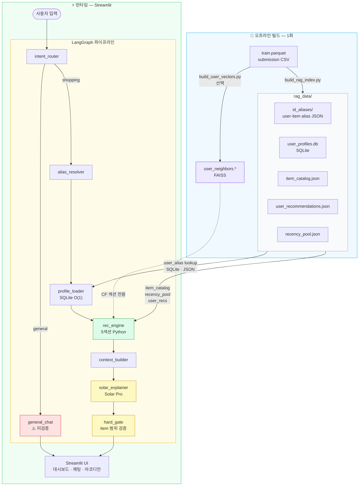
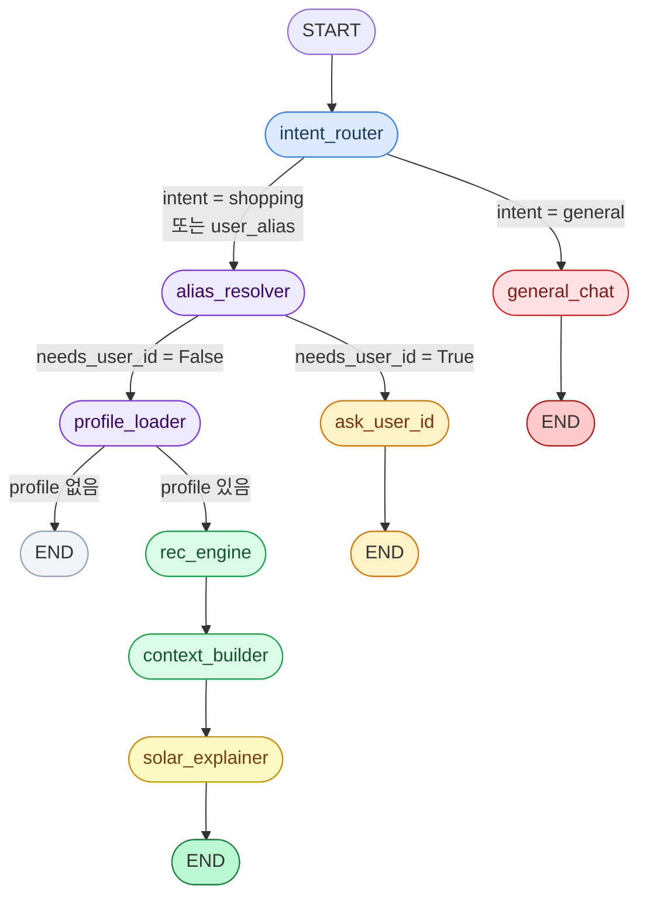

# LLM 기반 이커머스 추천 시스템 PRD

| 항목 | 내용 |
| ---- | ---- |
| 문서 버전 | 1.0 |
| 최종 수정 | 2026-05-30 |
| 작성 방식 | 최종 업데이트 시점 기준 |
| LLM | Upstage **Solar Pro** (`solar-pro3`) |
| 파이프라인 | **LangGraph** StateGraph + MemorySaver |
| UI | Streamlit (대시보드 + 채팅 + 아코디언) |

> 이 문서는 설계 의도가 아니라 **실제 구현된 것**을 기준으로 작성한 PRD입니다.  
> 설계 문서와 구현의 차이는 §11 "미구현 및 알려진 제한"에 명시합니다.

---

## 1. 제품 개요

경진대회 추천 모델 결과(`submission CSV`)와 행동 로그(`train.parquet`)를 재활용해 사용자가 채팅으로 쇼핑 추천을 받고 그 이유를 확인할 수 있는 **데모 서비스**다.

### 핵심 설계 원칙

| 원칙 | 설명 |
| ---- | ---- |
| **LLM은 고르지 않는다** | 상품 선정은 Python 규칙 엔진이 전담. LLM은 사유 설명만 담당 |
| **hallucination 방지** | `hard_gate`가 후보 범위 밖 상품 언급을 코드 레벨에서 차단 |
| **alias가 표시용** | Semantic ID(`shoes.keds.kapika.mid_0001`)는 UI·prompt 간결성 목적. 속성 추론은 카탈로그 JSON 필드만 허용 |
| **shopping만 검증** | 쇼핑 경로는 `hard_gate` → (선택) SelfCheckGPT → Calibration. 일반 대화는 ⚠️ 미검증 배지 |

---

## 2. 시스템 아키텍처



> **RAG 정의**: `user_alias` 키 기반 SQLite·JSON 직접 lookup. 벡터 검색 없음. FAISS는 CF 섹션(유사 유저) 전용.

---

## 3. 데이터 모델

### 3.1 ID 별칭 (Alias) 시스템

원본 UUID를 UI·채팅·LLM prompt에 노출하지 않는다. 오프라인 1회 생성.

#### User Alias

| 필드 | 예시 | 설명 |
| ---- | ---- | ---- |
| `user_id` (원본) | `0b517454-e7c3-...` | 내부 lookup 전용 |
| `user_alias` | `user_00001` | 채팅 파싱, LangGraph state, SQLite PK |
| `display_name` | `김민지` | dropdown 표시 전용 (중복 있음, 채팅 파싱 미사용) |

채팅 입력 파싱은 `user_\d+` 패턴만 허용. 한국어 이름 단독 입력은 `ask_user_id` 노드가 안내로 처리.

#### Item Alias (Semantic ID)

포맷: `{L2}[.{L3}].{brand_slug}.{price_bucket}_{seq:04d}`

```
shoes.keds.kapika.mid_0001
tshirt.respect.mid_0042
```

- `L2`, `L3`: `category_code` 파싱 (`apparel.shoes.keds` → L2=`shoes`, L3=`keds`)
- `brand_slug`: 영숫자·언더스코어만 허용 (원본 brand는 그룹 키로 사용해 충돌 방지)
- `price_bucket`: train.parquet 전체 `price_median` p33/p66 기준 `low`/`mid`/`high`
- `seq`: `(L2, L3, brand, price_bucket)` 그룹 내 독립 시퀀스, MD5 정렬로 재현 가능

**LLM 제약**: Solar Pro system prompt에 alias 문자열에서 속성 추론 금지 명시. 속성은 반드시 카탈로그 JSON 필드(`l2`, `l3`, `brand`, `price_display`)로 전달.

### 3.2 RAG 데이터 (rag_data/)

| 파일 | 형식 | 내용 |
| ---- | ---- | ---- |
| `id_aliases/user_alias.json` | JSON | `user_id → {user_alias, display_name}` |
| `id_aliases/item_alias.json` | JSON | `item_id → {item_alias, l2, l3, brand, price_bucket, price_median, price_display}` |
| `user_profiles.db` | SQLite | `user_alias PK`, `profile_json`, `profile_text` |
| `item_catalog.json` | JSON | `item_alias → {l2, l3, brand, price_display, price_median, view_count, cart_count, purchase_count, last_seen_date}` |
| `user_recommendations.json` | JSON | `user_alias → [item_alias, ...]` (submission Top-10) |
| `recency_pool.json` | JSON | `l2 → [item_alias, ...]` (submission 인기도 순) |
| `user_neighbors.npy` | NumPy | `(N, 20)` int32, FAISS row index 기준 이웃 |
| `user_neighbors_meta.pkl` | Pickle | `{faiss_row_idx: user_alias}` |
| `user_alias_to_row.pkl` | Pickle | `{user_alias: faiss_row_idx}` |

### 3.3 User Profile (SQLite)

`profile_json`에 저장되는 필드:

| 필드 | 설명 |
| ---- | ---- |
| `top_categories_l2` | 선호 L2 카테고리 Top-5 (view/cart/purchase 가중 빈도) |
| `top_brands` | 선호 브랜드 Top-5 |
| `price_range` | `{p25, p75}` — 가격대 필터 기준 |
| `activity_level` | `{total_events, recent_14d}` |
| `recent_items` | 최근 10개 상품 (item_alias + event_type) |
| `seen_items` | `{item_alias: {score, event_count, last_event_type, last_event_date}}` |
| `cart_items` | 장바구니에 담았지만 미구매 상품 |
| `purchased_items` | 구매 이력 `[{item_alias, purchase_date}]` |

이벤트 가중치: `view=1.0`, `cart=25.0`, `purchase=50.0` (TIFU-KNN·리랭커와 동일).

`profile_text`: Solar Pro 주입용 한국어 텍스트 (`[사용자 프로필 — 김민지 (user_00001)]` 형식).

---

## 4. LangGraph 파이프라인

### 4.1 GraphState 스키마

```python
class GraphState(TypedDict, total=False):
    message:               str
    intent:                Optional[Literal["shopping", "general", "user_alias"]]
    user_alias:            Optional[str]
    needs_user_id:         bool
    korean_name_detected:  bool
    profile:               Optional[dict]
    candidates:            Optional[dict]
    context_text:          Optional[str]
    requested_category:    Optional[str]     # 메시지 파싱: "shirt", "shoes", "clothing" 등
    requested_price_filter: Optional[str]   # "cheaper" | "pricier" | None
    requested_section:     Optional[str]    # "recency" | "revisit" | None
    explanation:           Optional[dict]   # {sections: {top10, content, recency, revisit}}
    trust_passed:          Optional[bool]
    groundedness:          Optional[float]  # SelfCheckGPT (없으면 None)
    response:              Optional[str]
```

MemorySaver가 `thread_id`별로 상태를 자동 누적 — 멀티턴 대화 지원.

### 4.2 그래프 구조



**조건부 엣지 요약**

| 출발 노드 | 조건 | 도착 노드 |
| --------- | ---- | --------- |
| `intent_router` | `intent == "general"` | `general_chat` |
| `intent_router` | `intent in ("shopping", "user_alias")` | `alias_resolver` |
| `alias_resolver` | `needs_user_id == True` | `ask_user_id` |
| `alias_resolver` | `needs_user_id == False` | `profile_loader` |
| `profile_loader` | `profile is None` | `END` |
| `profile_loader` | `profile is not None` | `rec_engine` |

고정 엣지: `rec_engine → context_builder → solar_explainer → END`

### 4.3 노드별 역할

| 노드 | Solar Pro 호출 | 역할 |
| ---- | -------------- | ---- |
| `intent_router` | 조건부 (키워드 미매칭 시) | 3-class 의도 분류 + 카테고리/가격/섹션 추출 |
| `alias_resolver` | 없음 | `user_\d+` 패턴 추출, 멀티턴 alias 유지 |
| `profile_loader` | 없음 | SQLite O(1) 프로필 조회 |
| `rec_engine` | 없음 | 5섹션 후보 생성 + dedup |
| `context_builder` | 없음 | 프로필 + 후보 → prompt context 조립 |
| `solar_explainer` | 1회 | JSON 사유 생성 + hard_gate 검증 |
| `general_chat` | 1회 | 일반 대화 응답 |
| `ask_user_id` | 없음 | alias 입력 요청 메시지 |

### 4.4 의도 분류 — 3단계 우선순위

```python
# 0순위: 이미 user_alias 있음 + 쇼핑 키워드 + 비쇼핑 단어 없음 → shopping 즉시
# 1순위: user_\d+ 패턴 감지 → user_alias (API 없음)
# 2순위: SHOPPING_KEYWORDS 매칭 + _NON_SHOPPING_OVERRIDE 없음 → shopping (API 없음)
# 3순위: Solar Pro 3-class 분류 (max_tokens=10, temperature=0.0)
```

카테고리 키워드 추출 (25개+), 가격 방향 (`cheaper`/`pricier`), 섹션 요청 (`recency`/`revisit`)도 `intent_router`에서 동시에 처리.

---

## 5. 추천 엔진 (5섹션)

### 5.1 섹션 구성

| # | 섹션 키 | UI 라벨 | 후보 소스 | dedup |
| - | ------- | ------- | --------- | ----- |
| 0 | `top10` | 모델 추천 Top-10 (대시보드) | submission 순위 그대로 | dedup 기준점 |
| 1 | `collaborative` | 👥 비슷한 분들이 산 | FAISS Top-20 이웃의 purchase/cart 점수 합산, unseen 필터 | unseen 풀 |
| 2 | `content` | 🎯 내 취향 | 카테고리(×2)·브랜드·가격대 affinity, unseen 필터 | unseen 풀 |
| 3 | `recency` | 🆕 새로 나온 | recency_pool − seen_items, 4단계 fallback | unseen 풀 |
| 4 | `revisit` | 🔄 다시 볼 만한 | seen_items revisit score (temporal decay 적용) | 독립(seen 풀) |

**섹션 숨김 규칙**:
- `collaborative`: FAISS 파일 3개 모두 없으면 빈 리스트 반환 → 섹션 미표시
- `revisit`: `seen_items` < 3개면 빈 리스트 반환 → 섹션 미표시

### 5.2 Dedup 우선순위 (unseen 풀)

```
top10 > collaborative > content > recency
```

Revisit은 seen 풀이므로 dedup 대상 외. `dedup_with_expand(max_expand=2)`: 후보 부족 시 k+5씩 최대 2회 확장.

### 5.3 가격 재질의 필터

"더 싼"/"더 고급" 요청 시 이전 추천 상위 5개의 중앙값 기준 ±20% 필터를 `effective_catalog`에 적용. `top10`·CF·content·recency·revisit 전 섹션에 일관 적용.

### 5.4 카테고리 오버라이드

"신발 추천해줘" 등 카테고리 키워드 감지 시 `effective_profile["top_categories_l2"]`를 해당 L2로 교체. "옷/패션/코디" → `_CLOTHING_L2` (신발 제외 의류 전체)로 확장.

### 5.5 revisit 점수

```python
score = Σ (event_weight × temporal_decay(last_event_date))
# event_weight: view=1.0, cart=25.0, purchase=50.0
# temporal_decay: exp(−λ × days_since_event)  (오프라인 사전 계산)
```

데이터 기준일 = `seen_items` 내 최근 `last_event_date`. 최근 14일 이내 구매 상품 제외 (`REVISIT_EXCLUDE_DAYS=14`, 환경 변수로 변경 가능).

---

## 6. Solar Pro 연동

### 6.1 API 설정

```python
client = OpenAI(
    api_key=UPSTAGE_API_KEY,
    base_url="https://api.upstage.ai/v1",
)
model = "solar-pro3"   # SOLAR_MODEL 환경 변수로 오버라이드 가능
```

### 6.2 3가지 역할

| 역할 | 메서드 | temperature | max_tokens | 응답 형식 |
| ---- | ------ | ----------- | ---------- | --------- |
| 의도 분류 | `classify_intent()` | 0.0 | 10 | `"shopping"` \| `"user_alias"` \| `"general"` |
| 추천 사유 | `explain_recommendations()` | 0.3 | 300 | JSON (`{"sections": {...}}`) |
| 일반 대화 | `general_chat()` | 0.7 | 512 | 자유 텍스트 |

### 6.3 추천 사유 프롬프트 구조

System prompt 핵심 규칙:
1. `[추천 후보]`에 있는 상품만 언급
2. item alias 문자열에서 속성 추론 금지 (카탈로그 메타데이터만 사용)
3. 각 reason = 유저 프로필 기반 한국어 2문장
4. 응답 형식 고정: `{"sections": {"top10": [...], "content": [...], "recency": [...], "revisit": [...]}}`

Context 조립 (`context_builder`):
```
[유저: 김민지 (user_00001)]
{profile_text}
[요청 카테고리/가격 조건 — 있을 때만]
[추천 후보]
[content]
- shoes.keds.kapika.mid_0001 | 카테고리: 신발 > 케즈 | 브랜드: kapika | 가격: 72,000원
...
위 후보 상품에 대해 섹션별 추천 사유를 JSON으로 작성하세요.
```

### 6.4 JSON 파싱

`_parse_json()`: 순수 JSON → 코드블록(`\`\`\`json ... \`\`\``) → 정규식(`{.*}`) 순서로 시도.

---

## 7. 신뢰성 검증 (trust_gate)

### 7.1 hard_gate

쇼핑 경로의 모든 Solar Pro JSON 응답을 코드 레벨에서 검증.

```python
검사 항목 (하나라도 실패 → passed=False, fallback 응답 표시):
1. explanation이 None이거나 'sections' 키 없음
2. 각 섹션이 list 타입인지 확인
3. 각 item이 dict 타입인지 확인
4. item_alias가 candidates 범위 밖 → 환각으로 차단 (결정적)
```

완화 항목: `reason` 빈 문자열은 차단하지 않음 (UI에서 숨김 처리).

미구현 (P4 이후 예정):
- Evidence Pack `evidence_ref` 화이트리스트 검사
- truthy 값 검사
- bool 모순 검사

### 7.2 SelfCheckGPT (P4, 선택)

arXiv:2303.08896 방식을 쇼핑 도메인에 적용.

```
1. 동일 context로 N회(기본 2회) 추가 설명 생성
2. 원본 ↔ 각 샘플 일관성 측정:
   - item-level: Jaccard(아이템 집합)
   - reason-level: 키워드 F1 (2자 이상 토큰, 공통 아이템만)
3. groundedness = 0.7 × item_Jaccard + 0.3 × reason_F1
```

Streamlit 사이드바 토글로 활성화. 쇼핑 추천 + hard_gate 통과 시에만 실행.

### 7.3 Calibration (P4, 선택)

Guo et al. 2017 Temperature Scaling:

```python
# ECE = Σ_bins |acc(bin) - conf(bin)| × |bin| / N
# calibrated = sigmoid(logit(groundedness) / T)
# T 최적화: NLL 최소화 (경사하강법 200 steps)
```

`rag_data/calibration.json`에 T 저장. UI에서 보정된 Groundedness 점수 표시.

---

## 8. 평가 파이프라인 (P4, eval/)

### 8.1 Golden Set

`golden_set.py --build --n N`: 샘플 유저에게 추천 + Solar Pro 응답 생성 후 JSON 저장.

### 8.2 LLM-as-Judge

Solar Pro가 추천 설명을 1~5점으로 채점. `pass_threshold=3.0` 기준 회귀 테스트.

### 8.3 평가 리포트 (`eval_report.json`)

| 필드 | 설명 |
| ---- | ---- |
| `avg_judge_score` | LLM-as-Judge 평균 점수 (1~5) |
| `judge_score_dist` | 점수 분포 |
| `avg_groundedness` | SelfCheckGPT 평균 (0이면 미실행) |
| `ece_before` / `ece_after` | Calibration 전/후 ECE |
| `temperature` | Temperature Scaling T |
| `pass_threshold` | `avg_judge_score >= 3.0` 여부 |

---

## 9. Streamlit UI

### 9.1 레이아웃

```
[사이드바]               [메인 — 상단] 모델 추천 Top-5 카드 + evidence chips
  - 유저 선택 dropdown      - ✅ / ⚠️ 배지
  - 프로필 요약              [메인 — 하단 좌] 채팅
  - 데모 시나리오 버튼          - 채팅 히스토리
  - 대화 초기화 버튼            - 프리셋 버튼 5개
  - SelfCheckGPT 토글       [메인 — 하단 우] 추천 목록 accordion
  - Golden Set 평가 결과       - 🎯 내 취향
                               - 🆕 새로 나온
                               - 🔄 다시 볼 만한
                               - 👥 비슷한 분들이 산
```

### 9.2 Evidence Chips

카드/아코디언 각 상품에 표시되는 신호 배지:

| 칩 | 조건 |
| -- | ---- |
| `💵 가격대` | `price_median` ∈ `[p25 − 0.5×IQR, p75 + 0.5×IQR]` |
| `🧭 선호 브랜드` | `brand` ∈ `top_brands` |
| `🧭 선호 카테고리` | `l2` ∈ `top_categories_l2` (브랜드 칩 없을 때) |
| `📈 인기↑` | `cart_count / view_count > 0.005` |
| `👥 유사 유저` | CF 섹션 전용 |
| `🛒 이웃 구매` | CF 섹션: `purchase_count / view_count > 0.003` |
| `🛒 이웃 장바구니` | CF 섹션: `cart_count / view_count > 0.005` |

### 9.3 세션 관리

- `thread_id`: 세션 초기화·유저 변경 시 UUID 재생성
- `last_result`: 마지막 `app.invoke()` 결과 저장 → 대시보드·아코디언 갱신
- `_prev_ua`: 유저 변경 감지용 — 변경 시 `thread_id`·messages·candidates 초기화

### 9.4 프리셋 버튼

| 버튼 | 전송 메시지 |
| ---- | ----------- |
| ❓ 왜? | "방금 추천한 상품들을 왜 나한테 추천했어?" |
| 💭 살까? | "추천 상품 중에 뭘 사면 좋을지 골라줘" |
| 💰 더 싼? | "비슷하지만 더 저렴한 상품은 없어?" |
| 💎 더 고급? | "더 프리미엄 고급 상품으로 추천해줘" |
| 🎯 취향? | "내 취향에 딱 맞는 다른 상품 더 알려줘" |

---

## 10. 오프라인 빌드

### 10.1 build_rag_index.py

```bash
# 빠른 검증 (1,000명 샘플, FAISS 제외, ~5분)
python src/mvp/build_rag_index.py \
  --submission outputs/submission_reranker_lgbm.csv \
  --skip-faiss --sample 1000

# 전체 빌드 FAISS 제외 (~55분)
python src/mvp/build_rag_index.py \
  --submission outputs/submission_reranker_lgbm.csv \
  --skip-faiss
```

환경 변수:
- `PRICE_SCALE` (기본 `1000`): `price_median` × 배율 → `price_display` 생성
- `RECENCY_DAYS` (기본 `14`): recency_pool 기준 최근 N일

### 10.2 build_user_vectors.py

```bash
# CF 섹션용 FAISS 인덱스 (별도 실행)
python src/mvp/build_user_vectors.py --full   # 전체 638K
```

유저 벡터: L2 카테고리 17차원 + 브랜드 one-hot, L2 정규화 후 내적 = 코사인 유사도.

### 10.3 현재 빌드 상태

> DB·FAISS 모두 **1,000명 샘플** 완료. `user_neighbors.npy` 78 KB.  
> 전체 638K 빌드 시 DB ~2.5분, FAISS `IndexFlatIP` 기준 수 시간 소요.

---

## 11. 미구현 및 알려진 제한

| 항목 | 설명 |
| ---- | ---- |
| **Evidence Pack** | `rag_data/evidence_pack.jsonl` 및 `evidence_pack.py` — 설계 문서(`LLM_RECSYS_SERVICE_PLAN.md`)에는 정의되어 있으나 코드·데이터 미구현. 현재 chips는 카탈로그·프로필 필드에서 직접 계산 |
| **hard_gate 완전판** | item_alias 범위 검사만 구현. Evidence Pack 기반 `evidence_ref` 화이트리스트·truthy·bool 모순 검사는 미구현 |
| **전체 유저 빌드** | 현재 1,000명 샘플. 전체 638K는 빌드 시간(DB ~2.5분, FAISS 수 시간) 이슈 |
| **멀티턴 재질의** | 가격(`cheaper`/`pricier`) 및 카테고리 오버라이드는 구현됨. "다른 브랜드는?" 등 브랜드 기반 재질의는 미구현 |
| **실시간 행동 반영** | 2020-02-29 기준 고정 데이터 |
| **display_name 채팅 입력** | `user_00001` 형식만 허용. 한국어 이름 직접 입력 시 안내 메시지만 반환 |
| **온라인 A/B 평가** | 오프라인 proxy(groundedness/judge 점수)만 가능 |

---

## 12. 모듈 구조

```
recsys/
├── src/mvp/
│   ├── id_alias.py           # build_user_aliases(), build_item_aliases()
│   ├── user_profile.py       # 프로필 집계 → user_profiles.db
│   ├── build_rag_index.py    # 오프라인 인덱스 빌드 (Phase 0)
│   ├── build_user_vectors.py # FAISS 유사 유저 인덱스 (별도 실행)
│   ├── recommenders.py       # 5섹션 추천 + dedup + 가격 필터
│   ├── trust_gate.py         # hard_gate: JSON 구조 + item 범위 검사
│   ├── solar_client.py       # SolarClient: classify / explain / chat
│   ├── graph_state.py        # GraphState TypedDict
│   ├── nodes.py              # LangGraph 노드 8개 + 응답 포맷터
│   ├── graph.py              # StateGraph 조립 + 전역 컴파일 (app)
│   ├── category_ko.py        # L2/L3 코드 → 한국어 카테고리명
│   ├── self_check.py         # SelfCheckGPT groundedness (P4)
│   ├── calibration.py        # Temperature Scaling ECE 보정 (P4)
│   └── eval/
│       ├── golden_set.py     # Golden Set 생성
│       └── evaluator.py      # LLM-as-Judge + groundedness + ECE
│
├── mvp_app/
│   └── app.py                # Streamlit 진입점
│
└── rag_data/                 # 오프라인 빌드 산출물 (gitignore)
```

---

## 13. 환경 변수 (.env)

| 변수 | 기본값 | 설명 |
| ---- | ------ | ---- |
| `UPSTAGE_API_KEY` | (필수) | Solar Pro API 키 |
| `UPSTAGE_BASE_URL` | `https://api.upstage.ai/v1` | API 엔드포인트 |
| `SOLAR_MODEL` | `solar-pro3` | 사용 모델 |
| `SOLAR_TEMPERATURE_EXPLAIN` | `0.3` | 추천 사유 생성 temperature |
| `SOLAR_TEMPERATURE_CHAT` | `0.7` | 일반 대화 temperature |
| `SOLAR_MAX_TOKENS_INTENT` | `10` | 의도 분류 max_tokens |
| `SOLAR_MAX_TOKENS_EXPLAIN` | `300` | 추천 사유 max_tokens |
| `PRICE_SCALE` | `1000` | price_median × 배율 → 원화 표시 |
| `RECENCY_DAYS` | `14` | recency_pool 기준 최근 N일 |
| `REVISIT_EXCLUDE_DAYS` | `14` | revisit에서 최근 구매 제외 기간 |

---

## 14. 실행 요약

```bash
# 1. 의존성
pip install -r requirements_mvp.txt

# 2. 환경 변수
cp .env.template .env  # UPSTAGE_API_KEY 설정

# 3. RAG 빌드 (최초 1회)
python src/mvp/build_rag_index.py \
  --submission outputs/submission_reranker_lgbm.csv \
  --skip-faiss --sample 1000

# 4. 앱 실행
streamlit run mvp_app/app.py

# 5. (선택) CF 섹션용 FAISS 빌드
python src/mvp/build_user_vectors.py --full

# 6. (선택) 평가
python src/mvp/eval/golden_set.py --build --n 20
python src/mvp/eval/evaluator.py \
  --golden rag_data/golden_set.json --self-check
```

---

*본 MVP는 RecSys 2026 경진대회 submission을 전제로 한 데모이며, 프로덕션 서비스가 아닙니다.*
