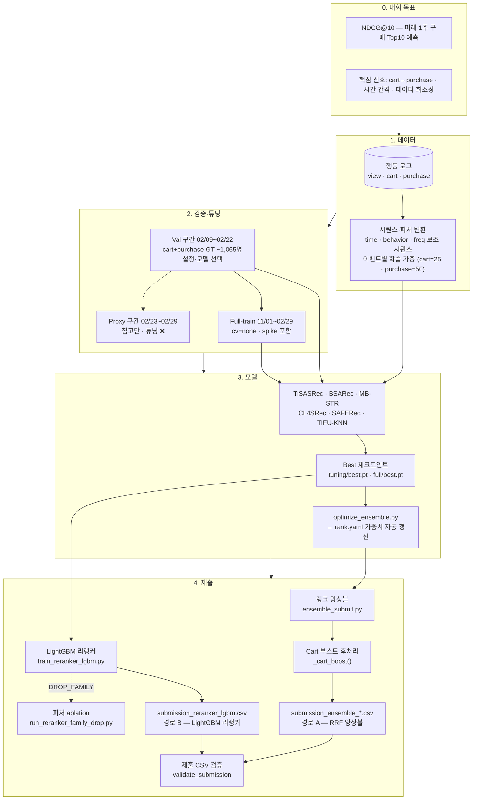

# PLAN — 추천 AI 모델링 방안

| 항목      | 내용                                                                                                                                                                                        |
| --------- | ------------------------------------------------------------------------------------------------------------------------------------------------------------------------------------------- |
| 최종 수정 | 2026-05-26                                                                                                                                                                                  |
| 하드웨어  | RTX 3090 24GB VRAM                                                                                                                                                                          |
| 개요      | 이커머스 로그(세션·시간순) 위에서 **미래 1주 구매 상품**을 **NDCG@10(이진 relevance)** 로 평가하는 경진대회. EDA 실측값·1-Fold Holdout CV·Hydra+wandb 파이프라인을 반영한 실행 가능한 플랜. |

---

## 중요 디스클레이머

1. **논문·표의 NDCG 향상 %**는 해당 논문의 데이터셋(Beauty, ML-1M 등) 결과이며, **본 경진대회 데이터와 다를 수 있음**. 모델 우선순위는 방향 참고용.
2. **대회 규정**에서 허용하는 외부 데이터·사전학습·상품 메타 사용 여부를 **반드시 확인**. 메타 기반 모델은 규정 허용 시에만 검토.
3. **`FEARec` 등 RecBole 내장 모델**은 **사용 중인 recbole 버전**에 따라 클래스명·설정키가 다를 수 있음.

---

## 하드웨어 환경

| 항목          | 사양                        | 영향                                         |
| ------------- | --------------------------- | -------------------------------------------- |
| GPU           | **NVIDIA GeForce RTX 3090** | TF32 기본 활성화, BF16/FP16 지원             |
| VRAM          | **24 GB GDDR6X**            | 이 데이터 규모에서 VRAM 제약 실질적으로 없음 |
| 메모리 대역폭 | 936.2 GB/s                  | Full-item scoring 빠름                       |

### VRAM 실측값 (hidden=256, max_seq_len=50, BF16 기준)

| 구성                                     | 사용량      | 비고                                |
| ---------------------------------------- | ----------- | ----------------------------------- |
| SASRec 학습 (batch=4096)                 | **~6 GB**   | attention [B,4,50,50] 3layer 누적   |
| TiSASRec 학습 (batch=1024)               | **~9 GB**   | time_matrix [B,50,50] einsum 추가   |
| CL4SRec 학습 (batch=2048)                | **~10 GB**  | 대조 뷰 2개 동시 활성화             |
| FEARec 학습 (batch=2048)                 | **~10 GB**  | FFT 증강 뷰 2개 동시 활성화         |
| BSARec 학습 (batch=4096)                 | **~6 GB**   | FFT 저역통과 in-place, SA와 동일   |
| SAFERec 학습 (batch=4096)                | **~6 GB**   | freq 임베딩 덧셈, SA와 동일         |
| MB-STR 학습 (batch=4096)                 | **~6 GB**   | behavior 임베딩 덧셈, SA와 동일    |
| 추론 score 행렬 (batch=32768, 29K items) | **~1.9 GB** | `[32768, 29502] × 2B`               |
| 모델 파라미터 (SASRec ~9M)               | **~17 MB**  | —                                   |
| **학습 최대 (CL4SRec/FEARec batch=2048)** | **~10 GB** | 여유 ~**14 GB**                     |

> ⚠️ batch=8192는 SASRec도 OOM. 실측 상한: **SASRec/BSARec/SAFERec/MB-STR≤4096 / CL4SRec/FEARec≤2048 / TiSASRec≤1024**.

### RTX 3090 최적 설정 원칙

1. **hidden_size=256** — 24GB 환경에서 논문 기본값 64는 불필요하게 보수적
2. **train_batch_size 모델별 기본값** — `conf/model/*.yaml` (SASRec/BSARec/SAFERec/MB-STR=4096·CL4SRec/FEARec=2048·TiSASRec=1024). OOM 시 `train.train_batch_size=` CLI 오버라이드
3. **max_seq_len=50** — p90=29 커버, 학습 속도·VRAM 균형 (p99=100은 선택 실험)
4. **AMP BF16 필수** — RTX 3090 TF32 기본 활성화, BF16으로 추가 속도·메모리 절감
5. **inference_batch=32768** — 638K 유저를 약 20배치로 처리 (~1~2분 내)
6. **앙상블 모델 전체 VRAM 상주** — 추론 시 eval 모드라 각 모델 ~17MB, 동시 상주 가능

---

## EDA 확정 사항

| 항목                  | 값                                                 | 모델 선택 영향                                                                                                                                                   |
| --------------------- | -------------------------------------------------- | ---------------------------------------------------------------------------------------------------------------------------------------------------------------- |
| 유저 수               | 638,257                                            | 제출 = 학습 유저, 폴백 불필요                                                                                                                                    |
| 아이템 수             | **29,502**                                         | 단일 스테이지 full-item scoring 가능                                                                                                                             |
| 인터랙션 수           | 8,350,311                                          | —                                                                                                                                                                |
| 희소성                | **99.9557%**                                       | CL4SRec ★★★ — 상위 1% 아이템이 인터랙션 25.1%, 상위 10%가 63.4% 커버(극단적 롱테일)                                                                              |
| 전체 기간             | 120일 (2019-11-01 ~ 2020-02-29)                    | 1-Fold Holdout 설계 기준                                                                                                                                         |
| 세션 수               | **2,889,552** (유저당 중앙값 2개, p90=9)           | 세션별 인터랙션 중앙값 1건 → 유저 타임라인 단위 멀티비헤이비어 모델링이 현실적                                                                                   |
| 시퀀스 길이 중앙값    | **6** (p90=29, p99=100)                            | **기본 `max_seq_len=50`** (p90 커버·학습 속도). 선택: 100 (p99, L² 4배) |
| 롱 시퀀스(>50) 유저   | **4.1%**                                           | Mamba4Rec ★☆☆ — `max_seq_len=100`일 때 초과 토큰은 과거 방향 트렁케이션                                                                                          |
| 인터랙션 희소 유저    | 1건 유저 **16.8%** (107,422명), 5건 이하 **47.5%** | CL4SRec ★★★ — 절반 가까운 유저가 극희소, augmentation 필수                                                                                                       |
| 반복 이벤트율         | **14.63%** (view 이벤트 기준, 구매 반복과 무관)    | view 빈도 기반 피처로 해석, TIFU-KNN 앙상블 보조; SAFERec EDA 자동 권고 ★★★이나 PLAN ★★☆ (view 빈도 대체 시 효과 미지수)                                         |
| 시간 간격 CV          | **4.12** (극도로 높음)                             | TiSASRec ★★★ 필수                                                                                                                                                |
| 제출 유저 ⊆ 학습 유저 | **True (100%)**                                    | 콜드 유저 전략 불필요                                                                                                                                            |

### category_code 계층 구조

**전체 데이터가 `apparel`(의류) 단일 도메인** — 24개 카테고리 모두 `apparel.*` 형태.

| 레벨   | 값                                                                                                                                                                   | 수       | 비고                                             |
| ------ | -------------------------------------------------------------------------------------------------------------------------------------------------------------------- | -------- | ------------------------------------------------ |
| **L1** | `apparel`                                                                                                                                                            | **1종**  | 전 아이템 동일 → 임베딩 불필요                   |
| **L2** | `shoes`, `tshirt`, `dress`, `jeans`, `jacket`, `shirt`, `trousers`, `skirt`, `jumper`, `underwear`, `shorts`, `pajamas`, `glove`, `scarf`, `belt`, `sock`, `costume` | **17종** | 핵심 피처 — 의류 유형                            |
| **L3** | `keds`, `moccasins`, `sandals`, `ballet_shoes`, `espadrilles`, `slipons`, `step_ins`                                                                                 | **7종**  | `shoes` 하위에만 존재, 나머지 카테고리는 L3 없음 |

```python
df['cat_l1'] = df['category_code'].str.split('.').str[0]   # 항상 'apparel' → 제거
df['cat_l2'] = df['category_code'].str.split('.').str[1]   # 17종 — 핵심
df['cat_l3'] = df['category_code'].str.split('.').str[2]   # shoes 하위 7종, 나머지 NaN
df['cat_l3'] = df['cat_l3'].fillna('none')
```

**의류 도메인 특이성**:

- **아웃핏 완성**: jacket 구매 후 → shirt·trousers·belt 연관 구매 패턴 실재
- **신발 세부 취향**: sandals 선호 유저 vs keds 선호 유저 — L3로 포착 가능
- **계절성**: 120일 기간이 Nov~Feb(가을→겨울→초봄) — jacket·glove·scarf 수요 집중 → 시간 간격 CV=4.12와 연결
- **브랜드 충성도**: 의류에서 브랜드 선호 매우 강함 (brand 1,859종 → UNK 처리 후 활용 가치 높음)

### event_type 분포

| event_type   | 전체 비율  | 세션 지배 비율 | 의미                                                            |
| ------------ | ---------- | -------------- | --------------------------------------------------------------- |
| **view**     | **99.78%** | 99.53%         | interest 탐색 시그널 — 구매 전환율 ~0.008%                      |
| **cart**     | **0.20%**  | 0.40%          | **핵심 구매 의향 시그널 — 구매 전환율 ~3.8% (view 대비 475배)** |
| **purchase** | **0.02%**  | 0.06%          | 실제 구매 — 독립 학습 불가                                      |

- 세션의 **99.76%**가 단일 event_type만 포함 — 한 세션 안의 깔때기보다 **유저 전체 타임라인**(여러 세션·여러 시점)에서의 멀티비헤이비어 모델링이 현실적으로 맞음
- **핵심 가설**: **cart → purchase**가 구매를 설명하는 주된 메커니즘. view는 interest 탐색 신호이며 구매 전환율이 극히 낮음. cart에 담긴 아이템 중 아직 purchase하지 않은 것이 추천 1순위 후보.
- **학습 전략**: 전체 이벤트(view+cart+purchase) 그대로 사용. cart를 purchase의 직접 전조 시그널로 취급. purchase-only 필터 없음.
- **반복 이벤트율 14.63%**: view 반복 패턴 수치. SAFERec 빈도 피처 = **view 빈도**로 정의.
- **competition ground truth (가설)**: 테스트 구간의 purchase 이벤트 또는 cart+purchase를 정답으로 사용할 가능성 — **cart→purchase 전환 예측**이 핵심인 크로스-비헤이비어 추천 문제로 가정

### ⚠️ Feb 27~29 Purchase Spike — 비정상적 농도 집중 (실제 데이터 확인됨)

EDA 결과, **전체 purchase(2,076건)의 69.3%가 Feb 27~29 단 3일에 집중**되는 비정상 패턴이 확인됨. **실제 구매 데이터임이 확인**되었으므로 학습에 포함.

| 지표                                 | 정상 기간   | Feb 27~29                  | 해석                                              |
| ------------------------------------ | ----------- | -------------------------- | ------------------------------------------------- |
| purchase-only 세션 비율              | 0.003~0.15% | **12.6%**                  | 정상 대비 80~4,000배 — 단기간 구매 집중           |
| 세션 내 이벤트 간격 중앙값           | —           | **0초**                    | 매우 빠른 연속 구매 (모바일/이벤트 기반 추정)     |
| purchase 유저 중 같은 날 view한 비율 | —           | **1.6%**                   | 사전 브라우징 없이 직접 구매 패턴                 |
| 이전 cart → spike 구매 전환          | —           | **2.5%**                   | 사전 cart 없이 구매 — 정상 기간 ~3.8%보다 낮음    |
| spike 구매 아이템의 정상 기간 겹침   | —           | **17.9%**                  | 82.1%가 신규 아이템 (특정 프로모션/이벤트 추정)   |
| 상위 구매 브랜드                     | 의류 브랜드 | **xiaomi·sony·apple·iqos** | 비apparel 브랜드 집중 — 특정 이벤트성 구매로 해석 |

**결론**: Feb 27~29 purchase는 **실제 데이터**이나 특정 이벤트/프로모션에 의한 단기 집중 구매 패턴으로 판단. 학습 데이터에 포함하여 리더보드 테스트 기간과 분포를 일치시키는 것이 기본 전략.

#### 데이터 처리 전략

```python
SPIKE_DATES = {'2020-02-27', '2020-02-28', '2020-02-29'}

df['is_spike_purchase'] = (
    (df['event_type'] == 'purchase') &
    (df['event_time'].dt.date.astype(str).isin(SPIKE_DATES))
)

train_clean = df   # 전체 데이터 학습 (spike purchase 포함 — 기본)
pseudo_gt   = df[df['is_spike_purchase']]    # leaderboard_proxy 전용 (1,437건 / 1,105명)
```

| 실험         | 학습 데이터                | 비고                                   |
| ------------ | -------------------------- | -------------------------------------- |
| **기본**     | 전체 `df` (spike 포함)     | 실제 데이터 전체 학습 — **기본값**     |
| **ablation** | `train_clean` (spike 제거) | spike 패턴 영향도 측정용 — 선택적 비교 |

### event_type 가중 손실 전략 (Loss 레이어)

view 99.78% / cart 0.20% / purchase 0.02%의 극단적 불균형을 Loss 단에서 보정. **cart→purchase가 핵심 메커니즘**이므로 cart 가중치를 단순 빈도 보정이 아닌 구매 예측력 기준으로 상향.

#### 전략 A: event_type별 샘플 가중치 (권장)

```python
EVENT_LOSS_WEIGHTS = {
    'view':     1.0,
    'cart':     25.0,   # cart→purchase 전환율이 view의 475배 — 핵심 신호로 취급. sweep 범위: 10~50
    'purchase': 50.0,   # 실제 구매 최고 가중치. cart와 gap을 좁혀 cart의 예측력 강조
}

# batch_event_types: 각 배치 샘플의 타겟 아이템(다음 예측 대상) event_type
loss_weights = torch.tensor(
    [EVENT_LOSS_WEIGHTS[et] for et in batch_event_types], device=device
)
loss = (criterion(logits, targets) * loss_weights).mean()
```

#### 전략 B: Focal Loss 적용 (대안)

```python
class FocalLoss(nn.Module):
    def __init__(self, gamma: float = 2.0):
        super().__init__()
        self.gamma = gamma

    def forward(self, logits, targets):
        ce = F.cross_entropy(logits, targets, reduction='none')
        pt = torch.exp(-ce)
        return ((1 - pt) ** self.gamma * ce).mean()
```

**적용 우선순위**:

- MB-STR / 멀티비헤이비어 모델 실험 시 **전략 A 필수**
- 단일 시퀀스 모델(TiSASRec·SASRec 등)에서는 **전략 B** 또는 cart/purchase 위치에만 가중치 부여
- YAML에 `loss_weights: {view: 1.0, cart: 25.0, purchase: 50.0}` 로 노출하여 wandb sweep 대상으로 관리 (cart sweep 범위: 10~50)

---

## 구현 현황 (2026-05-27 기준)

### 완료된 파일

| 파일                            | 상태 | 비고                                                                                      |
| ------------------------------- | ---- | ----------------------------------------------------------------------------------------- |
| `conf/config.yaml`              | ✅   | Hydra 최상위 설정, wandb 프로젝트 `recsys-2026`                                           |
| `conf/data/base.yaml`           | ✅   | spike 포함 기본, `exclude_spike_purchase: false`                                          |
| `conf/data/spike_excluded.yaml` | ✅   | ablation 비교용                                                                           |
| `conf/cv/single_holdout.yaml`   | ✅   | val_start=2020-02-09, val_end=2020-02-23                                                  |
| `conf/train/base.yaml`          | ✅   | epochs=20, lr=0.001, train_batch_size=${model.train_batch_size}, loss_weights            |
| `conf/model/sasrec.yaml`        | ✅   | hidden=256, n_layers=3, n_heads=4, max_seq_len=50, train_batch_size=4096                   |
| `conf/model/tisasrec.yaml`      | ✅   | max_seq_len=50, time_span=512, train_batch_size=1024                                      |
| `conf/model/cl4srec.yaml`       | ✅   | + lmd=0.1, tau=1.0, aug_ratios=0.2, train_batch_size=2048                                 |
| `conf/model/fearec.yaml`        | ✅   | lmd=0.1, tau=1.0, freq_mask_ratio=0.3, train_batch_size=2048                              |
| `conf/model/bsarec.yaml`        | ✅   | FFT 저역통과 + SA 혼합, train_batch_size=4096                                             |
| `conf/model/saferec.yaml`       | ✅   | n_freq_buckets=64, train_batch_size=4096                                                  |
| `conf/model/mbstr.yaml`         | ✅   | view/cart/purchase 행동 타입 임베딩, train_batch_size=4096                                |
| `conf/ensemble/rank.yaml`       | ✅   | 8개 모델 가중치, cart_boost, TIFU-KNN 하이퍼파라미터                                     |
| `src/cv/holdout.py`             | ✅   | `make_holdout`, `build_gt`, `build_leaderboard_proxy_gt`                                  |
| `src/metrics.py`                | ✅   | `ndcg_at_k`, batched `evaluate` (BF16 AMP, full-item scoring, freq/behavior/time 지원)    |
| `src/data/dataset.py`           | ✅   | `load_data`, `build_vocab`, `build_sequences`, `SeqTrainDataset`                          |
| `src/data/features.py`          | ✅   | `build_time_seq`, `build_freq_seq`, `compute_item_freq`, `build_behavior_seq` + Dataset 클래스 (MB-STR `SeqTrainDatasetWithBehavior` 패딩 3으로 수정) |
| `src/models/sasrec.py`          | ✅   | Pre-LN, causal mask only (key_padding_mask 제거 — NaN 방지), BPR loss                     |
| `src/models/tisasrec.py`        | ✅   | log-scale time bucketing, [B,L,L] time_matrix einsum                                      |
| `src/models/cl4srec.py`         | ✅   | crop/mask/reorder, InfoNCE in-batch negatives                                             |
| `src/models/fearec.py`          | ✅   | FFT rfft/irfft 주파수 증강, InfoNCE 대조학습 (SIGIR 2023)                                 |
| `src/models/bsarec.py`          | ✅   | BSARecLayer: SA + FFT 저역통과 혼합, learnable α (AAAI 2024)                              |
| `src/models/saferec.py`         | ✅   | SASRec + view 빈도 임베딩 (log-scale 64-bucket)                                           |
| `src/models/mbstr.py`           | ✅   | SASRec + view/cart/purchase 행동 타입 임베딩 (padding_idx=3)                              |
| `src/models/tifu_knn.py`        | ✅   | 비신경망, 그룹 기반 시간 감쇠 스코어 (TIFU-KNN) — `predict()` top_k 보장 수정             |
| `src/models/__init__.py`        | ✅   | `build_model(cfg, n_items)` factory (8개 모델 등록)                                       |
| `src/train.py`                  | ✅   | Hydra 진입점, 전체 파이프라인 (saferec/mbstr/tisasrec 보조 시퀀스 지원)                   |
| `src/train_tifu.py`             | ✅   | TIFU-KNN 전용 학습·예측 스크립트 → `outputs/tifu_knn/preds.pkl`                          |
| `src/optimize_ensemble.py`      | ✅   | Val 기준 랜덤 서치 앙상블 가중치 최적화 → `conf/ensemble/rank.yaml` 자동 갱신            |
| `src/ensemble.py`               | ✅   | `rank_ensemble()` — reciprocal rank fusion                                                |
| `src/inference.py`              | ✅   | `generate_predictions` (time/freq/behavior 보조 시퀀스 지원), `generate_submission_long`, `validate_submission` (n_users 필수 인자) |
| `src/ensemble_submit.py`        | ✅   | 랭크 앙상블 + `_cart_boost()` 후처리 → submission CSV (active_models를 rank.yaml에서 동적 파생) |
| `src/submit.py`                 | ✅   | 단일 모델 체크포인트 로드 → submission CSV (tisasrec·saferec·mbstr 보조 시퀀스 자동 선택) |
| `src/train_reranker_lgbm.py`    | ✅   | LightGBM LambdaMART 리랭커: tuning 예측 → 메타 데이터셋 빌드 → 학습 → full 예측 리랭킹 → `submission_reranker_lgbm.csv` |
| `src/run_reranker_family_drop.py` | ✅ | 피처 그룹 ablation 래퍼: `DROP_FAMILY` 환경변수로 popularity / tifu_rank / user_activity 피처 패치 후 리랭커 재실행 |

### Val NDCG@10 실험 결과 (cart+purchase GT = 1,065명)

| 모델 | best NDCG@10(cp) | best epoch | early stop epoch | 설정 | wandb run | ckpt |
|------|-----------------|-----------|-----------------|------|-----------|------|
| SASRec | **0.1541** | 10 | 14 | seq=50, batch=4096 | `9tzv2dyc` | `outputs/sasrec/run003_260520/tuning/best.pt` |
| TiSASRec | **0.1501** | 1 | 6 (patience=5) | seq=50, batch=1024, ~1119s/ep | `pzjvy1b6` | `outputs/tisasrec/run001_260520/tuning/best.pt` |
| CL4SRec | **0.1469** | 9 | 14 (patience=5) | seq=100, batch=2048, ~1617s/ep | `qdtlewun` | `outputs/cl4srec/run001_260520/tuning/best.pt` |
| FEARec | — | — | — | seq=50, batch=2048 | — | — |
| BSARec | **0.1450** | 1 | 6 (patience=5) | seq=50, batch=4096 | — | `outputs/bsarec/run001_260526/tuning/best.pt` |
| SAFERec | — | — | — | seq=50, batch=4096 | — | — |
| MB-STR | **0.1527** | 3 | 8 (patience=5) | seq=50, batch=4096 | — | `outputs/mbstr/run001_260526/tuning/best.pt` |

**Full-train `train.epochs` (0-index `best_epoch + 1`):** SASRec **11** · TiSASRec **2** · CL4SRec **10** · BSARec **2** · MB-STR **4** (early stop epoch 아님).

**관찰**:
- TiSASRec(0.1501) ≈ SASRec 스모크(0.1513) — 시간 정보가 미미한 추가 효과. epoch 1이 best이고 이후 loss는 계속 하락하지만 ndcg_cp는 정체 → 더 긴 patience(예: 10~20)로 재실험 여지 있음
- CL4SRec(0.1469) < TiSASRec — seq_len=100 사용으로 epoch당 ~27min. 대조학습 loss(InfoNCE)가 1.0 수준에서 매우 느리게 개선되며 epoch 9에야 best 도달 → lmd 및 tau 튜닝 여지 있음
- BSARec(0.1450) — SASRec·TiSASRec 대비 소폭 낮음. epoch 1 best·early stop 6 → Full-train **2** epoch
- MB-STR(0.1527) — 5모델 중 **최고**. cart/purchase 행동 임베딩이 cart+purchase GT와 정합. epoch 3 best·early stop 8 → Full-train **4** epoch
- 딥 모델 Val 0.145~0.154 대 — 앙상블·MB-STR 중심 조합이 다음 단계

### 주요 버그 수정 이력

| 버그                         | 원인                                                                          | 해결                                                                                      |
| ---------------------------- | ----------------------------------------------------------------------------- | ----------------------------------------------------------------------------------------- |
| YAML 파싱 오류               | `spike_purchase_dates: ["..."]` flow sequence + Hydra 변수 interpolation 충돌 | block sequence 형식으로 변경                                                              |
| TiSASRec dtype mismatch      | `_time_bucket` 내 Long 대입 대상에 Float 할당                                 | `torch.zeros_like(..., dtype=torch.long)` 로 초기화                                       |
| CL4SRec NaN loss             | `key_padding_mask` + causal mask 이중 적용 → `softmax(-inf,...,-inf) = NaN`   | **key_padding_mask 완전 제거** (SASRec·TiSASRec·CL4SRec 전체) — 좌패딩 + causal mask only |
| CUDA OOM (SASRec batch=8192) | attention [B,H,L,L] 누적 VRAM 초과                                            | SASRec≤4096 / TiSASRec≤1024 / CL4SRec≤2048 확정                                           |
| TiSASRec positional index 오류 | ensemble_submit.py에서 SASRec max_seq_len=100 시퀀스를 TiSASRec(50)에 사용  | 모델별 seq_len 다르면 전용 시퀀스 재빌드                                                  |
| MB-STR 행동 시퀀스 패딩 불일치 | `SeqTrainDatasetWithBehavior`가 `make_padded_seq`(pad=0)로 `seq_types` 패딩 → `behavior_emb(padding_idx=3)` 불일치로 패딩 위치에서 view(0) 임베딩 오용 | `[3]*pad_len + seq_types` 수동 패딩으로 교체; `_BEHAVIOR_MAP`에 `"pad": 3` 추가 |
| `submit.py`·`proxy_eval.py` saferec·mbstr 추론 미지원 | `is_tisasrec` 분기만 존재 → saferec/mbstr 실행 시 보조 시퀀스 미전달 | saferec(`freq_sequences`)·mbstr(`behavior_sequences`) 분기 추가 |
| TIFU-KNN `predict()` top_k 미보장 | 상위 `top_k`개 슬라이스 후 `idx2item` 필터 → 필터 결과가 top_k보다 적을 수 있음 | 전체 정렬 후 필터, 마지막에 `[:top_k]` 적용 |
| `ensemble_submit.py` active_models 하드코딩 | `["sasrec", "tisasrec", "cl4srec"]` 고정 → rank.yaml 가중치 변경 미반영, 신규 모델 자동 제외 | `list(ensemble_cfg.weights.keys())`로 동적 파생 |
| `optimize_ensemble.py` torch seed 누락 | `random.seed`·`np.random.seed`만 설정, PyTorch 난수 상태 비고정 → 재현성 불완전 | `torch.manual_seed(seed)` / `torch.cuda.manual_seed_all(seed)` 추가 |
| `optimize_ensemble.py` cold-start 유저 KeyError | `val_user_ids`를 `val_df` 기준으로 뽑은 뒤 `m_val_seqs`(train_df 기준)에서 조회 → val 기간에 처음 등장한 신규 유저 KeyError | `base_seq` 빌드 이후 `[uid for uid in val_df["user_id"].unique() if uid in base_seq]` 로 필터링, 출력 메시지에 cold-start 제외 수 표기 |
| TiSASRec 추론 CUDA OOM (`optimize_ensemble.py`, `ensemble_submit.py`) | `eval_batch_size=32768`에서 `[B,L,L,hd]` 시간 행렬 2개(T_k·T_q) × 3레이어 → ~19.5 GB 요구 | TiSASRec에만 `batch_size=512` 고정 분기 추가 (`bs = 512 if model_name == "tisasrec" else cfg.eval_batch_size`) |

### 실행 명령어

```bash
# 딥 모델 튜닝 (Holdout CV)
python src/train.py model=sasrec
python src/train.py model=tisasrec
python src/train.py model=cl4srec
python src/train.py model=fearec
python src/train.py model=bsarec
python src/train.py model=saferec
python src/train.py model=mbstr

# TIFU-KNN 예측 생성
python src/train_tifu.py

# 앙상블 가중치 최적화 (Val 기준)
python src/optimize_ensemble.py

# 앙상블 제출 (cart boost 포함)
python src/ensemble_submit.py

# LightGBM LambdaMART 리랭커 학습 + 제출
python src/train_reranker_lgbm.py

# 피처 그룹 ablation (DROP_FAMILY: popularity / tifu_rank / user_activity)
DROP_FAMILY=tifu_rank     python src/run_reranker_family_drop.py
DROP_FAMILY=popularity    python src/run_reranker_family_drop.py
DROP_FAMILY=user_activity python src/run_reranker_family_drop.py
```

---

## 실행 체크리스트

### Phase 0: 환경·데이터 파악

- [x] `train.parquet` 스키마·크기·시간범위 확인 (`user_id`, `item_id`, `user_session`, `event_time`, `category_code`, `brand`, `price`, `event_type`)
- [x] `event_type` 분포 확인 → view 99.78% / cart 0.20% / purchase 0.02%
- [x] 유저·아이템 분포 분석 (롱테일, 희소성 99.96%)
- [x] 반복 이벤트 비율 계산 (14.63% — view 기준)
- [x] 세션 길이 분포 및 연속 이벤트 간격(CV=4.12) 통계 확인
- [x] `sample_submission.csv` 포맷 검증 — 롱 포맷, 638,257 × 10 = 6,382,570행
- [x] 제출 유저 ⊆ 학습 유저 확인 → True, 콜드 유저 처리 불필요
- [x] Feb 27~29 purchase spike 원인 분석 → **실제 데이터 확인됨**. 특정 이벤트/프로모션에 의한 단기 집중 구매 패턴. 학습에 포함.
- [x] RecBole 설치 버전에서 지원 모델 목록 확인 → **v1.2.0**: TiSASRec ❌(직접 구현) / CL4SRec ❌(직접 구현) / FEARec ✅(통합 작업 필요) / LightSANs ✅ / CORE ✅ / S3Rec ✅
- [ ] (선택) ALS 베이스라인으로 저비용 협업필터 강도 파악

### Phase 1: 검증 프로토콜 확립

- [x] **1-Fold Holdout CV 구현** (Train Nov 01~Feb 08 / Val Feb 09~22) — `src/cv/holdout.py`
- [x] NDCG@10 — 활성 유저 기준, cart+purchase GT 실측 **1,065명** (예상 ~1,072명) — `src/metrics.py`
- [x] wandb에 `val/ndcg_cart_purchase` (튜닝 기준) / `val/ndcg_purchase_only` (보조) 동시 로깅 — `src/train.py`
- [x] Hydra + wandb 파이프라인 연결 확인 — `owy007-/recsys-2026` 프로젝트로 실시간 로깅 중
- [ ] (선택) leaderboard_proxy 별도 평가 — 튜닝 후 참고용, 모델 선택 반영 안 함

### Phase 2: 베이스라인 강화

- [x] **SASRec 구현 완료** — `src/models/sasrec.py`. Pre-LN, causal mask only(key_padding_mask 제거 — NaN 방지), BPR loss + event-type 가중치, BF16 AMP
  - 5-epoch 스모크: best NDCG@10(cp) = **0.1513** at epoch 1
- [x] **TiSASRec 학습 완료** — max_seq_len=50, epochs=20(patience=5), 약 1119s/epoch
  - best NDCG@10(cp) = **0.1501** at epoch 1, early stop at epoch 6. wandb `pzjvy1b6` (`outputs/tisasrec/run001_260520/tuning/best.pt`)
- [x] **CL4SRec 학습 완료** — max_seq_len=100, epochs=20(patience=5), 약 1617s/epoch
  - best NDCG@10(cp) = **0.1469** at epoch 9, early stop at epoch 14. wandb `qdtlewun` (`outputs/cl4srec/run001_260520/tuning/best.pt`)
- [x] **FEARec 구현 완료** — `src/models/fearec.py`. FFT rfft/irfft 주파수 증강 + InfoNCE 대조학습 (SIGIR 2023). `conf/model/fearec.yaml`
- [ ] FEARec·SASRec 등 추가 모델 학습 및 하이퍼파라미터 튜닝

### Phase 3: 확장 모델 실험

- [x] **BSARec 구현 완료** (AAAI 2024) — `src/models/bsarec.py`. BSARecLayer: SA + FFT 저역통과 혼합, learnable α. `conf/model/bsarec.yaml`
- [x] **SAFERec 구현 완료** — `src/models/saferec.py`. view 빈도 log-scale 64-bucket 임베딩. `src/data/features.py`에 `compute_item_freq`, `build_freq_seq`, `SeqTrainDatasetWithFreq` 추가. `conf/model/saferec.yaml`
- [x] **MB-STR 구현 완료** — `src/models/mbstr.py`. view/cart/purchase 행동 타입 임베딩 (padding_idx=3). `src/data/features.py`에 `build_behavior_seq`, `SeqTrainDatasetWithBehavior` 추가. `conf/model/mbstr.yaml`
- [ ] 각 모델 실험 결과 비교 및 앙상블 대상 확정

### Phase 4: 앙상블·후처리

- [x] **TIFU-KNN 구현 완료** — `src/models/tifu_knn.py`. 그룹 기반 시간 감쇠 스코어. `src/train_tifu.py` 독립 실행 스크립트
- [x] **앙상블 가중치 최적화 스크립트 완료** — `src/optimize_ensemble.py`. Val 기준 랜덤 서치 → `conf/ensemble/rank.yaml` 자동 갱신
- [x] **Cart boost 후처리 완료** — `ensemble_submit.py`의 `_cart_boost()`. carted-but-not-purchased 아이템 Top-K 상위 이동
- [x] **랭크 앙상블 완료** — `src/ensemble_submit.py`. 8개 모델 RRF, cart boost 통합, validate_submission
- [ ] Full-train 체크포인트 기반 최종 앙상블 실행

---

## 대회·데이터와 문제 성격

- **입력**: [`data/train.parquet`](../data/train.parquet) — 8,350,311행, 120일, 638K 유저, 29,502 아이템
- **제출**: [`data/sample_submission.csv`](../data/sample_submission.csv) — `(user_id, item_id)` 롱 포맷, 유저당 정확히 10행, 총 6,382,570행
- **평가**: **Binary Relevance NDCG@10** — 테스트 구간 실제 구매 = 1

**문제 재정의**: **cart→purchase가 구매를 설명하는 핵심 메커니즘** — cart 전환율(~3.8%)이 view 전환율(~0.008%)의 475배. view는 interest 탐색 신호로서 cart 이벤트를 유도하는 상위 funnel. 따라서 **"carted-but-not-purchased 아이템을 예측"**이 실질 문제 정의에 가장 가깝다. 시간 간격 변동성(CV=4.12)과 데이터 희소성(99.96%)이 모델 선택의 두 핵심 축.

> **학습 시그널 전략**: 전체 이벤트(view+cart+purchase)를 시퀀스로 사용. **cart 이벤트를 purchase의 직접 전조 신호로 취급** (loss weight 25.0). purchase는 0.02%로 극소량이지만 학습 포함 (loss weight 50.0).



> **실행 진입점**: `python src/train.py model=<name>` (딥 모델 튜닝·Full-train) · `python src/train_tifu.py` (TIFU-KNN 예측) · `python src/optimize_ensemble.py` (가중치 최적화) · `python src/ensemble_submit.py` (경로 A — RRF 앙상블) · `python src/train_reranker_lgbm.py` (경로 B — LightGBM 리랭커)

---

## 프로젝트 구조 및 도구

**Hydra 실행 규칙**: `python src/train.py ...`는 **레포 루트(`recsys/`)를 작업 디렉터리로** 두고 실행한다. 그래야 `config_path="../conf"`(엔트리가 `src/`에 있을 때)가 안정적으로 동작한다.

### 디렉토리 구조

```
recsys/
├── conf/                          # Hydra config 루트
│   ├── config.yaml                # 최상위 조합 설정 (defaults, seed, wandb)
│   ├── checkpoint/                # 체크포인트 로드 단계 (load_phase: full|tuning)
│   │   └── checkpoint.yaml
│   ├── data/
│   │   ├── base.yaml              # 전체 이벤트 (view+cart+purchase), spike 포함 — 기본
│   │   └── spike_excluded.yaml    # spike purchase 제거 (ablation 비교용)
│   ├── model/
│   │   ├── sasrec.yaml            # hidden=256, n_layers=3, batch=4096
│   │   ├── tisasrec.yaml          # time_span=512, batch=1024
│   │   ├── cl4srec.yaml           # lmd=0.1, aug_ratios=0.2, batch=2048
│   │   ├── fearec.yaml            # freq_mask_ratio=0.3, batch=2048
│   │   ├── bsarec.yaml            # FFT 저역통과+SA, batch=4096
│   │   ├── saferec.yaml           # n_freq_buckets=64, batch=4096
│   │   └── mbstr.yaml             # 행동 타입 임베딩, batch=4096
│   ├── cv/
│   │   ├── single_holdout.yaml    # val_start=2020-02-09, val_end=2020-02-23
│   │   └── none.yaml              # enabled: false — 전체 기간 학습
│   ├── train/
│   │   └── base.yaml              # epochs=20, lr=0.001, loss_weights, amp=bf16
│   └── ensemble/
│       └── rank.yaml              # 8개 모델 가중치, cart_boost, TIFU-KNN 파라미터
├── src/
│   ├── train.py                   # 딥 모델 학습·CV 평가 진입점 (Hydra)
│   ├── train_tifu.py              # TIFU-KNN 예측 생성 → outputs/tifu_knn/preds.pkl
│   ├── optimize_ensemble.py       # Val 기준 랜덤 서치 앙상블 가중치 최적화
│   ├── eval_proxy.py              # ckpt 로드 → leaderboard_proxy NDCG (재학습 없음)
│   ├── submit.py                  # 단일 모델 체크포인트 → submission CSV
│   ├── ensemble_submit.py         # 랭크 앙상블 + cart boost → submission CSV
│   ├── train_reranker_lgbm.py     # LightGBM LambdaMART 리랭커 학습·추론 → submission_reranker_lgbm.csv
│   ├── run_reranker_family_drop.py  # 피처 그룹 ablation (DROP_FAMILY 환경변수)
│   ├── inference.py               # generate_predictions, generate_submission_long, validate_submission
│   ├── metrics.py                 # ndcg_at_k, batched evaluate (freq/behavior/time 지원)
│   ├── ensemble.py                # rank_ensemble() — RRF
│   ├── data/
│   │   ├── dataset.py             # load_data, build_vocab, build_sequences, SeqTrainDataset
│   │   └── features.py            # build_time_seq, build_freq_seq, compute_item_freq, build_behavior_seq
│   ├── models/
│   │   ├── sasrec.py              # SASRec — Pre-LN, causal mask only, BPR loss
│   │   ├── tisasrec.py            # TiSASRec — log-scale time bucketing, [B,L,L] einsum
│   │   ├── cl4srec.py             # CL4SRec — crop/mask/reorder, InfoNCE
│   │   ├── fearec.py              # FEARec — FFT 주파수 증강 + InfoNCE (SIGIR 2023)
│   │   ├── bsarec.py              # BSARec — FFT 저역통과 + SA 혼합, learnable α (AAAI 2024)
│   │   ├── saferec.py             # SAFERec — SASRec + view 빈도 임베딩
│   │   ├── mbstr.py               # MB-STR — SASRec + view/cart/purchase 행동 타입 임베딩
│   │   ├── tifu_knn.py            # TIFU-KNN — 비신경망, 그룹 기반 시간 감쇠 스코어
│   │   └── __init__.py            # build_model(cfg, n_items) 팩토리 (8개 모델 등록)
│   ├── cv/
│   │   └── holdout.py             # make_holdout, build_gt, build_leaderboard_proxy_gt
│   └── util/
│       ├── paths.py               # get_checkpoint_path, resolve_run_dir, next_run_dir
│       └── proxy_eval.py          # leaderboard_proxy 평가 로직
├── data/
│   ├── train.parquet              # 대회 제공 학습 데이터 (8.35M행)
│   └── sample_submission.csv     # 제출 포맷 예시 (638,257 × 10행)
├── outputs/                       # 학습·추론 결과 (자동 생성)
│   ├── <model>/runNNN_YYMMDD/
│   │   ├── tuning/best.pt         # Val 튜닝 체크포인트
│   │   └── full/best.pt           # Full-train 체크포인트
│   ├── tifu_knn/preds.pkl         # TIFU-KNN 예측 캐시
│   ├── submission_<model>.csv     # 단일 모델 제출
│   ├── submission_ensemble_*.csv  # 앙상블 제출
│   └── YYYY-MM-DD/HH-MM-SS/      # Hydra 실행별 설정 스냅샷
├── EDA/                           # 탐색 분석 노트북
├── baseline_code/                 # 초기 SASRec·ALS 베이스라인
├── docs/
│   ├── PLAN.md                    # 이 문서 — EDA·설계·구현 현황
│   ├── OPERATION.md               # Phase별 운영 가이드 (CLI·체크리스트)
│   └── TUNING.md                  # 하이퍼파라미터 튜닝 가이드
├── requirements.txt               # 의존성 고정
├── .env.template                  # 환경변수 템플릿 (wandb API key 등)
└── .env                           # 실제 환경변수 — .gitignore 필수
```

### Hydra 핵심 설정

```yaml
# conf/config.yaml
defaults:
  - data: base
  - model: sasrec            # CLI: model=tisasrec 등으로 오버라이드
  - cv: single_holdout       # CV 끄려면: cv=none
  - train: base
  - ensemble: rank
  - checkpoint: checkpoint
  - _self_

seed: 42
output_dir: outputs/${model.name}/${now:%Y%m%d_%H%M%S}  # Hydra 실행별 워킹 디렉터리

# 체크포인트: outputs/<model>/runNNN_YYMMDD/{tuning|full}/best.pt
# run_id=null → 튜닝 시 run 자동 증가, full/로드 시 최신 run 사용
run_id: null
run_date: null   # null → 오늘 YYMMDD
ckpt_path: null  # 지정 시 run 구조 무시

wandb:
  project: recsys-2026
  name: null   # override: wandb.name=tune_cart10
  tags:
    - ${model.name}
  log_freq: 1
  enabled: true

n_trials: 300   # optimize_ensemble.py 전용
```

```yaml
# conf/cv/single_holdout.yaml
enabled: true
val_start: "2020-02-09" # inclusive
val_end: "2020-02-23" # exclusive (2주 holdout)
gt_mode: cart_purchase # 튜닝 기준: cart+purchase (~1,072명)
eval_only_active_users: true
run_leaderboard_proxy: false # true 시 Feb 23~29 spike GT로 별도 평가 (참고용)
```

```yaml
# conf/cv/none.yaml
enabled: false
```

```yaml
# conf/data/base.yaml
spike_purchase_dates: ["2020-02-27", "2020-02-28", "2020-02-29"]
exclude_spike_purchase: false # False: 전체 포함(기본) / True: spike 제거(ablation)
gt_mode: cart_purchase
```

```yaml
# conf/data/spike_excluded.yaml  (ablation 비교용)
spike_purchase_dates: ["2020-02-27", "2020-02-28", "2020-02-29"]
exclude_spike_purchase: true
gt_mode: cart_purchase
```

> **ablation 실험**: `python src/train.py data=spike_excluded` — spike 패턴 영향도 측정 시 사용. 기본값은 spike 포함 전체 학습.

```yaml
# conf/model/tisasrec.yaml  (RTX 3090 기준값)
name: tisasrec
train_batch_size: 1024
max_seq_len: 50
hidden_size: 256
n_layers: 3
n_heads: 4
time_span: 512
inner_size: 512
hidden_dropout: 0.5
attn_dropout: 0.5
```

```yaml
# conf/train/base.yaml  (RTX 3090 기준값)
epochs: 20
lr: 0.001
weight_decay: 1.0e-4
train_batch_size: ${model.train_batch_size}   # conf/model/*.yaml · CLI: train.train_batch_size=
eval_batch_size: 32768
amp: bf16              # RTX 3090 BF16 지원
num_workers: 4
pin_memory: true
early_stopping_patience: 5    # val/ndcg_cart_purchase 기준
loss_weights:
  view: 1.0
  cart: 25.0           # sweep 범위: 10~50
  purchase: 50.0
```

### wandb 모니터링 지표

| 지표                     | 용도                                                            |
| ------------------------ | --------------------------------------------------------------- |
| `val/ndcg_cart_purchase` | **튜닝 목적함수** — cart+purchase GT (~1,072명) 기준 NDCG@10    |
| `val/ndcg_purchase_only` | 보조 지표 — purchase-only GT (~37명), 분산 크므로 참고만        |
| `val/gt_user_count`      | GT 커버리지 모니터링                                            |
| `leaderboard_proxy/ndcg` | Feb 23~29 실구매 GT(1,105명) 기준 NDCG@10 — 참고용, 튜닝 미반영 |
| `train_loss`             | 과적합 모니터링                                                 |
| `gpu_memory_gb`          | VRAM 사용량 모니터링 (24GB 기준)                                |
| `inference_time_sec`     | 전 유저 추론 시간 (~20배치 목표)                                |

---

## 검증 전략: 1-Fold Holdout CV

### 분할 설계

```
전체 기간: 2019-11-01 ~ 2020-02-29 (120일)

Train  : Nov 01 ~ Feb 08  (전체 이벤트 포함)
Val    : Feb 09 ~ Feb 22  (2주 holdout, cart+purchase GT ~1,072명)  ← 튜닝 기준
─────────────────────────────────────────────────────────────────
Full-train (최종 제출용): Nov 01 ~ Feb 29  (cv=none 시, spike 포함 전체 기간)
leaderboard_proxy (참고): Feb 23 ~ Feb 29  (실구매 집중 구간 GT 1,105명, 튜닝 미반영)
```

### Full-train epoch 정책 (`best_epoch`)

| 단계 | early stopping | ckpt 저장 기준 |
|------|----------------|----------------|
| **튜닝** (`cv=single_holdout`) | ✅ `val/ndcg_cart_purchase` · `early_stopping_patience` | Val **best** → `tuning/best.pt` |
| **Full-train** (`cv=none`) | ❌ 없음 (Val GT 없음) | **마지막 epoch** → `full/best.pt` |

튜닝 run마다 **`best_epoch`를 기록**하고, Full-train 시 **`train.epochs = best_epoch + 1`** (코드 0-index)로 지정한다.

- **`best_epoch`**: Val NDCG 최고 epoch — Full-train epoch **기준값**
- **early stop epoch**: Val 정체로 학습 종료된 epoch — Full-train에 **사용하지 않음**
- 기본 `train.epochs=20`을 무분별히 쓰면 튜닝 best(예: epoch 1)와 불일치 → 과적합·미학습 위험

상세·실험 테이블: [TUNING.md §10](TUNING.md#10-s6--full-train--제출) · [OPERATION.md Phase 5](OPERATION.md#phase-5-full-train-최종-제출용-학습)

```

**Val GT 유저 수**:

| 구간                      | purchase-only GT | cart+purchase GT | 역할                            |
| ------------------------- | ---------------- | ---------------- | ------------------------------- |
| Feb 09~22 (2주 holdout)   | ~37명            | **~1,072명**     | **튜닝 기준 (cart+purchase)**   |
| Feb 23~29 (spike, 참고용) | **1,105명**      | 1,254명          | leaderboard_proxy — 튜닝 미반영 |

### 구현

```python
import pandas as pd
import numpy as np

VAL_START = pd.Timestamp("2020-02-09", tz="UTC")
VAL_END   = pd.Timestamp("2020-02-23", tz="UTC")  # exclusive

def make_holdout(train_clean: pd.DataFrame):
    train_df = train_clean[train_clean["event_time"] < VAL_START]
    val_df   = train_clean[(train_clean["event_time"] >= VAL_START) &
                           (train_clean["event_time"] < VAL_END)]
    return train_df, val_df

def build_gt(val_df: pd.DataFrame, mode: str = 'cart_purchase') -> dict:
    if mode == 'purchase_only':
        src = val_df[val_df['event_type'] == 'purchase']
    else:
        src = val_df[val_df['event_type'].isin(['cart', 'purchase'])]
    return src.groupby('user_id')['item_id'].apply(set).to_dict()

def ndcg_at_k(predicted: list, actual: set, k: int = 10) -> float:
    dcg  = sum(1 / np.log2(i + 2) for i, item in enumerate(predicted[:k]) if item in actual)
    idcg = sum(1 / np.log2(i + 2) for i in range(min(len(actual), k)))
    return dcg / idcg if idcg > 0 else 0.0

def evaluate(model, val_sequences: dict, val_user_ids, gt_dict: dict, k: int = 10) -> float:
    """
    val_sequences: {user_id: item_id_list}  — dataset.py의 build_sequences()로 생성
    gt_dict      : build_gt() 결과
    반환값       : GT가 있는 유저(val_user_ids ∩ gt_dict.keys())만 대상으로 한 평균 NDCG@10
    """
    model.eval()
    scores = []
    with torch.no_grad():
        for uid in val_user_ids:
            if uid not in gt_dict:
                continue
            seq   = val_sequences[uid]          # 유저 시퀀스 (val 이전 구간)
            preds = model.predict(seq, k=k)     # item_id 리스트, 길이 k
            scores.append(ndcg_at_k(preds, gt_dict[uid], k))
    return float(np.mean(scores)) if scores else 0.0
```

### wandb 로깅 통합

```python
# src/train.py
import hydra
import wandb
from omegaconf import DictConfig, OmegaConf

@hydra.main(config_path="../conf", config_name="config", version_base="1.3")
def main(cfg: DictConfig) -> float:
    wandb.init(
        project=cfg.wandb.project,
        name=getattr(cfg.wandb, "name", None) or f"{cfg.model.name}_seed{cfg.seed}",
        config=OmegaConf.to_container(cfg, resolve=True),
        tags=cfg.wandb.tags,
    )

    train_clean = load_data(cfg)  # 전체 데이터 로드 (spike purchase 포함, cfg.data.exclude_spike_purchase=false)

    if cfg.cv.enabled:
        train_df, val_df = make_holdout(train_clean)
        gt_dict      = build_gt(val_df, mode='cart_purchase')
        gt_pu_dict   = build_gt(val_df, mode='purchase_only')
        val_user_ids = val_df["user_id"].unique()
        # val_sequences: val 이전 구간(train_df)의 시퀀스 — leakage 방지
        val_sequences = build_sequences(train_df)   # dataset.py 참고

        model = build_model(cfg.model)

        # ── Early Stopping ──────────────────────────────────────
        best_ndcg, best_epoch, patience_counter = 0.0, 0, 0
        patience = cfg.train.early_stopping_patience  # conf/train/base.yaml: 20

        for epoch in range(cfg.train.epochs):
            loss = train_epoch(model, train_df)
            if epoch % cfg.wandb.log_freq == 0:
                ndcg_cp = evaluate(model, val_sequences, val_user_ids, gt_dict)
                ndcg_pu = evaluate(model, val_sequences, val_user_ids, gt_pu_dict)
                wandb.log({
                    "val/ndcg_cart_purchase": ndcg_cp,
                    "val/ndcg_purchase_only": ndcg_pu,
                    "val/gt_user_count":      len(gt_dict),
                    "train_loss":             loss,
                    "epoch":                  epoch,
                })
                if ndcg_cp > best_ndcg:
                    best_ndcg, best_epoch = ndcg_cp, epoch
                    patience_counter = 0
                    save_model(model, cfg)          # best checkpoint 저장
                else:
                    patience_counter += 1
                    if patience > 0 and patience_counter >= patience:
                        break   # Early stopping

        wandb.log({"val/best_ndcg_cart_purchase": best_ndcg, "best_epoch": best_epoch})

        if cfg.cv.run_leaderboard_proxy:
            proxy_ndcg = run_leaderboard_proxy(model, train_clean, pseudo_gt)
            wandb.log({"leaderboard_proxy/ndcg": proxy_ndcg})

        wandb.finish()
        return best_ndcg

    else:
        model = build_model(cfg.model)
        for epoch in range(cfg.train.epochs):
            loss = train_epoch(model, train_clean)
            if epoch % cfg.wandb.log_freq == 0:
                wandb.log({"train_loss": loss, "epoch": epoch})
        save_model(model, cfg)
        wandb.finish()
        return 0.0
```

> **실행 예시**
>
> ```bash
> # 1-Fold Holdout CV (기본)
> python src/train.py model=tisasrec
>
> # leaderboard_proxy 추가 평가 포함
> python src/train.py model=tisasrec cv.run_leaderboard_proxy=true
>
> # CV 없이 전체 학습 (최종 제출 전) — train.epochs = 튜닝 best_epoch + 1
> python src/train.py model=tisasrec cv=none train.epochs=2 wandb.tags=[fulltrain]
> python src/train.py model=cl4srec cv=none train.epochs=10 model.max_seq_len=100 wandb.tags=[fulltrain]
> ```

---

## 모델 리뷰 (EDA 우선순위 반영)

### 그룹 A: Transformer 강화 계열 (SASRec 직계)

#### BSARec (AAAI 2024) ★★★

- **핵심**: Fourier 변환 기반 귀납 편향을 self-attention에 결합. 고주파수+저주파수 동시 학습
- **EDA 적합성**: 시간 간격 CV=4.12 → 주파수 도메인 학습이 주기적 구매 패턴 포착에 유리
- **성능**: SASRec 대비 NDCG@10 +10~14% (Foursquare-NYC), +3.7~5.7% (ML-1M)
- **구현**: PyTorch, GitHub 공개 (`yehjin-shin/BSARec`). RecBole 미통합 → 직접 구현 필요
- **참고**: [arXiv 2312.10325](https://arxiv.org/pdf/2312.10325)

#### FEARec (SIGIR 2023) ★★★

- **핵심**: 주파수 도메인 self-attention. 자기상관(autocorrelation)으로 재구매 주기 포착
- **EDA 적합성**: view 반복률 14.63% + 시간 간격 CV=4.12 → 주기성 모델링 강점
- **구현**: RecBole 통합 (버전 확인 필요)
- **참고**: [SIGIR 2023](https://dl.acm.org/doi/10.1145/3539618.3591689)

#### FMLP-Rec (2022) ★★☆

- **핵심**: FFT 기반 MLP 필터. 경량·빠름
- **구현**: RecBole 통합

---

### 그룹 B: 대조학습(Contrastive Learning) 계열

#### CL4SRec (ICDE 2022) ★★★

- **핵심**: crop/mask/reorder 3종 augmentation으로 대조 뷰 생성
- **EDA 적합성**: **희소성 99.96%** — 데이터 augmentation이 가장 효과적인 환경. 시퀀스 중앙값 6 → 짧은 시퀀스에서 일반화 성능 향상
- **성능**: SASRec 대비 NDCG@10 평균 +8.50%, HR@10 +9.69%
- **구현**: RecBole 통합
- **참고**: [arXiv 2010.14395](https://arxiv.org/pdf/2010.14395)

#### DuoRec (WSDM 2022) ★★☆

- **핵심**: Dropout 기반 feature-level augmentation, 표현 퇴화 문제 해결
- **구현**: RecBole 통합

---

### 그룹 C: 시간 인지(Time-Aware) 계열 — 최우선

#### TiSASRec (WSDM 2020) ★★★ 최우선

- **핵심**: 아이템 절대 위치 + **아이템 간 시간 간격 행렬**을 attention weight에 직접 반영
- **EDA 적합성**: 시간 간격 CV=**4.12** — 이 데이터에서 가장 강력한 근거. 동일 세션 내 수 초~수십 일 간격이 혼재
- **성능**: SASRec 대비 MovieLens, Amazon-Movies에서 유의미한 향상
- **구현**: RecBole 통합
- **참고**: [WSDM 2020](https://cseweb.ucsd.edu/~jmcauley/pdfs/wsdm20b.pdf)

#### TiM4Rec (arXiv 2024) ★★☆

- **핵심**: Mamba(SSM) + 시간 인지 Structured State Space Duality
- **EDA 적합성**: 롱 시퀀스 유저 4.1% 대응
- **참고**: [arXiv 2409.16182](https://arxiv.org/pdf/2409.16182)

---

### 그룹 D: State Space Model (Mamba) 계열

#### Mamba4Rec (arXiv 2024) ★☆☆

- **핵심**: Selective SSM, 선형 복잡도. 긴 시퀀스에 유리
- **EDA 적합성**: **롱 시퀀스(>50) 유저 4.1%** → 대부분 유저가 짧은 시퀀스, 효과 미지수
- **판단**: 실험 후순위. 4.1% 롱 시퀀스 유저 서브셋에서만 비교 실험 검토
- **참고**: [arXiv 2403.03900](https://arxiv.org/abs/2403.03900)

---

### 그룹 E: Next Basket Recommendation (NBR) 특화

#### SAFERec (2024) ★★☆

- **핵심**: SASRec에 **아이템 빈도(item frequency)** 정보 통합
- **EDA 적용**: 원논문의 "구매 빈도"를 **view 빈도**로 대체. purchase 0.02%로 구매 빈도 피처 산출 불가 → 유저별 아이템 view 횟수를 빈도 피처로 사용
- **우선순위 근거**: EDA 노트북은 아이템 반복도 14.63% > 10% 임계값 조건으로 ★★★ 자동 권고하나, PLAN에서는 ★★☆로 하향 — "구매 빈도 → view 빈도 대체" 적용 시 원논문 효과 재현 불확실, cart→purchase 핵심 메커니즘 대응에 MB-STR이 우선이기 때문.
- **참고**: [arXiv 2412.14302](https://arxiv.org/html/2412.14302v1)

#### TIFU-KNN ★★☆ 앙상블 보조

- **핵심**: 시간 감쇄 + 아이템별 빈도 벡터를 KNN으로 next-basket 예측
- **EDA 적용**: "구매 빈도" → **view 빈도**로 대체. view 반복 이벤트 14.63% → 반복 시청 패턴 포착
- **구현**: 직접 구현 용이

---

### 그룹 F: 멀티비헤이비어 및 다중 인터레스트 계열

#### 멀티비헤이비어 모델 ★★★

cart→purchase가 핵심 메커니즘인 이 데이터에서 view/cart를 단순 가중치로 합산하는 것보다 **행동 타입을 명시적으로 분리하여 모델링**하는 것이 중요. view는 interest signal, cart는 purchase intent signal로 구분:

| 모델                                               | 방식                                     | 적합성                       |
| -------------------------------------------------- | ---------------------------------------- | ---------------------------- |
| **MBSL** (Multi-Behavior Self-supervised Learning) | 비헤이비어별 독립 시퀀스 + 대조학습 정렬 | ✅ view/cart 분리 학습       |
| **MB-STR** (Multi-Behavior Sequential Transformer) | 비헤이비어 타입 임베딩을 시퀀스에 concat | ✅ 구현 단순, 즉시 실험 가능 |
| **KHGT** (Knowledge-enhanced Hierarchical Graph)   | 그래프 기반, 비헤이비어 계층             | ⚠️ 구현 복잡, 후순위         |

```python
# MB-STR 스타일: event_type을 추가 임베딩으로
event_type_emb = nn.Embedding(3, hidden_size)  # view=0, cart=1, purchase=2
item_repr = item_emb + event_type_emb(event_type_seq)
```

#### ComiRec (KDD 2020, Alibaba) ★★☆

- **핵심**: Self-attention 기반 다중 인터레스트 추출
- **EDA 적합성**: 1주 내 여러 카테고리 구매 패턴 대응. cart 이벤트를 구매의향이 높은 서브시퀀스로 주입 가능
- **참고**: [KDD 2020](https://arxiv.org/abs/2005.09347)

---

### 그룹 G: LLM 기반 계열

#### 전체 ★☆☆ — 자연어 상품 설명 없음, 대회 규정 확인 후 재검토

- category_code, brand, price는 있으나 자연어 설명 없음
- 현실적 활용: category_code + brand를 템플릿 조합 → BERT 임베딩 → side info로 주입 (실험적)
- **CALRec (RecSys 2024, Google)**: PaLM-2 기반, 상품 메타 텍스트 필수 → 현 데이터에서 직접 적용 불가

---

## 단계별 구현 로드맵

### Phase 0: 데이터 탐색 및 환경 설정 (가이드: 약 1일)

```python
import pandas as pd

df = pd.read_parquet("data/train.parquet")
df['event_time'] = pd.to_datetime(df['event_time'], utc=True)

print(df['event_type'].value_counts())
print(f"유저: {df['user_id'].nunique():,}")    # 638,257
print(f"아이템: {df['item_id'].nunique():,}")   # 29,502
print(f"기간: {df['event_time'].min()} ~ {df['event_time'].max()}")
```

### Phase 1: 1-Fold Holdout CV 파이프라인 확립 (가이드: 약 1일)

위 검증 전략 섹션의 코드 기반으로 구현. Hydra + wandb 먼저 연결 후 베이스라인 SASRec으로 파이프라인 검증.

**`dataset.py` — raw 이벤트 → 유저 시퀀스 변환 (`build_sequences` 구현 필수)**

```python
# src/data/dataset.py
def build_sequences(df: pd.DataFrame, max_seq_len: int = 50) -> dict:
    """
    df 기준 시점 이전 이벤트만 사용 (leakage 방지 위해 항상 train_df를 넘길 것)
    반환: {user_id: [item_id, ...]}  — 시간순 정렬, 최대 max_seq_len개 (tail truncation)
    """
    df = df.sort_values(['user_id', 'event_time'])
    seqs = {}
    for uid, group in df.groupby('user_id'):
        items = group['item_id'].tolist()
        seqs[uid] = items[-max_seq_len:]   # 최신 max_seq_len개만 유지
    return seqs

# 시간 간격 피처 (TiSASRec용) — build_sequences와 함께 생성
def build_time_gaps(df: pd.DataFrame, max_seq_len: int = 50) -> dict:
    """반환: {user_id: [time_gap_sec, ...]}  — seqs와 동일 길이 보장"""
    df = df.sort_values(['user_id', 'event_time'])
    gaps = {}
    for uid, group in df.groupby('user_id'):
        ts = group['event_time'].astype('int64') // 1e9   # Unix 초
        g  = ts.diff().fillna(0).tolist()
        gaps[uid] = g[-max_seq_len:]
    return gaps
```

> ⚠️ `evaluate()` 호출 시 `val_sequences = build_sequences(train_df)` 로 **반드시 train_df 기준**으로 생성. val_df 또는 전체 df 사용 시 미래 이벤트가 시퀀스에 포함되어 leakage 발생.

```yaml
# conf/model/sasrec.yaml (스모크 테스트용)
name: sasrec
train_batch_size: 4096
max_seq_len: 50
hidden_size: 64
n_layers: 2
n_heads: 2
inner_size: 256
hidden_dropout: 0.5
attn_dropout: 0.3
```

### Phase 2: 베이스라인 강화 (가이드: 약 2일)

#### 2-1. SASRec 튜닝

| 하이퍼파라미터     | **RTX 3090 기준값** | 탐색 범위   | 근거                              |
| ------------------ | ------------------- | ----------- | --------------------------------- |
| `max_seq_len`      | **50**              | 50 / 100    | 기본 50, p99 필요 시 100         |
| `n_layers`         | **3**               | 2 / 3 / 4   | 24GB 여유                         |
| `n_heads`          | **4**               | 2 / 4 / 8   | hidden=256에 맞춤                 |
| `hidden_size`      | **256**             | 128 / 256   | 24GB VRAM에 적합                  |
| `inner_size`       | **512**             | 256 / 512   | hidden × 2                        |
| `hidden_dropout`   | 0.5                 | 0.3 / 0.5   | 희소성 99.96% → 높은 dropout 유지 |
| `train_batch_size` | **모델별 yaml**     | 4096 / 2048 | SASRec=4096, TiSASRec=1024, CL4SRec=2048 (`conf/model/*.yaml`) |
| `amp`              | **bf16**            | bf16 / fp16 | RTX 3090 BF16 지원                |

#### 2-2. TiSASRec (시간 간격 CV=4.12, 필수)

```yaml
# conf/model/tisasrec.yaml
name: tisasrec
max_seq_len: 50
n_layers: 3
n_heads: 4
hidden_size: 256
time_span: 512 # CV=4.12 — 넓은 버킷 유지
inner_size: 512
hidden_dropout: 0.5
attn_dropout: 0.5
train_batch_size: 1024 # time_matrix [B,L,L,hd] einsum → ~9GB (max_seq_len=50). 2048=OOM
```

#### 2-3. FEARec

```yaml
# conf/model/fearec.yaml
name: fearec
max_seq_len: 50
n_layers: 3
n_heads: 4
hidden_size: 256
inner_size: 512
freq_drop_ratio: 0.3
dual_domain: true
lmd: 0.1
train_batch_size: 8192
amp: bf16
```

#### 2-4. CL4SRec (희소성 99.96% 환경 핵심)

```yaml
# conf/model/cl4srec.yaml
name: cl4srec
max_seq_len: 50
n_layers: 3
n_heads: 4
hidden_size: 256
inner_size: 512
lmd: 0.1
tau: 1.0
aug_types: [crop, mask, reorder]
train_batch_size: 2048 # 대조 뷰 2개 동시 활성 → ~10GB (max_seq_len=50). 4096=OOM
```

### Phase 3: BSARec 직접 구현 (가이드: 약 2일)

```python
# BSARec 핵심 구조 (yehjin-shin/BSARec 참조)
import torch
import torch.nn as nn

class BSALayer(nn.Module):
    def __init__(self, hidden_size, num_heads, dropout):
        super().__init__()
        self.attn = nn.MultiheadAttention(hidden_size, num_heads, dropout=dropout)
        self.freq_filter = nn.Parameter(torch.ones(hidden_size // 2 + 1, dtype=torch.cfloat))
        self.norm = nn.LayerNorm(hidden_size)

    def forward(self, x):
        # FFT는 hidden 차원(-1)에 적용: [B, seq, hidden] → [B, seq, hidden//2+1]
        # dim=1(seq 차원) 적용 시 self.freq_filter와 shape mismatch 발생
        x_fft      = torch.fft.rfft(x, dim=-1)
        x_filtered = x_fft * self.freq_filter
        x_freq     = torch.fft.irfft(x_filtered, n=x.size(-1), dim=-1)
        x_attn, _  = self.attn(x, x, x)
        return self.norm(x + x_attn + x_freq)
```

**구현 순서**:

1. `yehjin-shin/BSARec` GitHub 클론
2. 1-Fold Holdout 데이터 로더 어댑터 작성
3. TiSASRec 시간 간격 임베딩 결합 실험 (BSARec + 시간 인지)
4. wandb에 `val/ndcg_cart_purchase` 추적

### Phase 4: SAFERec + TIFU-KNN (가이드: 약 2일)

**SAFERec — 빈도 피처 = view 빈도**

```python
class FrequencyEmbedding(nn.Module):
    def __init__(self, max_freq, hidden_size):
        super().__init__()
        self.freq_emb = nn.Embedding(max_freq + 1, hidden_size)
        self.max_freq = max_freq

    def forward(self, item_emb, freq_seq):
        return item_emb + self.freq_emb(freq_seq.clamp(0, self.max_freq))

df_sorted = df.sort_values(['user_id', 'event_time'])
df_sorted['item_freq'] = df_sorted.groupby(['user_id', 'item_id']).cumcount()
```

**TIFU-KNN — 앙상블 보조**

```python
import numpy as np

class TIFUKNNRecommender:
    def __init__(self, decay: float = 0.9, cart_weight: float = 25.0, purchase_weight: float = 50.0):
        self.decay = decay
        self.event_weights = {'view': 1.0, 'cart': cart_weight, 'purchase': purchase_weight}

    def build_user_profiles(self, df: pd.DataFrame) -> None:
        self.profiles = {}
        for uid, group in df.groupby('user_id'):
            group = group.sort_values('event_time')
            n = len(group)
            time_weights = self.decay ** np.arange(n - 1, -1, -1)
            item_scores: dict = {}
            for tw, (_, row) in zip(time_weights, group.iterrows()):
                ew = self.event_weights.get(row['event_type'], 1.0)
                item_scores[row['item_id']] = item_scores.get(row['item_id'], 0) + tw * ew
            self.profiles[uid] = item_scores

    def predict(self, uid: str, top_k: int = 10) -> list:
        scores = self.profiles.get(uid, {})
        return sorted(scores, key=scores.get, reverse=True)[:top_k]
```

### Phase 5: 앙상블 전략 (가이드: 약 1일)

#### 랭크 기반 앙상블 (권장)

```python
from collections import defaultdict

def rank_ensemble(model_predictions: dict, weights: dict, top_k: int = 10) -> dict:
    user_scores = defaultdict(lambda: defaultdict(float))
    for model_name, preds in model_predictions.items():
        w = weights[model_name]
        for uid, item_list in preds.items():
            for rank, item in enumerate(item_list):
                user_scores[uid][item] += w * (1.0 / (rank + 1))

    return {
        uid: sorted(scores, key=scores.get, reverse=True)[:top_k]
        for uid, scores in user_scores.items()
    }
```

#### 초기 가중치 (EDA 기반, 1-Fold Holdout CV로 최적화)

```yaml
# conf/ensemble/rank.yaml
weights:
  TiSASRec: 0.35 # 시간 간격 CV=4.12 — 핵심
  BSARec: 0.30 # AAAI 2024 주파수 귀납편향
  CL4SRec: 0.20 # 희소성 99.9557%, 인터랙션 5건 이하 유저 47.5% — augmentation 필수
  TIFU-KNN: 0.15 # view 반복·시간 감쇠 패턴 보완
  # SAFERec: 0.00  # 현재 미포함 — view 빈도 대체 실험 후 효과 확인 시 CL4SRec과 교체 검토
top_k: 10
```

> **EDA vs PLAN 앙상블 가중치 차이**: EDA 요약 셀은 SAFERec=0.20, CL4SRec=0.00을 출력하나, 이는 `w_cl = 1 - 0.35 - 0.30 - 0.20 - 0.15 = 0.00` 잔여값 계산 방식의 오류. 희소성 99.9557% + 5건 이하 유저 47.5% 환경에서 ★★★ CL4SRec을 0%로 배제하는 것은 불합리하므로 PLAN 가중치가 더 합리적. SAFERec은 view 빈도 대체 실험 결과에 따라 포함 여부 재결정.

#### 앙상블 실험 조합

| 조합                                     | 기대 효과                                                  |
| ---------------------------------------- | ---------------------------------------------------------- |
| TiSASRec + FEARec                        | 시간 인지 × 주기성 — 기본 앙상블                           |
| TiSASRec + BSARec + CL4SRec              | **희소성+시간+주파수 핵심 조합**                           |
| (TiSASRec + BSARec + CL4SRec) + TIFU-KNN | 딥러닝 + cart 가중 반복 패턴 혼합                          |
| **MB-STR + TiSASRec + CL4SRec**          | **cart→purchase 직접 모델링 + 시간 인지 — 권장 최종 조합** |
| **TiSASRec + BSARec + MB-STR + TIFU-KNN** | MB-STR 중심 4모델 + TIFU 보조 — `conf/ensemble/rank.yaml` 앙상블 **실측** |

**실측 제출 (Public LB)**

| # | 조합 | checkpoint_phase | 가중치 | 비고 | **Public LB NDCG@10** |
|---|------|-----------------|--------|------|----------------------|
| 1 | TiSASRec + BSARec + MB-STR + TIFU-KNN | tuning | tisasrec 0.1364 · bsarec 0.0948 · mbstr 0.1542 · tifu_knn 0.6461 | `optimize_ensemble.py` 300 trials, `cart_boost: true` | **0.1441** |
| 2 | TiSASRec + BSARec + MB-STR + TIFU-KNN | full | optimize 재실행 (1000+ trials) | ⚠️ **val 누수** — full-train이 val 구간(Feb 9~22)을 학습에 포함하므로 optimize 가중치 부풀려짐 | **0.1435** ↓ |
| 3 | TiSASRec + BSARec + MB-STR + TIFU-KNN | tuning | tifu_group_count=5, decay_within=0.93, decay_across=0.55 | TIFU 하이퍼파라미터 튜닝 | **0.1435** — 의미 없음 |
| 4 | TiSASRec + BSARec + MB-STR + TIFU-KNN | tuning | #1 가중치 그대로 | 재현성 확인 | **0.1440** |

> **TIFU-KNN 가중치 0.6461 도미넌스 분석**: `optimize_ensemble.py`가 Val(Feb 9~22, cart+purchase)에서 최적화한 결과. TIFU의 시간 감쇠 특성이 holdout Val에서 유리하게 작용하나 LB 테스트 구간에서 과적합 가능성 있음.

#### ⚠️ Full-train + optimize_ensemble.py 데이터 누수 경고

`optimize_ensemble.py`는 항상 `make_holdout()`으로 Val(Feb 9~22)을 분리해 평가한다. **Full-train 체크포인트는 이 Val 구간을 학습에 포함**했으므로, optimize 결과로 얻은 가중치는 **신경망 모델이 Val GT를 이미 학습한 상태**에서 측정한 것 — 실제 LB에서 일반화되지 않는다.

| 시나리오 | optimize_ensemble.py | 결과 |
|---------|---------------------|------|
| tuning ckpt + optimize | Val 미학습 → **누수 없음** ✓ | 신뢰 가능한 가중치 |
| **full ckpt + optimize** | Val 학습 포함 → **누수** ✗ | 신경망 가중치 과대평가 → LB 하락 |
| full ckpt + tuning 가중치 그대로 | optimize 미실행 | ← **다음 시도 후보** |

Full-train ckpt로 제출하려면 `optimize_ensemble.py` 없이 **tuning 시절 가중치를 그대로** `rank.yaml`에 유지하고 `checkpoint_phase: full`로 바꿔 제출하는 것이 가장 안전하다.

##### 조합별 도메인·EDA 해설

본 경진대회의 **실질 문제**는 “유저가 **다음 1주**에 **무엇을 살지**”를 맞추는 것이며, EDA상 정답에 가장 가까운 신호는 **cart→purchase**(cart 전환 ~3.8%, view 전환 ~0.008% — **475배 차**)입니다. 동시에 **희소성 99.96%**·**5건 이하 유저 47.5%**·**시간 간격 CV=4.12**·**Feb 27~29 purchase spike(전체 구매의 69.3%)**가 모델·조합 선택을 갈라놓는 축입니다. 아래는 각 조합이 **어떤 EDA 신호를 상호 보완**하려는지에 대한 해석입니다.

| EDA 축 | 수치·현상 | 주로 담당하는 모델 |
| ------ | --------- | ------------------ |
| cart→purchase 전환 | cart 0.20%, view 대비 475배 전환 | **MB-STR**, cart loss weight, **cart boost** |
| 시간 불규칙성 | 간격 CV **4.12**, Nov~Feb 계절(outerwear) | **TiSASRec** |
| 극희소·짧은 시퀀스 | 희소 99.96%, ≤5건 유저 **47.5%** | **CL4SRec** (대조 증강) |
| 주파수·롱테일 편향 | 상위 1% 아이템 25.1% 커버 | **BSARec** |
| view 반복·최근성 | 반복 이벤트 **14.63%**(view 기준) | **TIFU-KNN**, (SAFERec) |
| 시계열 주기성 | 의류 계절·재방문 패턴 | **FEARec** |

**1. TiSASRec + FEARec**

- **도메인 정합**: 의류(apparel) 단일 도메인에서 **겨울→초봄(11월~2월)** 수요 이동(jacket·glove·scarf)과 **재방문·브랜드 충성** 패턴이 공존. TiSASRec은 **이벤트 간격 CV=4.12**를 반영하고, FEARec(FFT)은 **반복 view의 주기·저주파 트렌드**를 포착.
- **한계**: 둘 다 **view/cart/purchase를 명시 분리하지 않음** — cart 신호는 loss weight(cart=25)에 의존. Val 단독 실측에서 TiSASRec(0.1501) ≈ SASRec 수준이라, FEARec 추가 시 **주기성 보완**은 기대되나 **cart→purchase 직접 모델링**은 약함.
- **적합 시나리오**: 시간+주기 **2축 베이스라인** 탐색, MB-STR·cart boost 도입 전 비교용.

**2. TiSASRec + BSARec + CL4SRec — “EDA 3축” 핵심 조합 (PLAN 초기안)**

- **TiSASRec**: “언제” — 세션·유저 타임라인의 **불규칙한 간격**(CV=4.12)과 계절성.
- **BSARec**: “어떤 아이템이 인기인가” — **롱테일 99.96%** 환경에서 attention의 **저주파(인기) 편향**을 FFT로 완화, 인기·비인기 아이템 균형.
- **CL4SRec**: “데이터가 너무 적은 유저” — **47.5%**가 5건 이하·시퀀스 중앙값 **6** → 대조학습으로 **희소 유저 일반화**.
- **도메인 의미**: view 99.78% 퍼널에서 **interest(시간·패턴) + 희소성**을 동시에 커버. cart→purchase는 **loss weight**로 간접 반영.
- **Val 실측**: CL4SRec 0.1469, TiSASRec 0.1501 — 세 모델 모두 **0.14~0.15** 밴드. 상호 **오류 상관이 낮을 때** 앙상블 이득이 큼.

**3. (TiSASRec + BSARec + CL4SRec) + TIFU-KNN — 딥러닝 + 규칙 기반 보조**

- **추가 신호**: TIFU-KNN은 **최근 50개 view/cart/purchase ID**(행동 타입 미구분)에 **시간 감쇠**를 적용 — EDA **view 반복 14.63%**·“최근 본 것 ≈ 관심” 가설과 정합.
- **Val에서 유리한 이유**: Holdout Val(Feb 09~22) GT가 **cart+purchase**이고, 평시에는 **사전 view/cart → 구매** 패턴이 상대적으로 유지됨 → optimize 시 TIFU 비중이 **0.15 → ~0.65**까지 치솟을 수 있음.
- **Proxy·LB에서의 리스크**: Feb 27~29 spike는 **view 없이 purchase(1.6%)**·**cart 전환 2.5%**(평시 3.8%↓) 등 **view·감쇠와 어긋난** 구간 — TIFU 고비중은 [Val↑ LB↓](#실측-제출-public-lb) 패턴을 만들 수 있음.

**4. MB-STR + TiSASRec + CL4SRec — cart→purchase 직접 모델링 (Proxy·LB 지향)**

- **MB-STR 교체 의미**: CL4SRec·BSARec 대신(또는 병행) **view/cart/purchase 행동 타입 임베딩**을 시퀀스에 주입 — EDA **핵심 가설(cart→purchase)** 과 **평가 GT(cart+purchase)** 에 **구조적으로 가장 정합**.
- **Val 실측**: MB-STR **0.1527**(5모델 중 최고) — cart/purchase를 명시한 설계가 Holdout Val에서 검증됨.
- **TiSASRec·CL4SRec 역할**: MB-STR이 행동 타입을 담당하는 동안, **시간(CV=4.12)** 과 **희소 유저(47.5%)** 는 기존 3축에서 보완.
- **Proxy 적합**: spike 구간에서 cart funnel이 약해져도, **행동 타입 + 시간 + 희소성** 조합이 **프로모션성 구매**와 **평시 funnel**을 동시에 커버하기 쉬움 — PLAN상 **최종 제출 후보 1순위** 조합.

**5. TiSASRec + BSARec + MB-STR + TIFU-KNN — 실측 제출 조합 (Public LB 0.1441)**

| 모델 | 담당 EDA 신호 | Val 단독 NDCG@10(cp) | 실측 앙상블 가중치 |
| ---- | ------------- | -------------------- | ------------------ |
| **MB-STR** | cart/purchase 행동 분리, GT 정합 | **0.1527** | 0.154 (정규화 ~15%) |
| **TiSASRec** | 시간 간격 CV=4.12 | 0.1501 | 0.136 (~13%) |
| **BSARec** | 롱테일·주파수 편향 | 0.1450 | 0.095 (~9%) |
| **TIFU-KNN** | view 반복·최근성 | — (비신경망) | **0.646 (~63%)** |

- **조합 의도**: CL4SRec(희소 증강) 대신 **Val 최고 MB-STR**을 넣고, BSARec으로 **주파수 축**을 유지, TIFU로 **최근 view 패턴** 보완 — “**cart 직접 모델링 + 시간 + 주파수 + 최근성**” 4신호.
- **cart boost와의 관계**: 제출 파이프라인에서 **carted-but-not-purchased**를 Top-K 앞으로 올림 — EDA cart→purchase 가설의 **규칙 기반 레이어**. TIFU(최근 view)와 **부분 중복** 가능 → TIFU·boost 동시 고비중 시 **신호 중복·Val 과적합** 주의.
- **LB 0.1441 해석**:
  - **Val(~0.35) vs LB(0.1441) 격차**: (①) Val은 Feb 09~22·**cart+purchase GT 1,065명**, LB는 **다른 1주·purchase 중심** 가능 (②) 제출 시 **tuning ckpt**·TIFU **~65%**는 Val holdout에 맞춘 조합 (③) spike 구간(**69.3% purchase**)에서는 **view·감쇠(TIFU) 신호 약화**, **MB-STR·cart boost**가 더 중요할 수 있음.
  - **시사점**: 조합 자체(MB-STR 포함)는 도메인과 정합하나, **가중치 optimize 결과(TIFU 과대)** 와 **ckpt phase(tuning)** 가 LB를 끌어내렸을 가능성 — **Full-train ckpt + TIFU 상한(예: 0.15~0.25) + CL4SRec 또는 MB-STR 중심 재조합**이 다음 실험 축.

**조합 선택 요약 (EDA → 실행)**

| 목표 | 권장 조합 | 이유 |
| ---- | --------- | ---- |
| Val Holdout 튜닝 | TiSASRec + BSARec + CL4SRec (+ TIFU 소량) | 시간·희소·주파수 3축 균형 |
| cart→purchase·Proxy·LB | **MB-STR + TiSASRec** (+ CL4SRec 또는 BSARec) | 행동 타입 GT 정합, spike 대응 |
| 이미 제출한 4모델 베이스 개선 | 동일 4모델, **TIFU↓·MB-STR↑**, **full ckpt** | LB 0.1441 대비 Val 과적합 완화 |

> 모든 조합은 `ensemble_submit.py`의 **cart boost**(`rank.yaml`: `cart_boost: true`)를 공통 후처리로 얹을 수 있음 — 랭크 가중치와 별개로 **cart→purchase 가설**을 제출 직전에 한 번 더 반영하는 레이어.

### Phase 6: 추론·제출 파이프라인 (가이드: 약 1일)

**RTX 3090 기준**: batch=32768, FP16 → score 행렬 ~1.9GB, 638K 유저를 **약 20배치**로 처리

```python
def generate_submission_long(
    model,
    user_ids: list,
    uid_to_external_id: dict,
    idx_to_item_id: dict,
    batch_size: int = 32768,
    amp_dtype=torch.float16,
) -> pd.DataFrame:
    model.eval()
    rows = []
    with torch.no_grad(), torch.autocast(device_type="cuda", dtype=amp_dtype):
        for i in range(0, len(user_ids), batch_size):
            batch = user_ids[i:i + batch_size]
            scores = model.full_sort_predict(batch)      # [B, 29502]
            top_indices = scores.topk(10, dim=-1).indices.cpu().tolist()
            for uid, idx_row in zip(batch, top_indices):
                for iid in idx_row:
                    rows.append({
                        "user_id": uid_to_external_id[uid],
                        "item_id": idx_to_item_id[iid],
                    })
    return pd.DataFrame(rows)

def validate_submission_long(sub_df: pd.DataFrame, n_users: int = 638257, top_k: int = 10) -> None:
    assert len(sub_df) == n_users * top_k, f"행 수 불일치: {len(sub_df)}"
    vc = sub_df.groupby("user_id").size()
    assert (vc == top_k).all(), "유저당 행 수가 10이 아닌 유저 존재"
    dup = sub_df.groupby("user_id")["item_id"].nunique()
    assert (dup == top_k).all(), "유저별 item_id 중복 존재"
    print("제출 파일 검증 통과")
```

### Phase 6-B: cart 후처리 부스트 (cart→purchase 가설 직접 적용)

cart에 담았지만 아직 purchase하지 않은 아이템은 구매 가능성이 가장 높은 후보 — 모델 스코어 위에 규칙 기반으로 순위를 보정.

```python
def build_cart_boost_map(train_df: pd.DataFrame) -> dict[str, set]:
    """유저별 carted-but-not-purchased 아이템 집합 반환 (학습 전체 구간 기준)"""
    carted    = train_df[train_df['event_type'] == 'cart'].groupby('user_id')['item_id'].apply(set)
    purchased = train_df[train_df['event_type'] == 'purchase'].groupby('user_id')['item_id'].apply(set)
    result = {}
    for uid in carted.index:
        cart_set = carted[uid]
        buy_set  = purchased.get(uid, set())
        unpurchased = cart_set - buy_set   # 카트에 담았지만 아직 구매 안 한 아이템
        if unpurchased:
            result[uid] = unpurchased
    return result

def apply_cart_boost(
    model_top_k: dict[str, list],
    cart_boost_map: dict[str, set],
    boost_to_top_n: int = 3,       # 카트 아이템을 상위 N위 안으로 끌어올림
) -> dict[str, list]:
    result = {}
    for uid, ranked_items in model_top_k.items():
        boost_items = [i for i in ranked_items if i in cart_boost_map.get(uid, set())]
        other_items = [i for i in ranked_items if i not in cart_boost_map.get(uid, set())]
        # 카트 아이템을 앞으로, 나머지를 뒤로 — 전체 10개 유지
        merged = boost_items[:boost_to_top_n] + other_items
        merged += [i for i in boost_items[boost_to_top_n:] if i not in merged]
        result[uid] = merged[:10]
    return result
```

> **적용 시점**: `generate_submission_long()` 결과에 후처리로 적용. `boost_to_top_n` 값은 val 성능으로 튜닝 (0=비활성, 3=권장 시작값).
>
> **주의**: `cart_boost_map`은 반드시 **`train_df`(val 이전 구간) 기준**으로 빌드. val_df 또는 전체 df 사용 시 leakage.

---

## 모델 선택 우선순위 매트릭스

| 우선순위 | 모델          | EDA 근거                                                                  | RTX 3090 설정                                | 기대 NDCG@10 향상 | RecBole      |
| -------- | ------------- | ------------------------------------------------------------------------- | -------------------------------------------- | ----------------- | ------------ |
| ★★★      | **TiSASRec**  | 시간간격 CV=4.12 필수                                                     | hidden=256, max_seq_len=50, **batch=1024**, BF16 (~9GB) | +5~10%            | ✅           |
| ★★★      | **BSARec**    | AAAI 2024, 주파수 편향                                                    | hidden=256, batch=4096, BF16                 | +10~14%           | ❌ 직접 구현 |
| ★★★      | **FEARec**    | 주기성, 즉시 실험                                                         | hidden=256, batch=4096, BF16                 | +5~8%             | ✅           |
| ★★★      | **CL4SRec**   | 희소성 99.96% 핵심                                                        | hidden=256, max_seq_len=50, **batch=2048**×2뷰, BF16 (~10GB) | +8.5%             | ✅           |
| ★★☆      | **SAFERec**   | view 반복 14.6% (EDA 자동 권고 ★★★이나 view 빈도 대체 효과 미지수로 하향) | hidden=256, batch=4096, BF16                 | +8% (Recall)      | ❌ 직접 구현 |
| ★★★      | **MB-STR**    | cart→purchase 핵심 메커니즘 직접 모델링                                   | hidden=256, batch=4096, BF16                 | 미검증            | ❌ 직접 구현 |
| ★★☆      | **TIFU-KNN**  | 앙상블 보완                                                               | CPU (VRAM 불필요)                            | 앙상블 보완       | ❌ 직접 구현 |
| ★☆☆      | **Mamba4Rec** | 롱시퀀스 유저 4.1%                                                        | hidden=256, batch=4096, BF16                 | 서브셋 유리       | ❌ 직접 구현 |
| ★☆☆      | **LLM 계열**  | 자연어 설명 없음                                                          | VRAM 충분하나 텍스트 없음                    | 조건부            | ❌           |

> **기대 NDCG@10 향상**은 각 논문의 공개 벤치마크 기준. 본 대회 데이터 보장 아님.

---

## 리더보드와 직결되는 체크리스트

| 항목                                                    | 이유                                                                                                                               | 담당                                                                                  |
| ------------------------------------------------------- | ---------------------------------------------------------------------------------------------------------------------------------- | ------------------------------------------------------------------------------------- |
| **spike purchase 학습 포함 확인**                       | 1,437건(Feb 27~29)은 실제 데이터 — 기본값으로 학습 포함. ablation 비교 시 `data=spike_excluded` 사용                               | `conf/data/base.yaml`의 `exclude_spike_purchase: false`                               |
| **1-Fold Val GT = cart+purchase ~1,072명**              | 튜닝 목적함수 — purchase-only ~37명은 분산 과다로 참고만                                                                           | `build_gt(val_df, mode='cart_purchase')`                                              |
| **leaderboard_proxy = Feb 23~29 실구매 GT 1,105명**     | 리더보드 상관도 참고용 — 실제 구매 집중 구간이므로 테스트 기간 프록시로 활용. 튜닝에 반영 안 함, 하이퍼파라미터 확정 후 1회 실행   | `cfg.cv.run_leaderboard_proxy=true`                                                   |
| 1-Fold val 기간(Feb 09~22)과 대회 테스트 기간 일치 확인 | 오프라인↔온라인 갭 최소화                                                                                                          | `VAL_START`, `VAL_END` 상수 확인                                                      |
| 전 유저 **638,257 × 10행** (롱 포맷 총 6,382,570행)     | 미제출·누락 시 채점 불가                                                                                                           | `validate_submission_long()`                                                          |
| 유저당 아이템 중복 금지                                 | 제약 위반 시 실격                                                                                                                  | Top-K 중복 제거                                                                       |
| `user_id` / `item_id` 역매핑 검증                       | 내부 인덱스와 UUID 불일치                                                                                                          | 수십 건 수동 대조                                                                     |
| 시간 feature 누수 방지                                  | 미래 정보 사용 금지                                                                                                                | `event_time < train_end`                                                              |
| **AMP BF16 활성화 확인**                                | RTX 3090에서 2~3배 속도 향상                                                                                                       | `torch.autocast("cuda", dtype=torch.bfloat16)`                                        |
| **VRAM 사용량 확인**                                    | 실측 (max_seq_len=50): SASRec batch=4096→**~6GB**, TiSASRec batch=1024→**~9GB**, CL4SRec batch=2048→**~10GB**. 각 모델별 상한 초과 시 배치 추가 축소 | `nvidia-smi` / wandb `gpu_memory_gb`                                                  |
| **brand 맵핑 Data Leakage 방지**                        | 전체 df 기준 계산 시 val 구간 brand 정보 누수                                                                                      | `train_df` 기준 `build_brand_mapping()` 호출 후 val_df에 동일 맵핑 적용               |
| **event_type 가중 손실 적용 확인**                      | cart→purchase 핵심 메커니즘 반영 — cart=25.0 기본값, sweep 범위 10~50                                                              | `EVENT_LOSS_WEIGHTS` 또는 FocalLoss; YAML sweep 대상                                  |
| **cart 후처리 부스트 적용 확인**                        | carted-but-not-purchased 아이템을 상위 랭킹으로 끌어올림 — val NDCG로 `boost_to_top_n` 튜닝                                        | `apply_cart_boost()` — train_df 기준 `cart_boost_map` 빌드                            |
| **Dynamic Padding / 어텐션 마스킹 정상 동작**           | max_seq_len=50, 시퀀스 중앙값 6 → 패딩 비율 ~88% — 마스킹 없으면 학습 오염                                                        | `key_padding_mask`에 패딩 위치 `True` 마스킹 단위 테스트로 검증                       |
| **Early Stopping 적용 확인**                            | epochs=300 고정 시 과적합 위험                                                                                                     | `early_stopping_patience=20`; best checkpoint 저장 시점 검증                          |
| **random seed 고정**                                    | 실험 재현성 보장                                                                                                                   | `torch.manual_seed / np.random.seed / random.seed` 세트로 `seed_everything(cfg.seed)` |
| wandb에 모든 실험 기록                                  | 재현성·비교                                                                                                                        | `wandb.init()`                                                                        |
| Hydra config로 실험 재현 가능                           | 동일 설정 재실행                                                                                                                   | `conf/` YAML                                                                          |

---

## 베이스라인 코드와의 연결

- **SASRec 파이프라인** ([`baseline_code/inference_sasrec.py`](../baseline_code/inference_sasrec.py)): 모델만 TiSASRec/FEARec 등으로 교체 가능. `user2idx` / `idx→원본 user_id`, `item` 역매핑 일치 여부 반드시 검증.
- **ALS** ([`baseline_code/train_als.py`](../baseline_code/train_als.py)): 앙상블 가중치 비교용으로 활용.
- **TiSASRec/FEARec/CL4SRec**: RecBole 버전 확인 후 YAML 실험.
- **BSARec/SAFERec**: 직접 구현 필요. 1-Fold Holdout CV 연결 포함.

---

## 한 줄 요약

**최적 전략**: **cart→purchase가 핵심 메커니즘** (전환율 view의 475배) — **RTX 3090 24GB** 기준 hidden=256·BF16으로 MB-STR(cart→purchase 직접 모델링) + TiSASRec(CV=4.12, batch=1024) + CL4SRec(희소성 99.96%, batch=2048) **랭크 앙상블** + cart 후처리 부스트(carted-but-not-purchased 우선). Loss weight: cart=25.0·purchase=50.0. 추론 시 모델 파라미터 ~17MB로 동시 상주 가능. 검증은 **1-Fold Holdout CV**(Train Nov~Feb 08 / Val Feb 09~22, cart+purchase GT 실측 **1,065명**), Full-train 최종 제출은 Nov~**Feb 29** 전체 기간(spike 포함), 실험 추적은 **Hydra + wandb** (`owy007-/recsys-2026`) 필수.

---

## 메타데이터 활용 전략 (category_code + brand)

### 피처 설계 요약

| 피처     | 고유값           | 처리                                   | 임베딩 크기 | 비고                     |
| -------- | ---------------- | -------------------------------------- | ----------- | ------------------------ |
| `cat_l1` | 1종 (`apparel`)  | **제거**                               | —           | 모든 아이템 동일, 무의미 |
| `cat_l2` | 17종             | 전수 사용                              | **16 dim**  | 의류 유형 핵심 피처      |
| `cat_l3` | 8종 (7 + `none`) | `NaN → 'none'` 처리                    | **8 dim**   | 신발 세부 유형만 유효    |
| `brand`  | 1,859종          | 빈도 임계값 적용 후 ~300~500종 + `UNK` | **32 dim**  | 롱테일 처리 필수         |

### brand 롱테일 처리

> ⚠️ **Data Leakage 주의**: brand 빈도 임계값은 반드시 **`train_df` 기준**으로 계산. 전체 `df`로 계산하면 val 구간 brand 정보가 학습 데이터에 누수됨.

```python
def build_brand_mapping(train_df: pd.DataFrame, min_freq: int = 10) -> set:
    brand_freq = train_df['brand'].value_counts()
    return set(brand_freq[brand_freq >= min_freq].index)

def apply_brand_mapping(df: pd.DataFrame, valid_brands: set) -> pd.DataFrame:
    df = df.copy()
    df['brand_mapped'] = df['brand'].where(df['brand'].isin(valid_brands), other='UNK')
    return df

# 1-Fold Holdout 사용 예시
train_df, val_df = make_holdout(train_clean)
valid_brands = build_brand_mapping(train_df, min_freq=10)
train_df = apply_brand_mapping(train_df, valid_brands)
val_df   = apply_brand_mapping(val_df,   valid_brands)

# ❌ 잘못된 방식 (Data Leakage)
# brand_freq = df['brand'].value_counts()   # 전체 df → val 구간 정보 누수
```

### 아이템 임베딩 통합 (SASRec/TiSASRec 적용 예시)

```python
class ItemEmbedding(nn.Module):
    def __init__(self, n_items, n_cat_l2, n_cat_l3, n_brands, hidden_size):
        super().__init__()
        self.item_emb  = nn.Embedding(n_items,   hidden_size)
        self.cat2_emb  = nn.Embedding(n_cat_l2,  16)    # 17종
        self.cat3_emb  = nn.Embedding(n_cat_l3,  8)     # 8종 (7 + 'none')
        self.brand_emb = nn.Embedding(n_brands,  32)    # ~300~500종 + UNK
        self.proj = nn.Linear(hidden_size + 16 + 8 + 32, hidden_size)

    def forward(self, item_id, cat2, cat3, brand):
        x = torch.cat([
            self.item_emb(item_id),
            self.cat2_emb(cat2),
            self.cat3_emb(cat3),
            self.brand_emb(brand),
        ], dim=-1)
        return self.proj(x)
```

기존 SASRec·TiSASRec에서 `item_emb(item_id)` 한 줄을 `ItemEmbedding.forward(...)` 호출로 교체하면 됩니다.

### 의류 도메인 특화 인사이트

**아웃핏 완성 패턴** — `cat_l2` 간 공통 구매 패턴:

```
jacket → shirt / trousers / belt
shoes  → sock
dress  → scarf / belt
```

**계절성과 시간 간격 CV=4.12 연결**:

```
Nov~Dec: jacket / glove / scarf / boots(shoes) 수요 집중
Jan~Feb: 세일 시즌 — 구매 간격 불규칙 (CV 상승 원인 중 하나)
```

### S3-Rec — 사전학습으로 attribute 연관성 내재화 (선택 실험)

```
마스킹된 아이템 위치에서
  "이 아이템의 cat_l2는?" + "brand는?" 도 함께 예측
→ 모델이 item ↔ category ↔ brand 연관성을 사전학습으로 내재화
→ 희소 아이템의 표현 품질 향상
```

RecBole에 포함되어 있어 별도 구현 없이 실험 가능. 희소성 99.96% 환경에서 CL4SRec과 함께 검토 가치 있음.

---

## Val vs Proxy: 앙상블·모델 조합 가이드

[검증 전략: 1-Fold Holdout CV](#검증-전략-1-fold-holdout-cv)에서 **Val(Feb 09~22, cart+purchase GT ~1,072명)** 으로 튜닝하고, **leaderboard_proxy(Feb 23~29, purchase 집중 ~1,105명)** 는 참고만 본다. 두 구간이 보는 신호가 다르므로, [초기 앙상블 가중치](#초기-가중치-eda-기반-1-fold-holdout-cv로-최적화)를 **어디에 맞출지** 구분하는 것이 중요하다.

### Val vs Proxy가 보는 것

|           | **Val (튜닝 기준)**           | **leaderboard_proxy (참고)**                |
| --------- | ----------------------------- | ------------------------------------------- |
| 기간      | 평시에 가까운 2주 (Feb 09~22) | 구매·스파이크 주간 (Feb 23~29)              |
| GT        | cart+purchase **~1,072명**    | purchase **~1,105명** (cart+purchase 1,254) |
| 강한 신호 | **장바구니 → 구매** 전환      | **실제 purchase** 집중                      |

Val에서 1등인 조합이 Proxy·리더보드에서도 1등이라는 보장은 없다. **가중치·하이퍼는 Val만**, Proxy는 **확정 후 1~2회 sanity check** (`cfg.cv.run_leaderboard_proxy=true`).

### 모델·요소별 Val / Proxy 적합도

| 구성요소                                                                                        | Val                          | Proxy                                                     | 가중치·역할 힌트                                                                                 |
| ----------------------------------------------------------------------------------------------- | ---------------------------- | --------------------------------------------------------- | ------------------------------------------------------------------------------------------------ |
| **TiSASRec**                                                                                    | ★★★ (시간 간격 CV=4.12)      | ★★☆ (스파이크는 간격보다 대량 purchase 성격)              | **0.35 유지** — 공통 뼈대, Val로 튜닝                                                            |
| **BSARec**                                                                                      | ★★☆                          | ★★☆ (말기 집중 구매 패턴 포착 가능)                       | **0.30** — Proxy에서 상대적으로 기대 가능                                                        |
| **CL4SRec**                                                                                     | ★★★ (희소·짧은 시퀀스)       | ★★★                                                       | **0.20** — Val/Proxy 모두에서 유지 권장                                                          |
| **TIFU-KNN**                                                                                    | ★★☆ (view 반복 + cart 가중)  | ★☆☆ (Feb 27 view↓ purchase↑ — view·감쇠와 어긋날 수 있음) | **0.15** — Val 튜닝용; Proxy만 보면 **감소 후보**                                                |
| **MB-STR** (랭크 가중치 미포함)                                                                 | ★★★ (cart+purchase GT 정합)  | ★★★                                                       | Val·Proxy **둘 다** 유리 → [권장 조합](#앙상블-실험-조합) 참고, 기존 4모델 중 일부 **교체 검토** |
| **cart 후처리 부스트** ([Phase 6-B](#phase-6-b-cart-후처리-부스트-cartpurchase-가설-직접-적용)) | ★★★                          | ★★★                                                       | 랭크 가중치 밖 **제출 직전** 규칙; Proxy 확인 시 `boost_to_top_n` 함께 기록                      |
| **SAFERec**                                                                                     | ★☆☆ (view 빈도 대체, 미검증) | ★☆☆                                                       | PLAN 초기값 **0.00** — Val/Proxy 확정 전 교체 실험만                                             |

### PLAN 조합별 권장

> 조합별 EDA·도메인 해석은 [조합별 도메인·EDA 해설](#조합별-도메인eda-해설) 참고.

| 조합                                                                        | Val 튜닝                                                           | Proxy·LB 감                |
| --------------------------------------------------------------------------- | ------------------------------------------------------------------ | -------------------------- |
| **TiSASRec + BSARec + CL4SRec + TIFU-KNN** (초기 PLAN 가중치)               | ★★★ 출발점 — cart+purchase GT·cart 가중 TIFU·희소성·시간·패턴 균형 | ★★☆                        |
| **TiSASRec + BSARec + MB-STR + TIFU-KNN** (`conf/ensemble/rank.yaml` 제출) | ★★★ Val optimize NDCG ~0.35                                        | **Public LB 0.1441** (실측) |
| **MB-STR + TiSASRec + CL4SRec** (+ BSARec 선택)                             | ★★★ cart→purchase 직접 모델링                                      | ★★★ Proxy에 더 가깝게 보강 |
| **(위 4모델) + cart 부스트**                                                | ★★★                                                                | ★★★                        |

### 가중치 튜닝 워크플로

1. **Val NDCG@10 (cart+purchase)** 만으로 `TiSASRec / BSARec / CL4SRec / TIFU-KNN` 비율 조정 (초기값 0.35 / 0.30 / 0.20 / 0.15).
2. 상위 후보 2~3세트를 **Proxy 1회** 평가 — 튜닝 루프에 넣지 않음.
3. **Val↑ Proxy↓** → TIFU 비중 ↓, **MB-STR·cart 부스트** ↑ 검토.
4. **Val↓ Proxy↑** → Val이 평시에 과적합 가능; **full-train(Feb 29까지)·스파이크 포함** 및 후처리가 제출에 더 중요할 수 있음.

**한 줄 요약**: 가중치는 **Val(cart+purchase) 전용**; Proxy는 **MB-STR·cart 부스트·BSARec** 쪽이 상대적으로 유리할 수 있고 **TIFU-KNN만 Proxy에서 약해질 수 있음**. 최종 제출은 **Val로 고른 딥 모델 + Proxy 확인 후 MB-STR·cart 부스트** 조합이 현실적 타협이다.

---

## 환경 설정 파일

### `.env.template`

```dotenv
WANDB_API_KEY=your_wandb_api_key_here
WANDB_PROJECT=recsys-2026
WANDB_ENTITY=your_wandb_entity_here

DATA_DIR=data
OUTPUT_DIR=outputs

PYTHONHASHSEED=42
```

> `.env`는 실제 키를 포함하므로 **`.gitignore`에 반드시 추가**. `.env.template`만 버전 관리.
>
> `src/train.py` 최상단에 `from dotenv import load_dotenv; load_dotenv()` 추가.

### `requirements.txt`

```text
torch==2.1.0+cu121
torchvision==0.16.0+cu121
--extra-index-url https://download.pytorch.org/whl/cu121

recbole>=1.2.0

hydra-core>=1.3.2
omegaconf>=2.3.0
wandb>=0.16.0
python-dotenv>=1.0.0

pandas>=2.0.0
numpy>=1.24.0
pyarrow>=14.0.0
scikit-learn>=1.3.0

tqdm>=4.65.0
```

---

## 참고 문헌

| 모델        | 학회/연도   | 링크                                                      |
| ----------- | ----------- | --------------------------------------------------------- |
| BSARec      | AAAI 2024   | [arXiv 2312.10325](https://arxiv.org/pdf/2312.10325)      |
| FEARec      | SIGIR 2023  | [ACM DL](https://dl.acm.org/doi/10.1145/3539618.3591689)  |
| TiSASRec    | WSDM 2020   | [PDF](https://cseweb.ucsd.edu/~jmcauley/pdfs/wsdm20b.pdf) |
| CL4SRec     | ICDE 2022   | [arXiv 2010.14395](https://arxiv.org/pdf/2010.14395)      |
| SAFERec     | 2024        | [arXiv 2412.14302](https://arxiv.org/html/2412.14302v1)   |
| Mamba4Rec   | arXiv 2024  | [arXiv 2403.03900](https://arxiv.org/abs/2403.03900)      |
| CALRec      | RecSys 2024 | [ACM DL](https://dl.acm.org/doi/10.1145/3640457.3688121)  |
| ComiRec     | KDD 2020    | [arXiv 2005.09347](https://arxiv.org/abs/2005.09347)      |
| TiM4Rec     | arXiv 2024  | [arXiv 2409.16182](https://arxiv.org/pdf/2409.16182)      |
| DuoRec      | WSDM 2022   | [GitHub](https://github.com/RuihongQiu/DuoRec)            |
| HSTU (Meta) | arXiv 2024  | [arXiv 2402.17152](https://arxiv.org/abs/2402.17152)      |
